prompt

```markdown
今後の試験対策まとめは、
(1) 口調は常に敬語、
(2) 余計な前置き/横断まとめ無し、
(3) 見出しは「# ユースケース(問題設定)」「## プラクティス」で固定、
(4) 各プラクティスは **適用される制約 / 判断基準 / メリット / デメリット** の順、
(5) mermaid はできる限り具体的なAWSサービス名（Lambda/ECS/Step Functions等）を省略せずに記述し、
ラベルはシンプルで構文エラーを避ける。
```

# 変動するログ量を、ほぼリアルタイムで S3 に集約し、形式変換したい

## Amazon Data Firehose（ストリーミング・最小運用）

**適用される制約**

- ほぼリアルタイム
- ログ量が時間帯で変動
- 運用オーバーヘッド最小
- S3保存＋形式変換

**判断基準**

- 「ほぼリアルタイム」「最小運用」が入ったら第一候補

**メリット**

- スケーリング自動
- バッファリング・再試行込み
- S3直結

**デメリット**

- 複雑な処理分岐は不可
- 超低レイテンシ不可

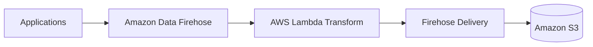

## S3 + EventBridge + Glue（ファイル起点バッチ）

**適用される制約**

- ファイル単位処理
- 準リアルタイムでよい
- 複雑なETLが必要

**判断基準**

- ログローテーション依存を許容できるか

**メリット**

- 変換自由度が高い
- Glueに処理を寄せられる

**デメリット**

- リアルタイム性が不安定
- ログ生成側設定に依存

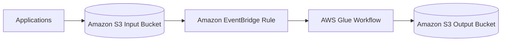

## Kinesis Data Streams + Consumer

**適用される制約**

- 独自処理ロジック必須
- 運用増を許容

**判断基準**

- Firehoseでは足りないか

**メリット**

- 処理自由度が最大
- 厳密な制御が可能

**デメリット**

- 運用負荷が高い
- 試験では不利になりがち

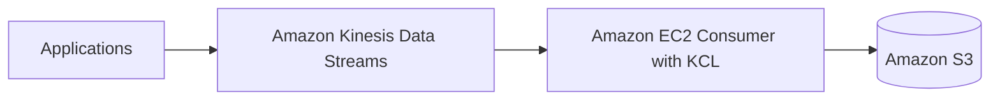

---

# S3データレイク内のデータから PII を特定し、検出時に後続処理を起動したい

## Amazon Macie（検出専用・標準解）

**適用される制約**

- S3が対象
- 既存データ＋新規データ
- PII検出

**判断基準**

- 「既存データも対象」「PII」が同時に出たら確定

**メリット**

- 検出ロジック不要
- S3特化で精度が高い

**デメリット**

- マスク処理はしない

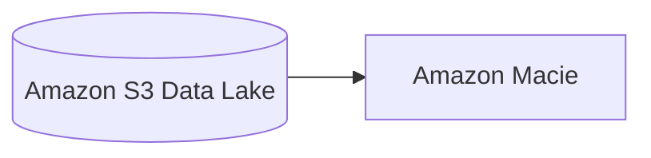

## Macie Findings（概要・可視化）

**適用される制約**

- 検出結果の概要が必要
- レポートが欲しい

**判断基準**

- 「概要」「サマリ」という単語

**メリット**

- 自動集計
- 追加実装不要

**デメリット**

- 独自集計には不向き

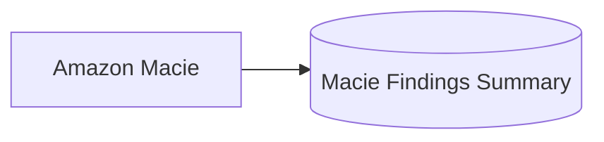

## EventBridge（検出時トリガー）

**適用される制約**

- 検出時に即時処理
- 既存アプリ起動
- 運用最小

**判断基準**

- ポーリング禁止
- Lambda必須とは書かれていない

**メリット**

- 非同期・即時
- ECS / Step Functions / SQS / HTTP 直接起動可

**デメリット**

- 非同期設計前提

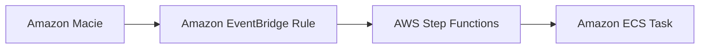

## Ingestion時マスキング（検出ではなく防止）

**適用される制約**

- 保存前に必ずマスク
- rawデータを残さない

**判断基準**

- 「保存前」「raw禁止」

**メリット**

- 下流が常に安全

**デメリット**

- 実装・運用増
- 既存データは別対応

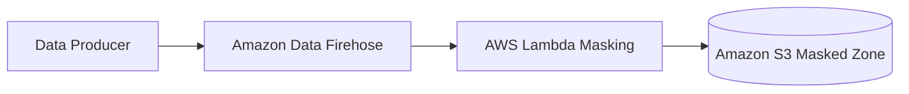

---

# メインの Amazon Redshift のデータを使って、2週間ごとに2時間だけ「別のテスト環境」で分析したい（最小コスト）

## Amazon Redshift Data Sharing + Amazon Redshift Serverless（オンデマンド実行・ライブ共有）

**適用される制約**

- テスト環境の稼働が「2週間に2時間」程度（低稼働）
- メイン環境と同一データを使いたい（複製ではなく参照でも可）
- できるだけ追加ストレージ／ETL／複製コストを避けたい
- テストのたびに最新データで分析したい（ライブ性）

**判断基準**

- 低稼働ワークロード → **Serverless の従量課金**が刺さる
- データ複製を避けたい／最新データを使いたい → **Data Sharing** が刺さる（S3アンロード不要）

**メリット**

- S3 退避・再ロード・Glue 等が不要（運用とコストを削減）
- Serverless は実行した分の計算のみ課金（未実行時は計算コストが基本発生しない）
- テスト側は「別環境」でもライブデータ参照が可能

**デメリット**

- Data Sharing の前提（例：RA3系、同リージョン/同アカウントや権限設計など）を満たす必要がある
- 共有は「参照」が基本で、テスト側でデータを書き換える用途には不向き（検証内容次第）

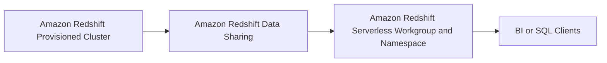

---

## Amazon Redshift Data Sharing + 小さめの Amazon Redshift Provisioned Cluster（固定費あり・ただし複製なし）

**適用される制約**

- テストは少ないが、Serverless を使えない事情がある
- ライブ共有（複製回避）はしたい
- テスト側はプロビジョンドでもよい（固定費を許容）

**判断基準**

- Serverless が使えない（組織ポリシー、制約、要件）場合の次善策
- それでも「S3アンロード＋ロード」などの複製を避けたい

**メリット**

- データ複製（S3アンロード/ロード）不要
- テスト側の環境をメインと分離できる

**デメリット**

- **2時間しか使わなくてもクラスター稼働中は課金**（低稼働だと不利）
- 運用（パッチ/メンテ/監視など）は Serverless より増える

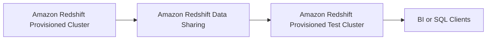

---

# ネストされた JSON の顧客インタラクションデータを、既存の Amazon Redshift データと結合して高頻度にクエリしたい（既存テーブル整合性・高可用性）

## Amazon Redshift SUPER + PartiQL（ネストのまま取り込み・既存スキーマ維持）

**適用される制約**

- ネストされた JSON（半構造化データ）
- 既存の Redshift テーブル整合性を維持（既存スキーマを壊さない）
- 既存の Redshift 追加データと結合してクエリ
- 毎日複数回クエリ（継続的な参照）
- 高可用性が必要（Redshift のマネージド性を活かす）

**判断基準**

- 「ネスト JSON」「Redshift で結合」「スキーマ変更を避けたい」→ **SUPER**
- 「ネストを SQL ライクに簡単にクエリしたい」→ **PartiQL**

**メリット**

- JSON を **フラット化せず**に取り込める（既存テーブルへの影響を最小化）
- Redshift 内で結合・クエリが完結（高頻度クエリに向く）
- 既存の分析基盤（Redshift）運用のまま拡張できる

**デメリット**

- SUPER/PartiQL に慣れが必要（従来の列指向SQLより書き味が変わる）
- ネストを多用した複雑クエリは設計次第で性能に影響（必要に応じて抽出列の併用が必要）

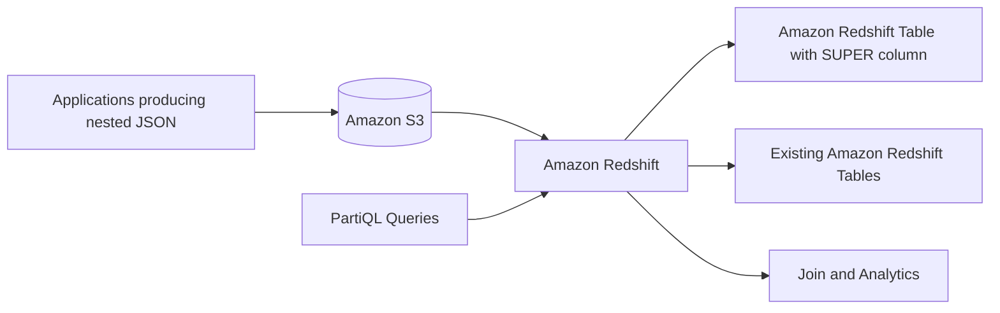

## Amazon Redshift Spectrum + Amazon Athena（ネストクエリを外だし・Redshiftは結合側）

**適用される制約**

- ネスト JSON をなるべくそのまま S3 に置きたい
- Redshift 側の既存テーブルを変更したくない
- クエリ頻度が高すぎない／スキャン課金を許容
- Redshift での結合を維持しつつ、ネストの取り回しを改善したい

**判断基準**

- S3 上のネストを **SQL で楽に**扱いたい → Athena（Presto/Trino系の扱いやすさ）
- Redshift は既存DWHとして維持し、外部データ参照を併用したい → Spectrum

**メリット**

- ネスト JSON を S3 に保持したまま分析しやすい（Athena）
- Redshift テーブルの整合性を保ちやすい（変更を最小化）

**デメリット**

- Athena/Spectrum は **スキャン課金**の影響が出やすい（高頻度だと不利）
- Redshift と外部の両方を跨ぐ設計になり、運用面の論点が増える

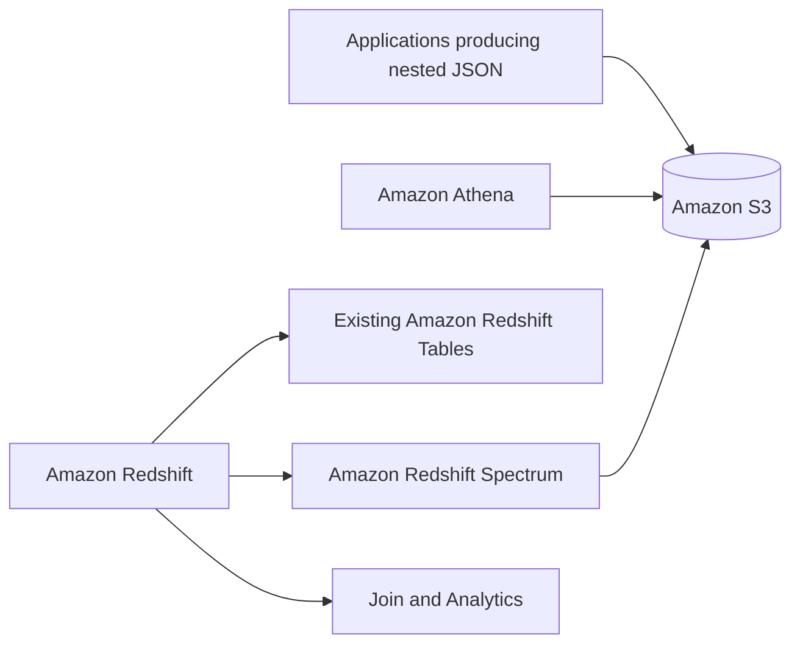

## AWS Glue でフラット化して Redshift へ列展開（参照性能優先・ただし整合性制約が緩い場合）

**適用される制約**

- ネストをフラット化して列指向性能を取りたい
- 既存スキーマへの影響を許容（新テーブル追加や列追加を許容）
- データモデルを固めてから運用したい

**判断基準**

- 「既存テーブル整合性維持」が弱い／別スキーマ・別テーブル追加が許容
- 反復クエリで性能を安定させたい

**メリット**

- 列として最適化できるため、典型的なBIクエリが速くしやすい
- 既存SQL資産を活かしやすい

**デメリット**

- ETL とスキーマ管理の運用が増える
- ネスト構造変更に追随が必要（破壊的変更が起きやすい）

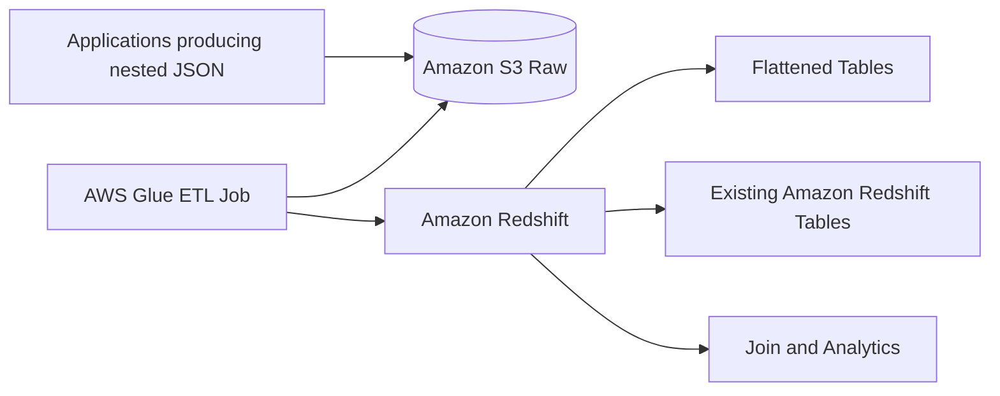

---

# スキャン済み文書（画像）から抽出したメタデータで、氏名・日付・本文テキスト検索を高速にしたい（最もパフォーマンス最適化）

## Amazon OpenSearch Service（全文検索インデックス＋S3ロケーション参照）

**適用される制約**

- 検索キーが「応募者名」「応募日」「応募テキスト」（全文検索を含む）
- 数十万件規模で検索を繰り返す
- “最もパフォーマンスが最適化された”検索が必要
- 元データは S3 に画像として保存（検索対象は抽出メタデータ＋本文テキスト）
- 検索結果から S3 のオブジェクト（場所）へ辿りたい

**判断基準**

- “全文検索” “検索最適化” “高速検索” が入ったら **OpenSearch**
- SQL ベース（Athena/Redshift）より **インデックス検索**が適切

**メリット**

- 文字列検索（全文・部分一致・スコアリング）に最適化
- メタデータと本文をインデックス化して高速検索
- 検索結果に S3 オブジェクトキー／URI を載せて参照できる
- OpenSearch Dashboards でアナリストが直接検索可能

**デメリット**

- クラスター運用（キャパシティ、シャーディング、保持設計）が必要
- インデックス更新パイプラインが必要（抽出→投入）

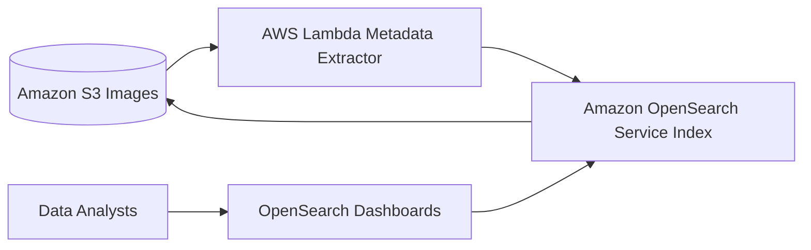

## Amazon OpenSearch Serverless（運用最小化しつつ全文検索）

**適用される制約**

- 全文検索が必要
- クラスタ運用を極力避けたい
- 変動する検索負荷を吸収したい

**判断基準**

- 「最小運用」も同時に強く求められる
- OpenSearch は使いたいがクラスター管理は避けたい

**メリット**

- クラスター管理を抑えやすい
- スケール設計の運用負荷を低減

**デメリット**

- 要件（ネットワーク/認可/機能）によってはマネージドクラスターより制約が出る
- 既存運用（プラグイン/細かいチューニング）を前提にすると合わない場合がある

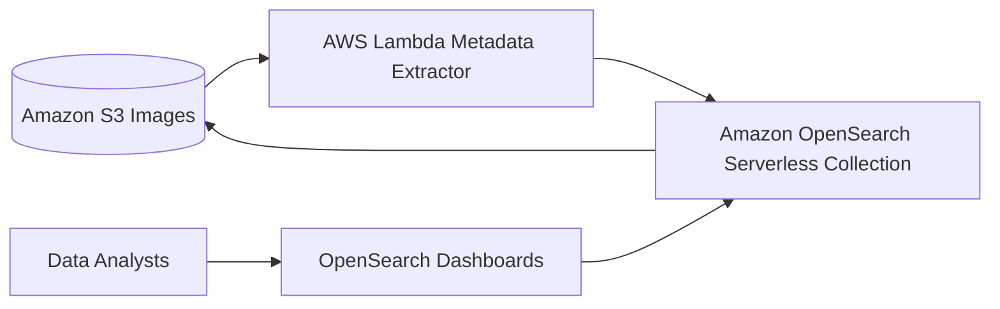

## Amazon Athena + AWS Glue Data Catalog（コスト優先・性能最優先ではない）

**適用される制約**

- SQL で十分
- “最もパフォーマンス最適化”ではなく、運用レス/都度クエリ優先
- 全文検索を強く求めない（部分一致程度・工夫前提）

**判断基準**

- 「最もパフォーマンス」ではなく「簡単にクエリ」「サーバレス」が主目的
- インデックス構築・維持を避けたい

**メリット**

- サーバレスで運用が軽い
- パイプラインが単純（S3にParquet＋カタログ）

**デメリット**

- スキャン型で、全文検索の体感性能はインデックス型に劣る
- 高頻度・低レイテンシ検索には不利

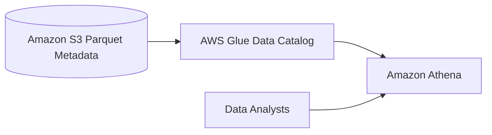

---

# 一元化されたメタデータストレージを AWS 上に構築し、データレベルで細粒度なアクセス制御を行いたい

## AWS Lake Formation（データレイク＋メタデータ＋細粒度アクセス制御の統合管理）

**適用される制約**

- メタデータを一元管理したい
- 高い信頼性とスケーラビリティが必要
- データベース / テーブル / 列 / 行 / セル レベルでのアクセス制御が必要
- 運用上のオーバーヘッドを最小化したい
- 複数の分析エンジン（Athena / Redshift / EMR 等）と連携したい

**判断基準**

- 「列・行・セルレベルの権限制御」が明示されている
- 「メタデータ管理」と「アクセス制御」を分離せずに統合したい
- Hive Metastore や独自DBの運用を避けたい

→ **Lake Formation + Data Filters**

**メリット**

- Glue Data Catalog を基盤にした **フルマネージドなメタデータ管理**
- データフィルターにより **列・行・セルレベルの制御が可能**
- IAM / Lake Formation 権限モデルに統合
- Athena / Redshift Spectrum / EMR などとネイティブ連携
- メタストアDBやHiveの運用が不要

**デメリット**

- Lake Formation 固有の権限モデル理解が必要
- 既存Glue Catalogのみ利用していた場合、移行設計が必要

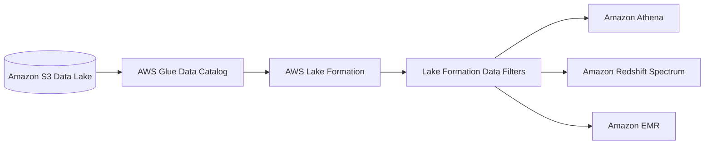

---

## AWS Glue Data Catalog + IAM（テーブルレベルまでで妥協する場合）

**適用される制約**

- メタデータを一元管理したい
- テーブル単位までのアクセス制御で十分
- 行・列・セルレベル制御は不要
- Lake Formation の導入は避けたい

**判断基準**

- 「細粒度」が **テーブルレベルまで**で許容される
- IAM ポリシーでの管理で十分

**メリット**

- シンプルな構成
- Glue Data Catalog はフルマネージドで信頼性が高い
- 既存Athena/Glue利用との親和性が高い

**デメリット**

- 列・行・セルレベルの制御は不可
- セキュリティ要件が厳しいケースでは不足

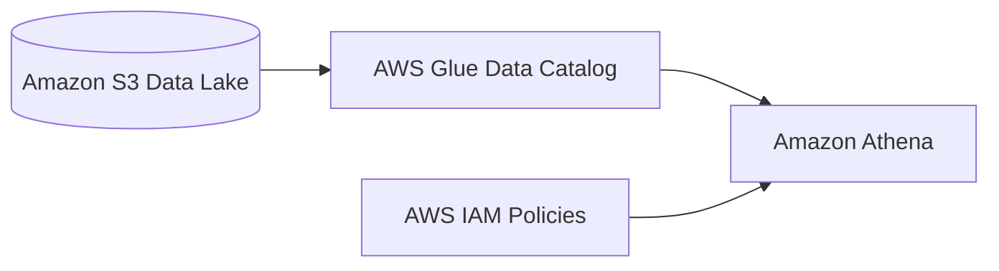

---

## Hive Metastore（Aurora / EMR）（運用を許容する場合）

**適用される制約**

- Hive 互換メタストアが必須
- SQLベースでの権限管理が必要
- 運用負荷を許容できる

**判断基準**

- 既存Hiveベース基盤を踏襲する必要がある
- フルマネージドである必要がない

**メリット**

- Hive エコシステムとの完全互換
- SQL GRANT による柔軟な制御が可能（理論上）

**デメリット**

- EMR / EC2 / Aurora の運用が必要
- スケーラビリティ・可用性設計を自前で担保
- 試験では「運用オーバーヘッド最小」の条件で不利

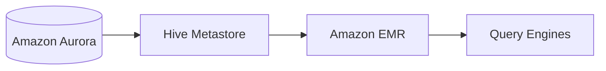

---

## まとめ（試験観点）

- **列・行・セルレベルのアクセス制御** → **AWS Lake Formation**
- **運用オーバーヘッド最小** → **フルマネージド（Lake Formation）**
- **Glue Catalog単体** → テーブルレベル止まり
- **Hive Metastore** → 運用過多で不利

この問題は
**「細粒度アクセス制御 × 一元メタデータ × 最小運用」＝ Lake Formation**
を即断できるかがポイントです。
