prompt

```markdown
今後の試験対策まとめは、
(1) 口調は常に敬語、
(2) 余計な前置き/横断まとめ無し、
(3) 見出しは「# ユースケース(問題設定)」「## プラクティス」で固定、
(4) 各プラクティスは **適用される制約 / 判断基準 / メリット / デメリット** の順、
(5) mermaid はできる限り具体的なAWSサービス名（Lambda/ECS/Step Functions等）を省略せずに記述し、
ラベルはシンプルで構文エラーを避ける。
```

# 変動するログ量を、ほぼリアルタイムで S3 に集約し、形式変換したい

## Amazon Data Firehose（ストリーミング・最小運用）

**適用される制約**

- ほぼリアルタイム
- ログ量が時間帯で変動
- 運用オーバーヘッド最小
- S3保存＋形式変換

**判断基準**

- 「ほぼリアルタイム」「最小運用」が入ったら第一候補

**メリット**

- スケーリング自動
- バッファリング・再試行込み
- S3直結

**デメリット**

- 複雑な処理分岐は不可
- 超低レイテンシ不可

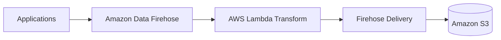

## S3 + EventBridge + Glue（ファイル起点バッチ）

**適用される制約**

- ファイル単位処理
- 準リアルタイムでよい
- 複雑なETLが必要

**判断基準**

- ログローテーション依存を許容できるか

**メリット**

- 変換自由度が高い
- Glueに処理を寄せられる

**デメリット**

- リアルタイム性が不安定
- ログ生成側設定に依存

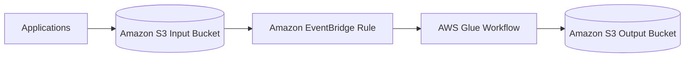

## Kinesis Data Streams + Consumer

**適用される制約**

- 独自処理ロジック必須
- 運用増を許容

**判断基準**

- Firehoseでは足りないか

**メリット**

- 処理自由度が最大
- 厳密な制御が可能

**デメリット**

- 運用負荷が高い
- 試験では不利になりがち

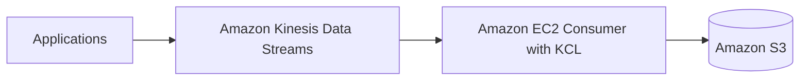

---

# S3データレイク内のデータから PII を特定し、検出時に後続処理を起動したい

## Amazon Macie（検出専用・標準解）

**適用される制約**

- S3が対象
- 既存データ＋新規データ
- PII検出

**判断基準**

- 「既存データも対象」「PII」が同時に出たら確定

**メリット**

- 検出ロジック不要
- S3特化で精度が高い

**デメリット**

- マスク処理はしない

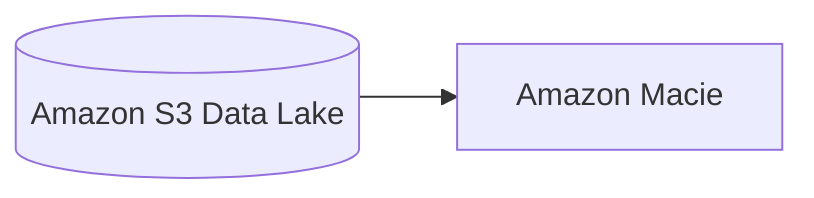

## Macie Findings（概要・可視化）

**適用される制約**

- 検出結果の概要が必要
- レポートが欲しい

**判断基準**

- 「概要」「サマリ」という単語

**メリット**

- 自動集計
- 追加実装不要

**デメリット**

- 独自集計には不向き

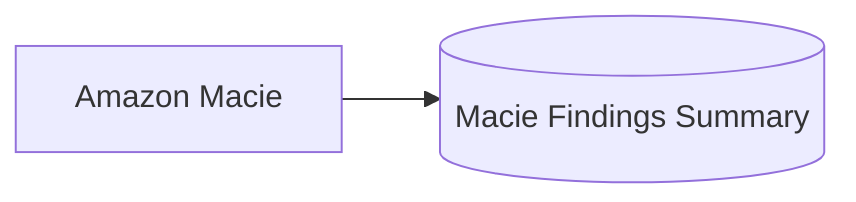

## EventBridge（検出時トリガー）

**適用される制約**

- 検出時に即時処理
- 既存アプリ起動
- 運用最小

**判断基準**

- ポーリング禁止
- Lambda必須とは書かれていない

**メリット**

- 非同期・即時
- ECS / Step Functions / SQS / HTTP 直接起動可

**デメリット**

- 非同期設計前提

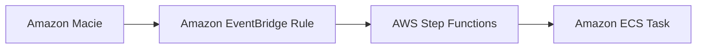

## Ingestion時マスキング（検出ではなく防止）

**適用される制約**

- 保存前に必ずマスク
- rawデータを残さない

**判断基準**

- 「保存前」「raw禁止」

**メリット**

- 下流が常に安全

**デメリット**

- 実装・運用増
- 既存データは別対応

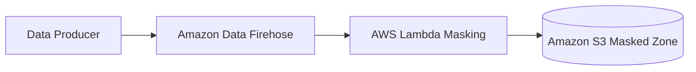

---

# メインの Amazon Redshift のデータを使って、2週間ごとに2時間だけ「別のテスト環境」で分析したい（最小コスト）

## Amazon Redshift Data Sharing + Amazon Redshift Serverless（オンデマンド実行・ライブ共有）

**適用される制約**

- テスト環境の稼働が「2週間に2時間」程度（低稼働）
- メイン環境と同一データを使いたい（複製ではなく参照でも可）
- できるだけ追加ストレージ／ETL／複製コストを避けたい
- テストのたびに最新データで分析したい（ライブ性）

**判断基準**

- 低稼働ワークロード → **Serverless の従量課金**が刺さる
- データ複製を避けたい／最新データを使いたい → **Data Sharing** が刺さる（S3アンロード不要）

**メリット**

- S3 退避・再ロード・Glue 等が不要（運用とコストを削減）
- Serverless は実行した分の計算のみ課金（未実行時は計算コストが基本発生しない）
- テスト側は「別環境」でもライブデータ参照が可能

**デメリット**

- Data Sharing の前提（例：RA3系、同リージョン/同アカウントや権限設計など）を満たす必要がある
- 共有は「参照」が基本で、テスト側でデータを書き換える用途には不向き（検証内容次第）

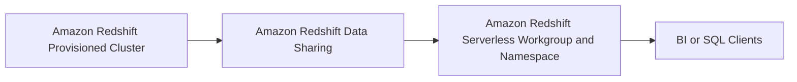

---

## Amazon Redshift Data Sharing + 小さめの Amazon Redshift Provisioned Cluster（固定費あり・ただし複製なし）

**適用される制約**

- テストは少ないが、Serverless を使えない事情がある
- ライブ共有（複製回避）はしたい
- テスト側はプロビジョンドでもよい（固定費を許容）

**判断基準**

- Serverless が使えない（組織ポリシー、制約、要件）場合の次善策
- それでも「S3アンロード＋ロード」などの複製を避けたい

**メリット**

- データ複製（S3アンロード/ロード）不要
- テスト側の環境をメインと分離できる

**デメリット**

- **2時間しか使わなくてもクラスター稼働中は課金**（低稼働だと不利）
- 運用（パッチ/メンテ/監視など）は Serverless より増える

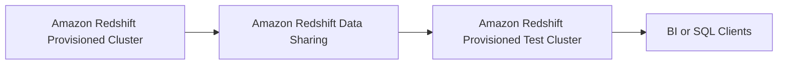

---

# ネストされた JSON の顧客インタラクションデータを、既存の Amazon Redshift データと結合して高頻度にクエリしたい（既存テーブル整合性・高可用性）

## Amazon Redshift SUPER + PartiQL（ネストのまま取り込み・既存スキーマ維持）

**適用される制約**

- ネストされた JSON（半構造化データ）
- 既存の Redshift テーブル整合性を維持（既存スキーマを壊さない）
- 既存の Redshift 追加データと結合してクエリ
- 毎日複数回クエリ（継続的な参照）
- 高可用性が必要（Redshift のマネージド性を活かす）

**判断基準**

- 「ネスト JSON」「Redshift で結合」「スキーマ変更を避けたい」→ **SUPER**
- 「ネストを SQL ライクに簡単にクエリしたい」→ **PartiQL**

**メリット**

- JSON を **フラット化せず**に取り込める（既存テーブルへの影響を最小化）
- Redshift 内で結合・クエリが完結（高頻度クエリに向く）
- 既存の分析基盤（Redshift）運用のまま拡張できる

**デメリット**

- SUPER/PartiQL に慣れが必要（従来の列指向SQLより書き味が変わる）
- ネストを多用した複雑クエリは設計次第で性能に影響（必要に応じて抽出列の併用が必要）

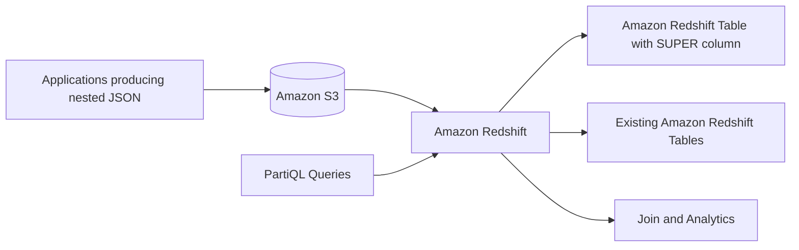

## Amazon Redshift Spectrum + Amazon Athena（ネストクエリを外だし・Redshiftは結合側）

**適用される制約**

- ネスト JSON をなるべくそのまま S3 に置きたい
- Redshift 側の既存テーブルを変更したくない
- クエリ頻度が高すぎない／スキャン課金を許容
- Redshift での結合を維持しつつ、ネストの取り回しを改善したい

**判断基準**

- S3 上のネストを **SQL で楽に**扱いたい → Athena（Presto/Trino系の扱いやすさ）
- Redshift は既存DWHとして維持し、外部データ参照を併用したい → Spectrum

**メリット**

- ネスト JSON を S3 に保持したまま分析しやすい（Athena）
- Redshift テーブルの整合性を保ちやすい（変更を最小化）

**デメリット**

- Athena/Spectrum は **スキャン課金**の影響が出やすい（高頻度だと不利）
- Redshift と外部の両方を跨ぐ設計になり、運用面の論点が増える

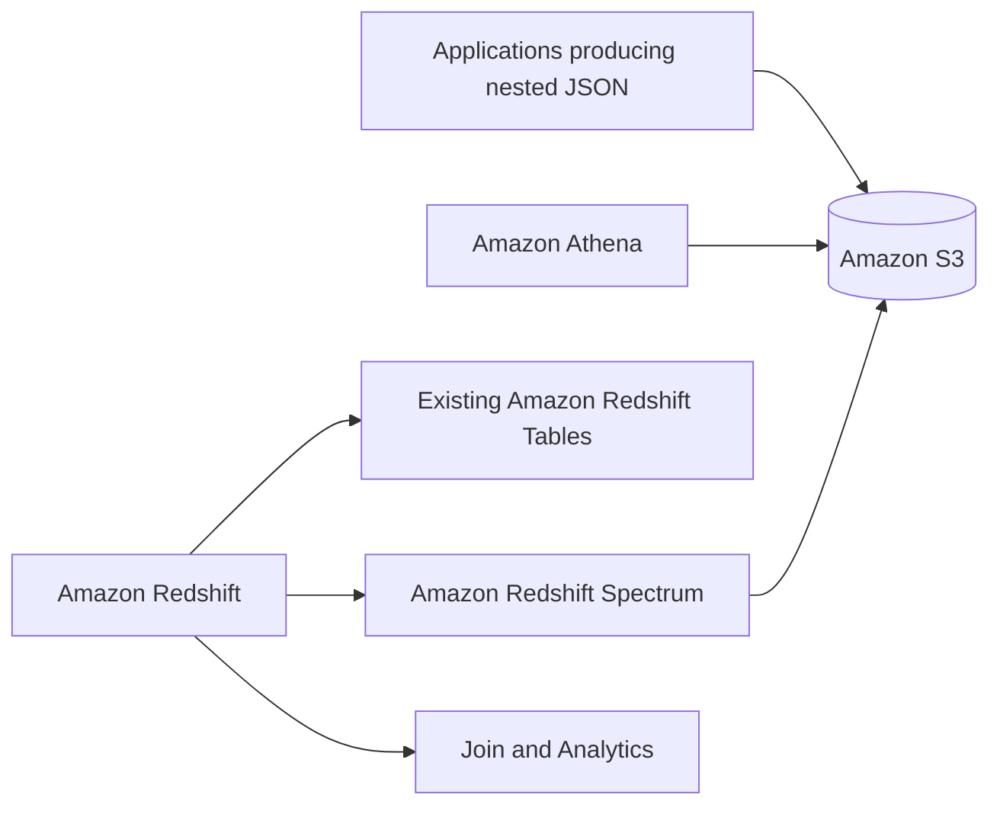

## AWS Glue でフラット化して Redshift へ列展開（参照性能優先・ただし整合性制約が緩い場合）

**適用される制約**

- ネストをフラット化して列指向性能を取りたい
- 既存スキーマへの影響を許容（新テーブル追加や列追加を許容）
- データモデルを固めてから運用したい

**判断基準**

- 「既存テーブル整合性維持」が弱い／別スキーマ・別テーブル追加が許容
- 反復クエリで性能を安定させたい

**メリット**

- 列として最適化できるため、典型的なBIクエリが速くしやすい
- 既存SQL資産を活かしやすい

**デメリット**

- ETL とスキーマ管理の運用が増える
- ネスト構造変更に追随が必要（破壊的変更が起きやすい）

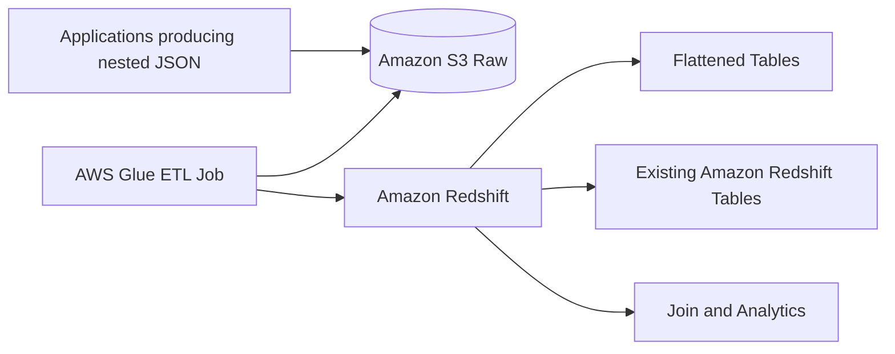

---

# スキャン済み文書（画像）から抽出したメタデータで、氏名・日付・本文テキスト検索を高速にしたい（最もパフォーマンス最適化）

## Amazon OpenSearch Service（全文検索インデックス＋S3ロケーション参照）

**適用される制約**

- 検索キーが「応募者名」「応募日」「応募テキスト」（全文検索を含む）
- 数十万件規模で検索を繰り返す
- “最もパフォーマンスが最適化された”検索が必要
- 元データは S3 に画像として保存（検索対象は抽出メタデータ＋本文テキスト）
- 検索結果から S3 のオブジェクト（場所）へ辿りたい

**判断基準**

- “全文検索” “検索最適化” “高速検索” が入ったら **OpenSearch**
- SQL ベース（Athena/Redshift）より **インデックス検索**が適切

**メリット**

- 文字列検索（全文・部分一致・スコアリング）に最適化
- メタデータと本文をインデックス化して高速検索
- 検索結果に S3 オブジェクトキー／URI を載せて参照できる
- OpenSearch Dashboards でアナリストが直接検索可能

**デメリット**

- クラスター運用（キャパシティ、シャーディング、保持設計）が必要
- インデックス更新パイプラインが必要（抽出→投入）

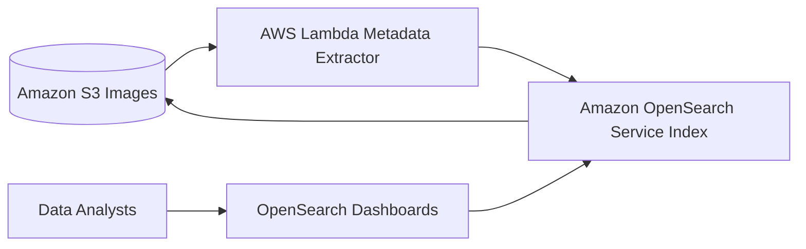

## Amazon OpenSearch Serverless（運用最小化しつつ全文検索）

**適用される制約**

- 全文検索が必要
- クラスタ運用を極力避けたい
- 変動する検索負荷を吸収したい

**判断基準**

- 「最小運用」も同時に強く求められる
- OpenSearch は使いたいがクラスター管理は避けたい

**メリット**

- クラスター管理を抑えやすい
- スケール設計の運用負荷を低減

**デメリット**

- 要件（ネットワーク/認可/機能）によってはマネージドクラスターより制約が出る
- 既存運用（プラグイン/細かいチューニング）を前提にすると合わない場合がある

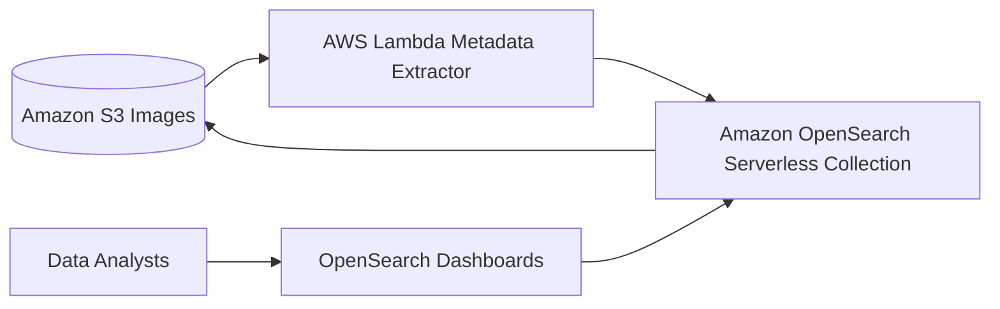

## Amazon Athena + AWS Glue Data Catalog（コスト優先・性能最優先ではない）

**適用される制約**

- SQL で十分
- “最もパフォーマンス最適化”ではなく、運用レス/都度クエリ優先
- 全文検索を強く求めない（部分一致程度・工夫前提）

**判断基準**

- 「最もパフォーマンス」ではなく「簡単にクエリ」「サーバレス」が主目的
- インデックス構築・維持を避けたい

**メリット**

- サーバレスで運用が軽い
- パイプラインが単純（S3にParquet＋カタログ）

**デメリット**

- スキャン型で、全文検索の体感性能はインデックス型に劣る
- 高頻度・低レイテンシ検索には不利

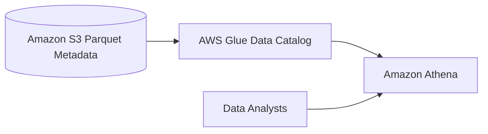

---

# 一元化されたメタデータストレージを AWS 上に構築し、データレベルで細粒度なアクセス制御を行いたい

## AWS Lake Formation（データレイク＋メタデータ＋細粒度アクセス制御の統合管理）

**適用される制約**

- メタデータを一元管理したい
- 高い信頼性とスケーラビリティが必要
- データベース / テーブル / 列 / 行 / セル レベルでのアクセス制御が必要
- 運用上のオーバーヘッドを最小化したい
- 複数の分析エンジン（Athena / Redshift / EMR 等）と連携したい

**判断基準**

- 「列・行・セルレベルの権限制御」が明示されている
- 「メタデータ管理」と「アクセス制御」を分離せずに統合したい
- Hive Metastore や独自DBの運用を避けたい

→ **Lake Formation + Data Filters**

**メリット**

- Glue Data Catalog を基盤にした **フルマネージドなメタデータ管理**
- データフィルターにより **列・行・セルレベルの制御が可能**
- IAM / Lake Formation 権限モデルに統合
- Athena / Redshift Spectrum / EMR などとネイティブ連携
- メタストアDBやHiveの運用が不要

**デメリット**

- Lake Formation 固有の権限モデル理解が必要
- 既存Glue Catalogのみ利用していた場合、移行設計が必要

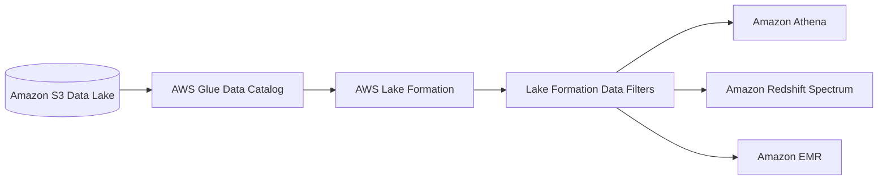

---

## AWS Glue Data Catalog + IAM（テーブルレベルまでで妥協する場合）

**適用される制約**

- メタデータを一元管理したい
- テーブル単位までのアクセス制御で十分
- 行・列・セルレベル制御は不要
- Lake Formation の導入は避けたい

**判断基準**

- 「細粒度」が **テーブルレベルまで**で許容される
- IAM ポリシーでの管理で十分

**メリット**

- シンプルな構成
- Glue Data Catalog はフルマネージドで信頼性が高い
- 既存Athena/Glue利用との親和性が高い

**デメリット**

- 列・行・セルレベルの制御は不可
- セキュリティ要件が厳しいケースでは不足

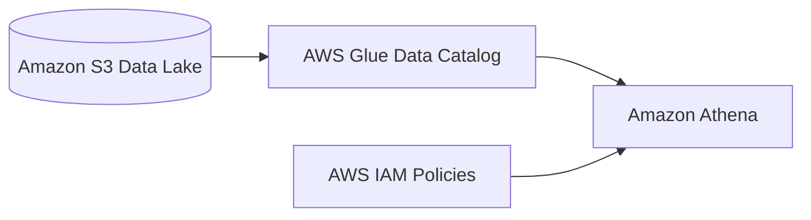

---

## Hive Metastore（Aurora / EMR）（運用を許容する場合）

**適用される制約**

- Hive 互換メタストアが必須
- SQLベースでの権限管理が必要
- 運用負荷を許容できる

**判断基準**

- 既存Hiveベース基盤を踏襲する必要がある
- フルマネージドである必要がない

**メリット**

- Hive エコシステムとの完全互換
- SQL GRANT による柔軟な制御が可能（理論上）

**デメリット**

- EMR / EC2 / Aurora の運用が必要
- スケーラビリティ・可用性設計を自前で担保
- 試験では「運用オーバーヘッド最小」の条件で不利

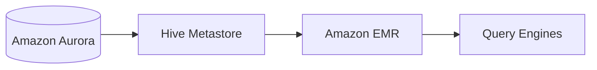

---

## まとめ（試験観点）

- **列・行・セルレベルのアクセス制御** → **AWS Lake Formation**
- **運用オーバーヘッド最小** → **フルマネージド（Lake Formation）**
- **Glue Catalog単体** → テーブルレベル止まり
- **Hive Metastore** → 運用過多で不利

この問題は
**「細粒度アクセス制御 × 一元メタデータ × 最小運用」＝ Lake Formation**
を即断できるかがポイントです。

---

# EventBridge で起動される「Lambda 1本」に ETL を詰め込み、外部API待ち（合計約3秒）＋DynamoDB更新をしている。コストと技術的負債を下げたい

## AWS Step Functions（外部API待ちをワークフロー化し、サービス統合でDynamoDB更新）

**適用される制約**

- 外部ベンダーAPI呼び出しが複数（3回）あり、待ち時間が支配的
- 取得したレスポンスを結合して後続処理したい
- DynamoDB を2テーブル更新（独立）
- 既存は「Lambdaモノリス」で技術的負債が高い
- 最もコスト効率の良い再設計（待ち時間課金を減らしたい）
- 運用オーバーヘッドは増やしたくない（マネージドで完結したい）

**判断基準**

- 「外部API待ちが長い」＋「処理が複数ステップ」→ **Step Functions**
- 「Lambdaの実行時間が待ちに引っ張られている」→ **待ち時間をワークフロー側に逃がす**
- DynamoDB は **Step Functions の AWS SDK 統合**で更新（不要なLambdaを減らす）

**メリット**

- 外部API待ちで **Lambda実行時間（課金）を引き伸ばさない設計**にできる
- リトライ、タイムアウト、並列、エラー分岐が宣言的に書ける（技術的負債低減）
- DynamoDB 更新を **サービス統合**で実行でき、Lambda本数を抑えられる
- 可観測性（実行履歴）が標準で得られる

**デメリット**

- ワークフロー設計（状態遷移、エラー設計）を前提にする
- 外部APIが「コール→後で結果」型でない場合、API呼び出し自体は何らかの実行主体が必要（API Destination / Lambda 等）

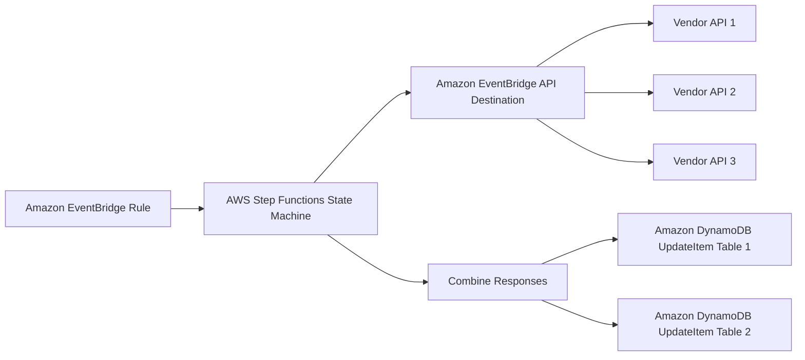

---

## Amazon EventBridge Pipes（フィルタ＋入力変換を併用して起動パラメータを整える）

**適用される制約**

- 除外条件に加えて、Step Functions の入力を整形したい（不要フィールド削除、名前変更など）
- それでもコーディングは避けたい

**判断基準**

- 「フィルタ」だけでなく「入力の形を合わせたい」が入る
- 変換が軽微で済む

**メリット**

- フィルタと簡単な入力整形を同一パイプで完結できる
- Step Functions のステート入力を安定化できる

**デメリット**

- 複雑な変換ロジック（外部呼び出し、状態保持）は不可

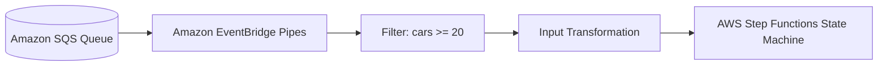

---

# Amazon SQS の注文メッセージを AWS Step Functions に渡したい。車が 20 台未満の注文は無視したい（開発労力最小）

## Amazon EventBridge Pipes（SQS→フィルタ→Step Functions 直結）

**適用される制約**

- ソースが Amazon SQS（JSONメッセージ）
- ターゲットが AWS Step Functions（ワークフロー起動）
- 条件（車 < 20）は除外したい
- コーディングを避けたい（開発労力最小）

**判断基準**

- 「SQS から Step Functions へ転送」かつ「フィルタ」かつ「最小開発」→ EventBridge Pipes
- Lambda/EC2 などの実装が選択肢に出てきたら、まず Pipes を検討

**メリット**

- コード不要で SQS→Step Functions の接続ができる
- フィルタリングを Pipes 側で実施できる
- 運用対象（Lambda/EC2）が増えない

**デメリット**

- フィルタ条件が複雑（集計・外部参照・複数メッセージ相関）になると限界がある
- メッセージ整形が大きく必要な場合は別途変換が必要

```mermaid
flowchart LR
  SQS[(Amazon SQS Queue)] --> Pipes[Amazon EventBridge Pipes]
  Pipes --> Filter[EventBridge Pipes Filter]
  Filter --> SF[AWS Step Functions State Machine]

  SQSmsg[Order JSON Message] -.-> Pipes
```

---

# HDFS/HiveとS3/Athenaを統合する

S3/Athenaに寄せる

- **耐久性とコスト**: **S3**が最強。HDFS（EMR内）はクラスターを消すとデータが消える「エフェメラル（一時的）」な性質があるため、長期保存には向きません。
- **メタデータ統合**: **Glue Data Catalog**に一本化すべきです。Hiveメタストア（EMR内）は管理の手間がかかりますが、GlueならAthenaとEMRの両方から共通の「目次」として参照できます。
- **移行の労力**: AthenaのSQLと互換性が高いのは同じPresto系のツールです。

---

### 「古い構成」vs「新しい構成」の比較

| 比較項目     | HDFS + Hive (EMR内)              | S3 + Glue Data Catalog             |
| ------------ | -------------------------------- | ---------------------------------- |
| **耐久性**   | **低** (クラスター削除で消える)  | **極高** (イレブンナイン)          |
| **コスト**   | **高** (ストレージ用にEC2が必要) | **低** (使った分だけ)              |
| **カタログ** | Hive Metastore (個別管理)        | **Glue Data Catalog (共通)**       |
| **連携**     | EMR内のみが基本                  | **Athena / EMR / Redshift で共有** |

---

### ベストプラクティスの可視化 (Mermaid)

```mermaid
graph TD
    subgraph "旧：バラバラな状態"
        HDFS[(HDFS)] --- HMS[Hive Metastore]
        S3_old[(S3)] --- Glue_old[Glue Catalog]
        Athena -- 参照不可 --- HMS
    end

    subgraph "新：モダンなデータレイク (正解パターン)"
        S3_new[(Amazon S3)] --- Glue_new[(AWS Glue Data Catalog)]
        Athena -- "SQLクエリ" --- Glue_new
        EMR[Amazon EMR / Spark] -- "EMRFS経由で分析" --- Glue_new
        Glue_new --- S3_new
    end

    style S3_new fill:#dcf5ff,stroke:#0073bb,stroke-width:2px
    style Glue_new fill:#dcf5ff,stroke:#0073bb,stroke-width:2px

```

### 試験対策の決め手キーワード

1. **「データの耐久性 (Durability)」** → **S3** を選ぶ（HDFSはNG）。
2. **「共通のデータカタログ (Common Catalog)」** → **Glue Data Catalog** に統合する。
3. **「移行の労力最小 (Minimal effort)」** → Athenaのクエリを書き換えずに済むよう、そのままAthenaを使うか、共通カタログを参照させる。

**結論：**
「Hadoop/Hive」という言葉が出てきたら、AWSではそれを「S3/Glue」というマネージドな環境へ移行させるのが、データエンジニアとしての正解ルートになります。

次は、EMRがS3をHDFSのように扱うための仕組みである **EMRFS** について詳しく見てみましょうか？

---

# 外部クラウドデータウェアハウスにある大規模データを、労力最小で Amazon Redshift に移行したい

## AWS Schema Conversion Tool + AWS Glue Studio（異種DWH→Redshift 移行の統合ソリューション）

**適用される制約**

- ソースは外部クラウドデータウェアハウス（異種環境）
- ターゲットは Amazon Redshift
- 大規模な既存データセットを移行したい
- スキーマ互換性の問題を手作業で解決したくない
- データ移行作業の実装・運用コストを最小化したい

**判断基準**

- 「異種DWH → Redshift」＝ スキーマ変換とデータ移行の両方が必須
- スキーマ変換を自動化できる専用ツールが必要
- 大量データを GUI ベースで安全に移行できる手段が必要
- UNLOAD / COPY / 手書きDDL を避けたい

**メリット**

- AWS Schema Conversion Tool により、外部DWHのスキーマとDDLを自動で Redshift 互換に変換できる
- AWS Glue Studio により、変換済みスキーマを前提として大規模データを効率的に Redshift にロードできる
- スキーマ変換とデータ移行を役割分担させつつ、**一連の移行ソリューションとして成立**する
- 手動DDL作成や個別ETL実装を避けられ、全体の移行工数を最小化できる

**デメリット**

- SCT で自動変換できない一部の型や構文はレビュー・調整が必要
- Glue Studio のコネクタ対応範囲に依存する
- 移行性能や並列度はデータ量に応じて調整が必要な場合がある

```mermaid
flowchart LR
  Src[External Cloud Data Warehouse]
  SCT[AWS Schema Conversion Tool]
  Glue[AWS Glue Studio Job]
  RS[Amazon Redshift]

  Src --> SCT
  Src --> Glue
  SCT --> RS
  Glue --> RS
```

この設問は
**「異種DWH移行では、スキーマ変換とデータ移行を分離せず、SCT + Glue Studio を一体の移行ソリューションとして選べるか」**
を見ています。

---

# Amazon EKS 上の多数マイクロサービス（複数クラスター/ノードグループ/数百Pod）のメトリクスとログを一元可視化し、ほぼリアルタイムにクエリ結果を表示したい

## Amazon CloudWatch Container Insights + Amazon CloudWatch Logs サブスクリプションフィルター + Amazon Data Firehose + Amazon OpenSearch Service（メトリクスはCloudWatch、ログはOpenSearchで低レイテンシ検索）

**適用される制約**

- 対象は Amazon EKS（クラスター/Pod/コンテナ単位の詳細メトリクスが必要）
- ログとメトリクスを一元的に表示したい
- デバッグ/検索のためにログを低レイテンシでクエリしたい（ほぼリアルタイム）
- マルチクラスター・大規模Podでスケールが必要
- 運用オーバーヘッドを最小化したい（マネージド中心）

**判断基準**

- 「EKSの詳細メトリクス」→ Amazon CloudWatch Container Insights
- 「ログのほぼリアルタイム検索・可視化」→ OpenSearch（インデックス検索）
- 「CloudWatch Logs からほぼリアルタイムで別基盤へ配信」→ サブスクリプションフィルター
- 「配信/バッファ/再試行をマネージド化」→ Amazon Data Firehose

**メリット**

- Container Insights で EKS のクラスター/Pod/コンテナの詳細メトリクスを標準収集できる
- CloudWatch Logs → Firehose → OpenSearch により、ログをほぼリアルタイムでインデックス化して高速検索できる
- マネージドサービス中心で、独自エージェント/独自基盤の運用を避けられる
- 監視（CloudWatch）と検索（OpenSearch）を役割分担できる

**デメリット**

- ログを OpenSearch に送るための設計（インデックス設計、保持、容量計画）が必要
- 可視化を一枚にまとめる場合、CloudWatch と OpenSearch Dashboards の使い分け/統合方針が必要

```mermaid
flowchart LR
  EKS[Amazon EKS Clusters]
  CI[Amazon CloudWatch Container Insights]
  CWL[Amazon CloudWatch Logs]
  Sub[CloudWatch Logs Subscription Filter]
  FH[Amazon Data Firehose]
  OS[Amazon OpenSearch Service]
  Dash[OpenSearch Dashboards]
  CW[Amazon CloudWatch Dashboards]

  EKS --> CI --> CW
  EKS --> CWL --> Sub --> FH --> OS --> Dash
```

---

# さまざまな AWS データセット／ファイル形式から PII を検出し、データプレパレーション中にマスキングしたい（2つ選択）

## AWS Glue Studio（ETLベースで柔軟に PII 検出・マスキング）

**適用される制約**

- 複数の AWS データセットを対象にしたい（S3 など）
- CSV / JSON / Parquet など複数のファイル形式
- データプレパレーション工程で PII を検出したい
- マスキング処理を組み込みたい
- コードを書かずに済む部分は減らしたいが、柔軟性も必要

**判断基準**

- 「ETL パイプラインの中で PII 検出＋マスキングを行いたい」
- 「変換ロジックを柔軟に制御したい」

**メリット**

- 多様なデータソース／ファイル形式に対応
- ETL 処理の一部として PII 検出・マスキングを実装できる
- Glue の他ジョブ（クレンジング、正規化等）と統合しやすい

**デメリット**

- ジョブ設計・実行管理は必要
- DataBrew よりは設計自由度が高い分、学習コストがある

```mermaid
flowchart LR
  Src[Various AWS Datasets]
  Glue[AWS Glue Studio ETL Job]
  Mask[PII Detection and Masking]
  S3[(Amazon S3 Output)]

  Src --> Glue --> Mask --> S3
```

---

## AWS Glue DataBrew（ノーコードでの PII 検出・マスキング）

**適用される制約**

- データプレパレーションが主目的
- PII を検出してマスキングしたい
- コーディングによる運用負荷を極力下げたい
- 多様なファイル形式を扱いたい

**判断基準**

- 「データプレパレーション」「ノーコード」
- 「PII 検出・編集を簡単に行いたい」

**メリット**

- PII 検出・マスキング機能が組み込み済み
- GUI 操作のみで変換を定義できる
- CSV / JSON / XLSX / Parquet / ORC など幅広い形式に対応
- 実装・保守のオーバーヘッドが最小

**デメリット**

- 複雑なカスタムロジックには不向き
- 完全なETL基盤としては Glue Studio に劣る

```mermaid
flowchart LR
  Src[Various AWS Datasets]
  Brew[AWS Glue DataBrew]
  Mask[Built-in PII Detection and Masking]
  S3[(Amazon S3 Output)]

  Src --> Brew --> Mask --> S3
```

---

この問題は、

- **PII を「検出するだけ」では不十分**
- **マスキングを「データプレパレーション中」に行えること**
- **さまざまなデータセット／形式に対応できること**

という制約から、

- **AWS Glue Studio**
- **AWS Glue DataBrew**

を **役割の異なるが要件を満たす2解**として選ばせる設問です。

---

# オンプレの Apache Hadoop クラスターで多様なバッチ処理（Spark / Hive / Presto / TensorFlow）を実行している。データ量増加に備えて AWS に移行し、ストレージをスケールさせ、耐久性を上げ、既存ジョブを再利用したい（最もコスト効率）

## Amazon EMR + Amazon S3（データはS3、計算は一時的EMRクラスター）

**適用される制約**

- 既存ジョブをそのまま再利用したい（Spark / Hive / Presto / TensorFlow）
- ストレージのスケーラビリティが最重要（データ量が大幅増）
- **データの耐久性を高めたい（HDFSのエフェメラル性を避けたい）**
- バッチ処理中心（常時稼働クラスター不要）
- 最もコスト効率が重要

**判断基準**

- 「Hadoop系フレームワークを再利用」→ Amazon EMR
- 「耐久性＋スケールするストレージ」→ Amazon S3
- 「バッチ中心でコスト最適化」→ 一時的（エフェメラル）EMR クラスター

**メリット**

- Amazon S3 をストレージ基盤にすることで高耐久・高スケール・低コスト
- EMR で既存の Hadoop/Spark/Hive/Presto/TensorFlow ジョブを再利用できる
- 一時クラスター運用で、アイドル時の計算コストを抑えられる
- HDFS運用（容量計画・障害時データ喪失リスク）を最小化できる

**デメリット**

- ジョブ実行のたびにクラスター起動時間が入る（超低レイテンシ用途は不向き）
- ログ／依存関係（ライブラリ、ブートストラップ）の再現性設計が必要

```mermaid
flowchart LR
  S3[(Amazon S3 Data Lake)]
  EMR[Amazon EMR Ephemeral Cluster]
  Jobs[Apache Spark / Apache Hive / Presto / TensorFlow Jobs]

  S3 --> EMR
  Jobs --> EMR
  EMR --> S3
```

---

# サーバーレスデータパイプラインを「週次で確実に」動かし、Amazon QuickSight のデータを自動更新したい（運用オーバーヘッド最小）

## AWS Step Functions + Amazon EventBridge Scheduler（サーバーレス標準・最小運用）

**適用される制約**

- 週次で確実に起動したい（スケジュール駆動）
- パイプライン全体のオーケストレーションが必要（複数ステップ）
- サーバーレス前提
- 運用オーバーヘッド最小（環境運用を増やしたくない）

**判断基準**

- 「サーバーレス」「定期実行」「ワークフロー」→ Step Functions
- 「cron的スケジュール」→ EventBridge Scheduler

**メリット**

- インフラ運用（Airflow環境など）が不要
- 失敗時のリトライ/タイムアウト/分岐が組み込みで実装できる
- スケジュールは Scheduler に集約できる

**デメリット**

- DAG をコードで高度に組みたい用途には向かない（後述）

```mermaid
flowchart LR
  Scheduler[Amazon EventBridge Scheduler] --> SF[AWS Step Functions State Machine]
  SF --> QS[Amazon QuickSight Dataset Refresh]
```

---

# MWAA が解答になるのはどんなケース？

## Amazon MWAA（Airflow）（DAG主体・多数ジョブ・依存関係が複雑）

**適用される制約**

- タスク数が多い／依存関係が複雑（DAGが大きい、分岐が多い、動的にタスク生成したい等）
- 既に Airflow を運用している／Airflow の資産（DAG、オペレータ、プラグイン、運用ノウハウ）を流用したい
- 多様なシステム（AWS外含む）へのコネクタ/オペレータを Airflow で統一したい
- データパイプラインの「運用管理」を Airflow UI（DAG管理、リラン、SLA、バックフィル、履歴）中心でやりたい
- 週次に限らず、バックフィルやリカバリ運用が頻繁に必要

**判断基準**

- 「Airflow のDAG/運用を使う前提」または「Step Functions だと表現しづらい DAG 運用要件」がある
- 具体例キーフレーズ：**backfill / catchup / SLA / DAGの動的生成 / 既存Airflow資産の移植**

**メリット**

- Airflow の表現力（DAG、動的タスク、豊富なOperator/Provider）
- UIでの運用（再実行、履歴、バックフィル、依存関係の可視化）が強い
- 複数パイプラインを統一運用しやすい

**デメリット**

- 環境運用が発生（VPC、MWAA環境、依存パッケージ、DAGデプロイ等）
- 小規模・単純な週次起動には過剰になりやすい
- コスト/構成要素が増えがち

```mermaid
flowchart LR
  MWAA[Amazon MWAA Environment] --> DAG[Apache Airflow DAG]
  DAG --> Tasks[Operators and Tasks]
  Tasks --> QS[Amazon QuickSight Dataset Refresh]
```

---

試験の「コスト効率（Cost-effective）」という観点では、**CloudWatch Logs + Insights よりも、S3 (Parquet) + Athena の方が正解になる確率が高い**です。

理由は、**「ログの取り込みコスト」**と**「クエリの計算コスト」**の両方で S3 ＋ Athena が圧倒的に有利だからです。

---

# S3/Athena vs CloudWatch/CloudWatchInsights

| 項目               | **CloudWatch Logs (+ Insights)** | **Amazon S3 (+ Athena)**                               |
| ------------------ | -------------------------------- | ------------------------------------------------------ |
| **取り込み料金**   | **高い** (約 0.50 USD/GB)        | **安い**（実質無料または非常に低額）                   |
| **ストレージ料金** | **高い** (約 0.03 USD/GB)        | **安い** (約 0.023 USD/GB、さらに安価な階層あり)       |
| **クエリ料金**     | スキャン 1 GB あたり 0.005 USD   | スキャン 1 TB あたり 5 USD (1 GB あたり **0.005 USD**) |
| **データ形式**     | 非構造化/JSON                    | **Parquet (列指向圧縮)**                               |

---

### コスト効率の決定打：Parquet の存在

この問題の最大のポイントは選択肢 D の **Parquet 形式** です。

1. **スキャン量の削減**: Athena（および Insights）はスキャンしたデータ量に対して課金されます。Parquet は必要な列だけを読み取り、さらに圧縮されているため、**スキャン量を 80〜90% 削減**できます。
2. **ログ取り込みの中抜き**: VPC フローログを直接 S3 に送る設定にすれば、高価な CloudWatch Logs の取り込み料金を完全に回避できます。

---

### CloudWatch Logs Insights が正解になるケース

もちろん、Insights が正解になる場合もありますが、それは以下のようなキーワードがある時です。

- **「リアルタイム性が重要」**: 数秒以内のログを即座に確認したい場合。
- **「運用オーバーヘッドを極限まで減らしたい」**: テーブル定義（DDL）すら書きたくない場合。
- **「ログの量が極めて少ない」**: S3/Athena の構成を組む手間の方が高くつくレベルの小規模。

---

### 構成イメージ (Mermaid)

```mermaid
graph LR
    VPC[VPC Flow Logs] -- "直接出力 (高効率)" --> S3[(Amazon S3<br/>Parquet形式)]
    S3 -- "必要な列だけスキャン" --> Athena[Amazon Athena]
    Athena --> User[分析エンジニア]

    style S3 fill:#fff2cc,stroke:#d6b656
    style Athena fill:#dcf5ff,stroke:#0073bb

```

**結論：**
「ネットワークトラフィック分析」×「大容量ログ」×「コスト効率」と来たら、**「S3 に Parquet で出して Athena で叩く」** が AWS 試験における鉄板の解答パターンです。

---

# IoT センサー（10秒ごとに 100KB）を Amazon S3 に配信し、ダウンストリームが 30 秒ごとに S3 から読む。レイテンシーを最小化したい

## Amazon Kinesis Data Streams + Kinesis Client Library + Amazon S3（カスタム短間隔バッファで低レイテンシ配信）

**適用される制約**

- S3 への到達レイテンシーを最小化したい
- ダウンストリームが 30 秒ごとに S3 をポーリング（到達遅延が致命）
- Amazon Data Firehose のデフォルト（S3宛てバッファ間隔が長い）では満たせない
- 追加の変換要件はなく、配信が主目的

**判断基準**

- 「S3 へ最小レイテンシで到達」かつ「Firehose のバッファが要件に合わない」→ Kinesis Data Streams + カスタムコンシューマ
- バッファ間隔を秒単位で制御したい → KCL（または同等の自前実装）

**メリット**

- バッファ間隔を短くでき、S3 への到達レイテンシーを小さくできる
- Kinesis Data Streams により取り込みはスケールしやすい
- ダウンストリームの 30 秒間隔読み取りに合わせやすい

**デメリット**

- コンシューマ（KCL 実装）の開発・運用が発生する
- S3 への書き込み頻度が上がるため、小さなオブジェクトが増えやすい（パーティション/集約設計が必要）

```mermaid
flowchart LR
  Sensors[IoT Sensors] --> KDS[Amazon Kinesis Data Streams]
  KDS --> KCL[Amazon EC2 Consumer with Kinesis Client Library]
  KCL --> S3[(Amazon S3 Bucket)]
  S3 --> Downstream[Downstream Process every 30s]
```

## Amazon Kinesis Data Streams + AWS Lambda コンシューマ + Amazon S3（サーバレス寄りで短間隔集約）

**適用される制約**

- S3 への到達レイテンシーを下げたい
- コンシューマをサーバレスに寄せたい（EC2 運用を避けたい）
- 多少の実装は許容できる（集約して PutObject する）

**判断基準**

- 「低レイテンシ配信」＋「EC2 を避けたい」→ Kinesis Data Streams + Lambda
- Firehose のバッファ制約がボトルネック → ストリーム＋自前配信に寄せる

**メリット**

- EC2 なしで運用負荷を下げられる
- Kinesis Data Streams の取り込み耐性は維持できる
- 30 秒要件に合わせた集約・出力制御が可能

**デメリット**

- Lambda 側で集約・順序・再試行時の重複対策（冪等性）が必要
- 書き込み頻度/オブジェクト数の設計が必要

```mermaid
flowchart LR
  Sensors[IoT Sensors] --> KDS[Amazon Kinesis Data Streams]
  KDS --> Lambda[AWS Lambda Consumer]
  Lambda --> S3[(Amazon S3 Bucket)]
  S3 --> Downstream[Downstream Process (every 30s)]
```

---

# 複数ソースの売上データを可視化するプロトタイプを AWS 上で作りたい。将来のスケールにも対応したい（運用オーバーヘッド最小）

## Amazon S3 + AWS Glue Data Catalog + Amazon Athena + Amazon QuickSight（サーバーレスで直接可視化）

**適用される制約**

- 複数ソースのデータを集約して可視化したい
- まずはプロトタイプ（シンプルに始めたい）
- 将来的なスケーラビリティが必要
- 運用オーバーヘッドを最小化したい（DWH管理を避けたい）
- SQL で分析・可視化したい（QuickSight）

**判断基準**

- 「プロトタイプ」「最小運用」「スケール」→ S3 + Athena + QuickSight
- Redshift 等の DWH へのロード運用を避けたい
- 手動で CSV 取り回ししたくない（QuickSight が Athena を直接参照できる）

**メリット**

- 全体がサーバーレスで運用が軽い（クラスター管理不要）
- S3 でスケールし、Athena で都度クエリ可能
- QuickSight が Athena をデータソースとして直接利用できる（中間ファイル不要）
- プロトタイプ→本番へ拡張しやすい

**デメリット**

- 高頻度・重いダッシュボードでは Athena のスキャン課金と性能設計が論点になり得る
- スキーマ管理（パーティション設計、カタログ更新方針）が必要

```mermaid
flowchart LR
  Sources[Multiple Sales Data Sources] --> S3[(Amazon S3 Data Lake)]
  S3 --> Catalog[AWS Glue Data Catalog]
  Athena[Amazon Athena] --> Catalog
  QuickSight[Amazon QuickSight] --> Athena
  Athena --> S3
```

---

申し訳ありません。
**このケースは「1つの統合ソリューション」として書くべき問題**でした。
以下、**1ソリューションとしてまとめて**記述します。

---

# AWS Lake Formation 管理の S3 データレイクで発生する全イベントを捕捉し、Amazon QuickSight で監査レポートを作成したい

## AWS CloudTrail（証跡）＋ Amazon Athena ＋ Amazon QuickSight（監査イベント分析の統合ソリューション）

**適用される制約**

- Amazon S3 上のデータレイクは **AWS Lake Formation** で管理・保護されている
- **すべての Lake Formation イベント**（管理イベント・データイベント）を捕捉したい
- 大量のイベントを **SQL で大規模分析**したい
- **Amazon QuickSight** で監査レポートを作成したい
- 運用上のオーバーヘッドを最小限に抑えたい（独自ETL・常駐基盤を避けたい）

**判断基準**

- 「Lake Formation の操作履歴をすべて記録」→ **AWS CloudTrail 証跡**
- 「大規模ログを SQL で分析」→ **Amazon Athena**
- 「監査レポート可視化」→ **Amazon QuickSight（Athena データソース）**
- CloudTrail Lake は **QuickSight 非対応**のため不採用

**メリット**

- CloudTrail 証跡により **Lake Formation の全操作を継続的に捕捉**
- S3 に保存された CloudTrail ログを Athena で **サーバーレスに分析**
- Athena をデータソースとして QuickSight で **監査レポートを直接作成**
- Glue ETL や独自ワークフロー不要で **運用オーバーヘッドが最小**

**デメリット**

- CloudTrail データイベント有効化によりログ量が増加する可能性
- Athena クエリ最適化（パーティション設計）が必要

```mermaid
flowchart LR
  LF[AWS Lake Formation]
  CT[AWS CloudTrail Trail]
  S3[(Amazon S3 CloudTrail Logs)]
  Athena[Amazon Athena]
  QS[Amazon QuickSight]

  LF --> CT
  CT --> S3
  S3 --> Athena
  Athena --> QS
```

CloudTrailをQuickSightで表示するにはAthenaを噛ませる必要がある
