# AWS Data Engineer アーキテクチャパターン集

---

# 1. ログ収集・S3配信

## ベストプラクティス: Amazon Data Firehose

**キーワード**: ほぼリアルタイム、最小運用、S3配信、形式変換

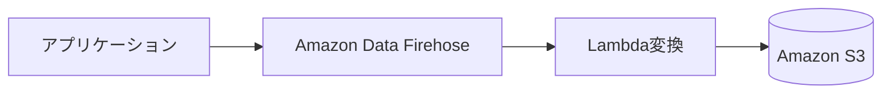

| メリット | デメリット |
|---------|----------|
| スケーリング自動 | 複雑な処理分岐不可 |
| バッファ・再試行込み | 超低レイテンシ不可 |
| 運用最小 | |

---

## ベタープラクティス: S3 + EventBridge + Glue

**キーワード**: ファイル単位処理、複雑ETL、準リアルタイム可

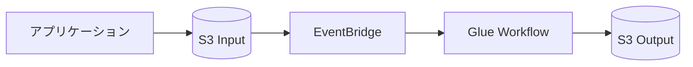

| メリット | デメリット |
|---------|----------|
| 変換自由度が高い | リアルタイム性不安定 |
| Glueに処理集約 | ログ生成側設定に依存 |

---

## ベタープラクティス: Kinesis Data Streams + Consumer

**キーワード**: 独自処理必須、厳密制御、運用増許容

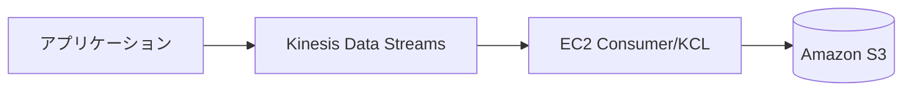

| メリット | デメリット |
|---------|----------|
| 処理自由度が最大 | 運用負荷が高い |
| 厳密な制御可能 | 試験では不利 |

---

# 2. PII検出・後続処理

## ベストプラクティス: Amazon Macie + EventBridge

**キーワード**: S3のPII検出、既存+新規データ、即時トリガー

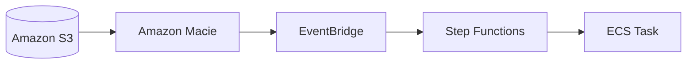

| メリット | デメリット |
|---------|----------|
| 検出ロジック不要 | マスク処理はしない |
| S3特化で高精度 | |

---

## ベタープラクティス: 取込時マスキング (Firehose + Lambda)

**キーワード**: 保存前マスク必須、rawデータ禁止

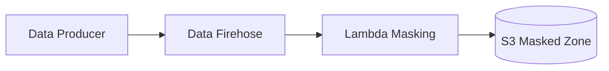

| メリット | デメリット |
|---------|----------|
| 下流が常に安全 | 実装・運用増 |
| | 既存データは別対応 |

---

# 3. Redshiftテスト環境（低稼働）

## ベストプラクティス: Data Sharing + Redshift Serverless

**キーワード**: 低稼働、ライブ共有、複製不要、最小コスト

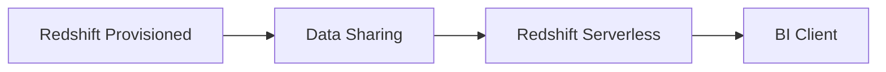

| メリット | デメリット |
|---------|----------|
| S3退避・再ロード不要 | Data Sharing前提条件あり |
| 実行分のみ課金 | 書き換え用途は不向き |

---

## ベタープラクティス: Data Sharing + 小規模Provisioned

**キーワード**: Serverless不可時の次善策

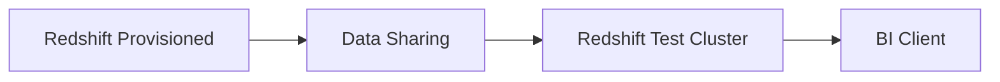

| メリット | デメリット |
|---------|----------|
| データ複製不要 | 低稼働でも固定費 |
| 環境分離 | 運用増 |

---

# 4. ネストJSON + Redshift結合

## ベストプラクティス: Redshift SUPER + PartiQL

**キーワード**: ネストJSON、既存スキーマ維持、高頻度クエリ

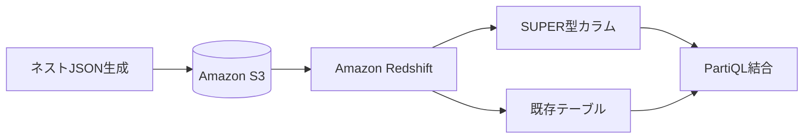

| メリット | デメリット |
|---------|----------|
| フラット化不要 | PartiQL習得コスト |
| Redshift内で完結 | 複雑クエリは設計注意 |

---

## ベタープラクティス: Spectrum + Athena

**キーワード**: S3にJSON保持、スキャン課金許容

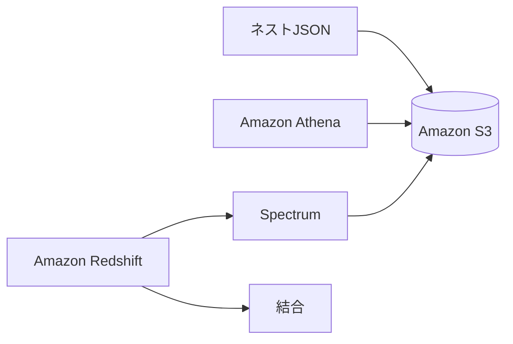

| メリット | デメリット |
|---------|----------|
| Redshift変更最小 | スキャン課金（高頻度不利） |
| ネスト扱いやすい | 設計複雑化 |

---

# 5. 全文検索（メタデータ+テキスト）

## ベストプラクティス: Amazon OpenSearch Service

**キーワード**: 全文検索、最もパフォーマンス最適化、インデックス

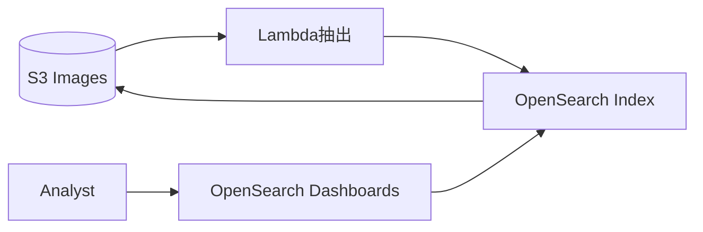

| メリット | デメリット |
|---------|----------|
| 全文検索に最適化 | クラスター運用必要 |
| 高速インデックス検索 | パイプライン構築必要 |

---

## ベタープラクティス: S3 + Athena

**キーワード**: SQL十分、サーバレス優先、性能最優先でない

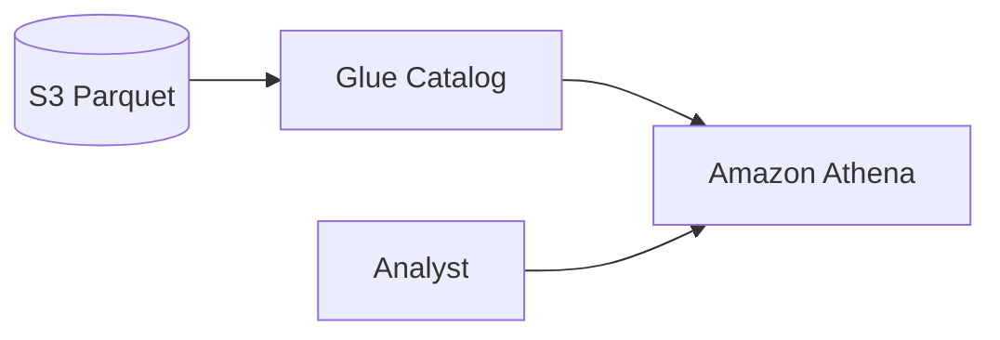

| メリット | デメリット |
|---------|----------|
| サーバレスで運用軽い | スキャン型で全文検索劣る |
| パイプライン単純 | 高頻度・低レイテンシ不向き |

---

# 6. メタデータ一元管理 + 細粒度アクセス制御

## ベストプラクティス: AWS Lake Formation

**キーワード**: 列・行・セルレベル制御、一元管理、最小運用

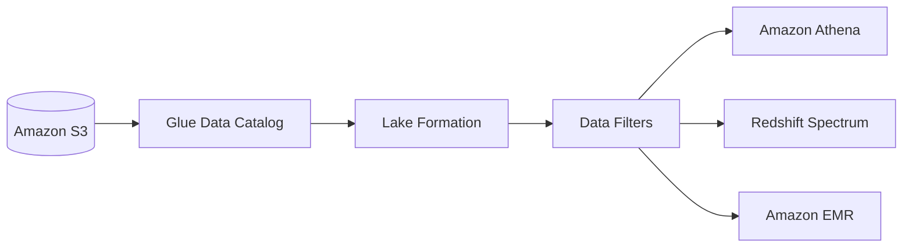

| メリット | デメリット |
|---------|----------|
| 列・行・セル単位制御 | 権限モデル理解必要 |
| フルマネージド | 移行設計必要 |

---

## ベタープラクティス: Glue Data Catalog + IAM

**キーワード**: テーブルレベルまで、Lake Formation不要

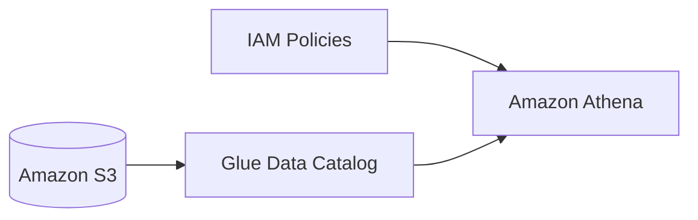

| メリット | デメリット |
|---------|----------|
| シンプル構成 | 列・行制御不可 |
| 既存Glue親和性高い | セキュリティ厳格時は不足 |

---

# 7. ETLオーケストレーション

## ベストプラクティス: Step Functions + EventBridge Scheduler

**キーワード**: サーバレス、定期実行、ワークフロー、最小運用

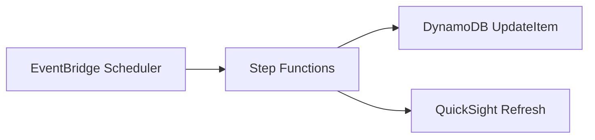

| メリット | デメリット |
|---------|----------|
| インフラ運用不要 | 複雑DAGには不向き |
| リトライ・分岐組込み | |

---

## ベタープラクティス: Amazon MWAA (Airflow)

**キーワード**: DAG複雑、既存Airflow資産、バックフィル必要

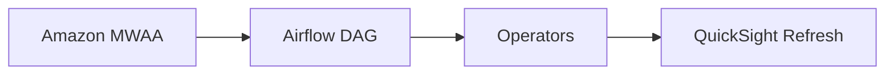

| メリット | デメリット |
|---------|----------|
| DAG表現力が高い | 環境運用発生 |
| UI運用（再実行・履歴）強い | 小規模には過剰 |

---

# 8. SQSからStep Functionsへ（フィルタ付き）

## ベストプラクティス: EventBridge Pipes

**キーワード**: SQS→Step Functions、フィルタ、コード不要

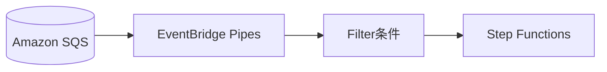

| メリット | デメリット |
|---------|----------|
| コード不要 | 複雑フィルタに限界 |
| 運用対象増えない | |

---

# 9. HDFS/Hive → AWS移行

## ベストプラクティス: S3 + Glue Data Catalog

**キーワード**: 耐久性、共通カタログ、移行労力最小

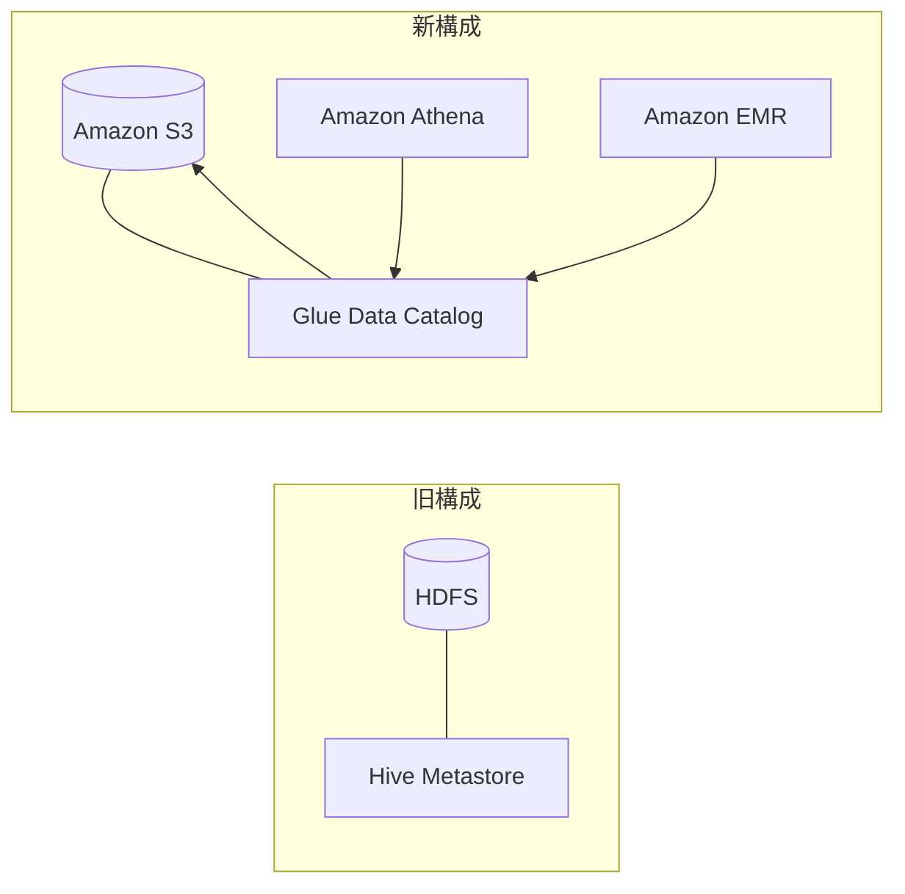

| 比較 | HDFS + Hive | S3 + Glue |
|------|-------------|-----------|
| 耐久性 | 低（削除で消える） | 極高 |
| コスト | 高（EC2必要） | 低 |
| 連携 | EMR内のみ | Athena/EMR/Redshift共有 |

---

# 10. 異種DWH → Redshift移行

## ベストプラクティス: AWS SCT + Glue Studio

**キーワード**: 異種DWH、スキーマ変換、大規模移行、最小労力

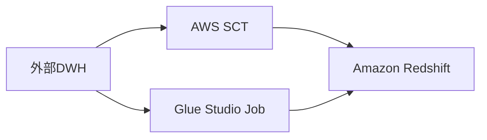

| メリット | デメリット |
|---------|----------|
| スキーマ自動変換 | 一部型は手動調整 |
| 移行工数最小化 | コネクタ対応範囲依存 |

---

# 11. EKSメトリクス・ログ一元可視化

## ベストプラクティス: Container Insights + CloudWatch Logs → Firehose → OpenSearch

**キーワード**: EKS詳細メトリクス、ログ低レイテンシ検索、マネージド中心

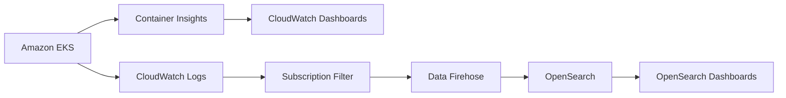

| メリット | デメリット |
|---------|----------|
| EKS詳細メトリクス標準収集 | インデックス設計必要 |
| ログをほぼリアルタイム検索 | ダッシュボード統合方針必要 |

---

# 12. IoT低レイテンシS3配信

## ベストプラクティス: Kinesis Data Streams + KCL

**キーワード**: S3到達レイテンシ最小、Firehoseバッファ制約回避

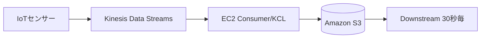

| メリット | デメリット |
|---------|----------|
| バッファ間隔を秒単位制御 | コンシューマ開発・運用 |
| 30秒要件に合わせやすい | 小オブジェクト増加 |

---

## ベタープラクティス: Kinesis Data Streams + Lambda

**キーワード**: 低レイテンシ + サーバレス寄せ

```mermaid
flowchart LR
  Sensors[IoTセンサー] --> KDS[Kinesis Data Streams]
  KDS --> Lambda[Lambda Consumer]
  Lambda --> S3[(Amazon S3)]
```

| メリット | デメリット |
|---------|----------|
| EC2なしで運用負荷低減 | 冪等性対策必要 |

---

# 13. プロトタイプ可視化（売上データ）

## ベストプラクティス: S3 + Glue Catalog + Athena + QuickSight

**キーワード**: プロトタイプ、最小運用、将来スケール、サーバレス

```mermaid
flowchart LR
  Sources[複数データソース] --> S3[(Amazon S3)]
  S3 --> Catalog[Glue Data Catalog]
  Athena[Amazon Athena] --> Catalog
  QS[Amazon QuickSight] --> Athena
  Athena --> S3
```

| メリット | デメリット |
|---------|----------|
| 全体サーバレス | 重いダッシュボードは性能設計必要 |
| プロトタイプ→本番拡張容易 | スキーマ管理必要 |

---

# 14. Lake Formation監査レポート

## ベストプラクティス: CloudTrail + Athena + QuickSight

**キーワード**: Lake Formationイベント全捕捉、SQL分析、QuickSight可視化

```mermaid
flowchart LR
  LF[Lake Formation] --> CT[CloudTrail]
  CT --> S3[(S3 CloudTrail Logs)]
  S3 --> Athena[Amazon Athena]
  Athena --> QS[Amazon QuickSight]
```

| メリット | デメリット |
|---------|----------|
| 全操作を継続捕捉 | ログ量増加可能性 |
| サーバレス分析 | パーティション設計必要 |

※ CloudTrail Lake は QuickSight非対応

---

# 判断フローまとめ

| 要件キーワード | 選択サービス |
|--------------|-------------|
| ほぼリアルタイム + 最小運用 + S3 | Data Firehose |
| 全文検索 + 最適パフォーマンス | OpenSearch |
| 列・行・セル制御 | Lake Formation |
| 大量パーティション + インデックス | catalogPartitionPredicate |
| サーバレス + 定期実行 + ワークフロー | Step Functions + EventBridge |
| DAG複雑 + Airflow資産 | MWAA |
| SQS → Step Functions + フィルタ | EventBridge Pipes |
| PB級 + コスト削減 + 検索 | OpenSearch UltraWarm |
| 低稼働テスト環境 + ライブ共有 | Data Sharing + Redshift Serverless |
| 大容量ログ + コスト効率 | S3 Parquet + Athena |
