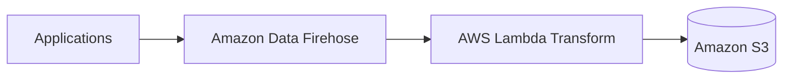
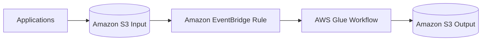
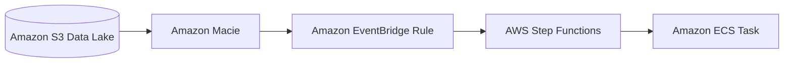
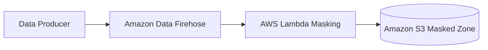
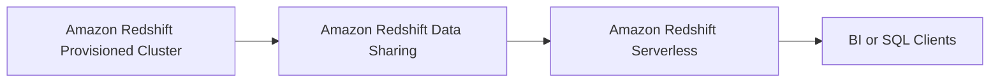
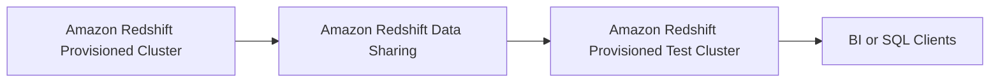
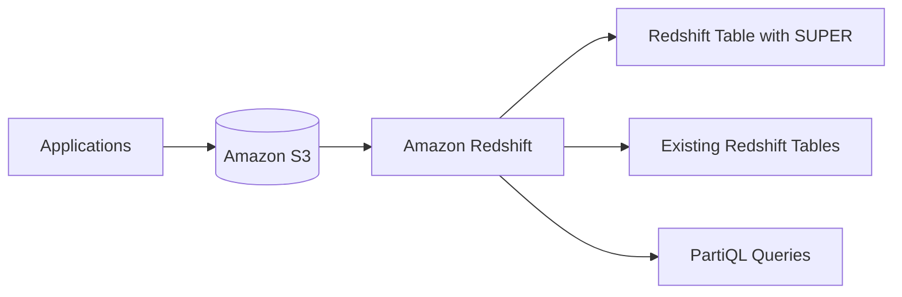
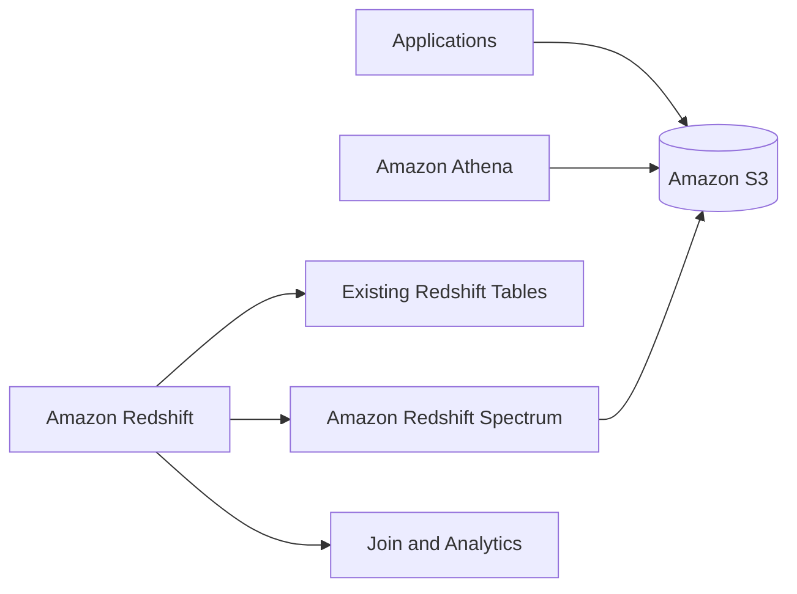
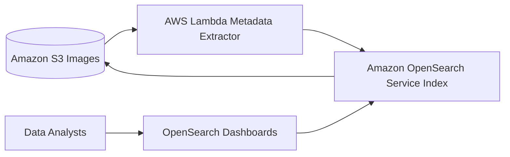
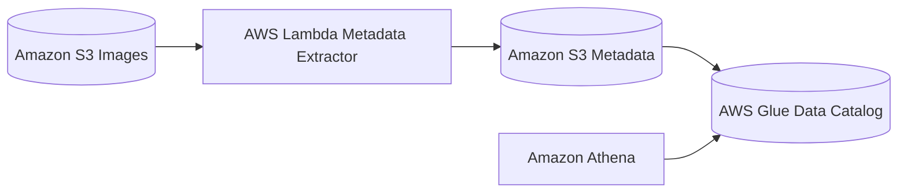

# 変動するログ量を、ほぼリアルタイムで S3 に集約し、形式変換したい

## ベストプラクティス: Amazon Data Firehose + Lambda 変換
- メリット: 自動スケール、バッファ/再試行込み、運用最小、S3直結
- デメリット: 複雑分岐や超低レイテンシには不向き

## ベタープラクティス: S3 + EventBridge + Glue Workflow（ファイル起点バッチ）
- メリット: 複雑ETLに強い、処理設計の自由度が高い
- デメリット: リアルタイム性が不安定、ログローテ依存

---

# S3データレイク内のデータから PII を特定し、検出時に後続処理を起動したい

## ベストプラクティス: Amazon Macie + EventBridge + Step Functions
- メリット: PII検出ロジック不要、検出→後続処理がイベント駆動で完結
- デメリット: 非同期前提、検出精度は設定とチューニング依存

## ベタープラクティス: Firehose + Lambda マスキング（保存前に防止）
- メリット: rawを残さず下流が安全
- デメリット: 既存データは別対応、実装と運用が増える

---

# メインの Amazon Redshift のデータを使って、2週間ごとに2時間だけ別テスト環境で分析したい

## ベストプラクティス: Redshift Data Sharing + Redshift Serverless
- メリット: 複製不要、従量課金、常に最新データ
- デメリット: Data Sharing前提の制約あり、テスト側は参照中心

## ベタープラクティス: Data Sharing + 小さめのプロビジョンドクラスター
- メリット: 複製不要、環境分離が明確
- デメリット: 固定費が発生、運用負荷が増える

---

# ネストされた JSON を既存 Redshift データと高頻度に結合してクエリしたい

## ベストプラクティス: Redshift SUPER + PartiQL
- メリット: 既存スキーマ維持、Redshift内で結合/分析が完結
- デメリット: クエリ記法の学習が必要、複雑クエリは性能調整が必要

## ベタープラクティス: Redshift Spectrum + Athena（S3外部参照）
- メリット: S3のネストJSONをそのまま扱える
- デメリット: スキャン課金の影響、頻繁クエリでは不利

---

# スキャン済み文書から抽出メタデータで氏名・日付・本文検索を高速化したい

## ベストプラクティス: OpenSearch Service で全文検索インデックス
- メリット: 全文検索/スコアリング最適、検索性能最優先
- デメリット: インデックス運用と容量設計が必要

## ベタープラクティス: Athena + Glue Catalog（SQL検索でコスト優先）
- メリット: 低運用でSQL検索が可能
- デメリット: 全文検索に弱く、速度はOpenSearchに劣る

