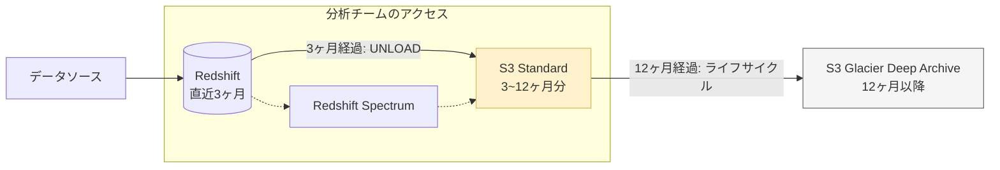
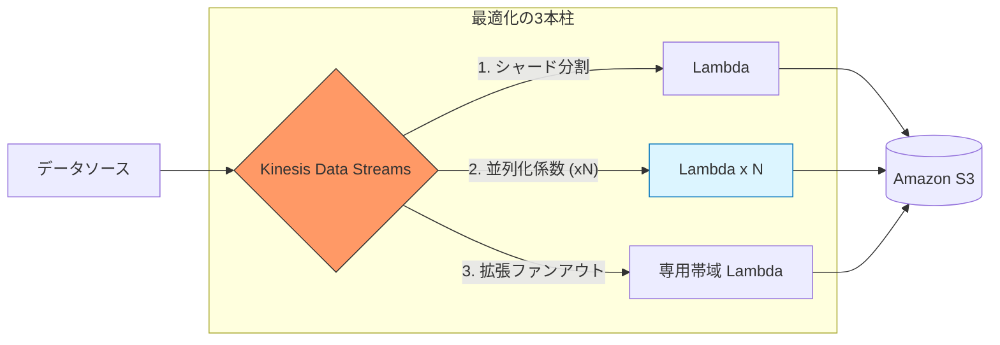

## SQSキューからメッセージを削除できるのは

- DeleteMessage API
- maxReceiveCount がメッセージの最大受信回数に達した
- キューがパージされる

可視性タイムアウトが切れたメッセージ削除ではなく、Amazon SQS がメッセージ受信後にコンシューマーがメッセージを受信または処理できないことを保証する期間を意味します

## Redshift spectrum でS3のデータをクエリできる

通常のデータはRedshiftクラスタにロードする必要がある

### Redshift vs Redshift Spectrum

たまにしか行わないクエリやはRedshift Spectrumを使う

| 項目           | Redshift           | Redshift Spectrum    |
| -------------- | ------------------ | -------------------- |
| データ保存場所 | Redshiftクラスタ内 | S3                   |
| パフォーマンス | 高速               | ロード遅い、JOIN遅い |
| コスト         | 定額               | 従量課金             |
| 運用           | クラスタ管理が必要 | 管理不要             |

## Lambda　Kinesis Data Streamsの同時実行数

iteratorAgeMilliseconds: Kinesis Data Streamsからデータを取得してからLambda関数がそのデータを処理するまでの時間

「Lambda側の設定（同時実行数）」をいじるのではなく、**「Kinesisからいかに効率よくデータを引き出すか」**がポイントになります。

---

### タスク：Kinesis + Lambda のスループット最適化

| 制約・状況                   | ベストプラクティス                               | 理由（試験での急所）                                       |
| ---------------------------- | ------------------------------------------------ | ---------------------------------------------------------- |
| **全体の流量が限界**         | **シャード数を増やす**                           | 1シャード＝1Lambdaが基本。入り口を広げて並列度を上げる。   |
| **1シャード内での渋滞**      | **並列化係数 (Parallelization Factor) を上げる** | 1シャードを最大10個のLambdaで同時処理できる。              |
| **読み取り制限 (429エラー)** | **拡張ファンアウト (Enhanced Fan-out)**          | コンシューマー専用の2MB/秒帯域を確保し、他と競合させない。 |

---

### 最適化につながる要素（各1行まとめ）

- **シャードの増加**: 物理的な入り口を増やし、Lambda の同時起動数を増やす。
- **並列化係数**: 1シャード内のデータを細分化し、複数の Lambda で同時並行処理する。
- **拡張ファンアウト**: HTTP/2 を使い、各 Lambda 専用のスループット帯域を割り当てる。
- **バッチサイズ**: 1回の Lambda 起動で処理するレコード数を増やし、起動オーバーヘッドを減らす。
- **バッチウィンドウ**: データが溜まるまで待つ時間を調整し、処理効率を最大化する。

書き込み(1MB)が足りない → シャードを増やす、または書き込み方を効率化（KPL）する。

読み出し(2MB)が足りない → 拡張ファンアウトや並列化係数を使う。

---

### 処理フローと改善ポイントの可視化

### 試験対策：間違いの共通点

選択肢 E, F のような「Lambda 本体の同時実行数」の設定変更が不正解になる理由は、KDS 連携において Lambda の起動数は**「シャード数 × 並列化係数」で自動的に決まる**からです。呼び出し側の KDS の設定を調整しない限り、Lambda 側の枠だけ広げても意味がありません。

## Amazon AppFlow

SaaSアプリケーションからAWSサービスへデータを転送するマネージドサービス

## Glue メトリクス

コンソールで確認できる

ジョブ実行モニタリングセクションで
プロファイリングされたメトリクスを確認できる

ビジュアル抽出、変換、ロード (ETL) セクションはジョブの作成とカスタマイズができる

## Redshift COPY 時の暗号化

SSE-KMSをサポート

SSE-Cはサポートしていない

## Hiveとは

Hadoop上で動作しデータをHiveQLで操作できるデータウェアハウスソフトウェア
Athenaの先祖みたいなもの

AthenaはS3、HiveはHadoop HDFS上のデータを扱う
