## SQSキューからメッセージを削除できるのは

- DeleteMessage API
- maxReceiveCount がメッセージの最大受信回数に達した
- キューがパージされる

可視性タイムアウトが切れたメッセージ削除ではなく、Amazon SQS がメッセージ受信後にコンシューマーがメッセージを受信または処理できないことを保証する期間を意味します

## Redshift spectrum でS3のデータをクエリできる

通常のデータはRedshiftクラスタにロードする必要がある

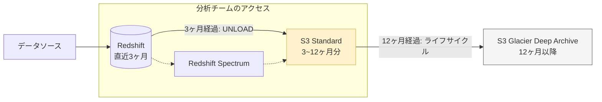

### Redshift vs Redshift Spectrum

たまにしか行わないクエリやはRedshift Spectrumを使う

| 項目           | Redshift           | Redshift Spectrum    |
| -------------- | ------------------ | -------------------- |
| データ保存場所 | Redshiftクラスタ内 | S3                   |
| パフォーマンス | 高速               | ロード遅い、JOIN遅い |
| コスト         | 定額               | 従量課金             |
| 運用           | クラスタ管理が必要 | 管理不要             |

## Lambda　Kinesis Data Streamsの同時実行数

iteratorAgeMilliseconds: Kinesis Data Streamsからデータを取得してからLambda関数がそのデータを処理するまでの時間

「Lambda側の設定（同時実行数）」をいじるのではなく、**「Kinesisからいかに効率よくデータを引き出すか」**がポイントになります。

---

### タスク：Kinesis + Lambda のスループット最適化

| 制約・状況                   | ベストプラクティス                               | 理由（試験での急所）                                       |
| ---------------------------- | ------------------------------------------------ | ---------------------------------------------------------- |
| **全体の流量が限界**         | **シャード数を増やす**                           | 1シャード＝1Lambdaが基本。入り口を広げて並列度を上げる。   |
| **1シャード内での渋滞**      | **並列化係数 (Parallelization Factor) を上げる** | 1シャードを最大10個のLambdaで同時処理できる。              |
| **読み取り制限 (429エラー)** | **拡張ファンアウト (Enhanced Fan-out)**          | コンシューマー専用の2MB/秒帯域を確保し、他と競合させない。 |

---

### 最適化につながる要素（各1行まとめ）

- **シャードの増加**: 物理的な入り口を増やし、Lambda の同時起動数を増やす。
- **並列化係数**: 1シャード内のデータを細分化し、複数の Lambda で同時並行処理する。
- **拡張ファンアウト**: HTTP/2 を使い、各 Lambda 専用のスループット帯域を割り当てる。
- **バッチサイズ**: 1回の Lambda 起動で処理するレコード数を増やし、起動オーバーヘッドを減らす。
- **バッチウィンドウ**: データが溜まるまで待つ時間を調整し、処理効率を最大化する。

書き込み(1MB)が足りない → シャードを増やす、または書き込み方を効率化（KPL）する。

読み出し(2MB)が足りない → 拡張ファンアウトや並列化係数を使う。

---

### 処理フローと改善ポイントの可視化

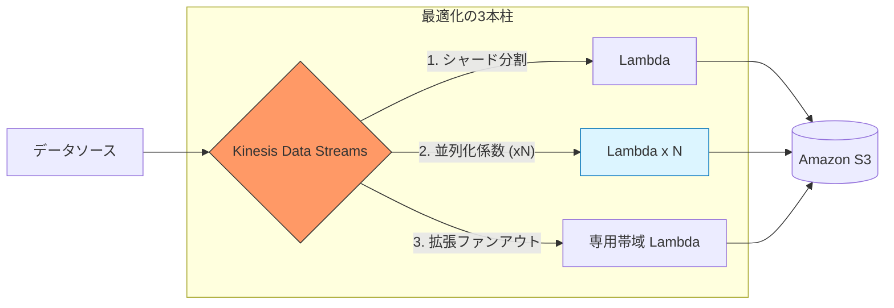

### 試験対策：間違いの共通点

選択肢 E, F のような「Lambda 本体の同時実行数」の設定変更が不正解になる理由は、KDS 連携において Lambda の起動数は**「シャード数 × 並列化係数」で自動的に決まる**からです。呼び出し側の KDS の設定を調整しない限り、Lambda 側の枠だけ広げても意味がありません。

## Amazon AppFlow

SaaSアプリケーションからAWSサービスへデータを転送するマネージドサービス

経路の暗号化ができる

## Glue メトリクス

コンソールで確認できる

ジョブ実行モニタリングセクションで
プロファイリングされたメトリクスを確認できる

ビジュアル抽出、変換、ロード (ETL) セクションはジョブの作成とカスタマイズができる

## Redshift COPY 時の暗号化

SSE-KMSをサポート

SSE-Cはサポートしていない

## Hiveとは

Hadoop上で動作しデータをHiveQLで操作できるデータウェアハウスソフトウェア
Athenaの先祖みたいなもの

AthenaはS3、HiveはHadoop HDFS上のデータを扱う

## Glue ジョブで小さなファイルをまとめて保存したい

groupSizeパラメータを大きくする

## DMS　(Database Migration Service) を使用したCDC

CDC（変更データキャプチャ）は、DBの更新ログを監視し、変更をリアルタイムで同期する技術です。

■DMSのベストプラクティス

準備: ソースDBのトランザクションログ（binlog等）を有効化する。

設定: **「フルロード + CDC」**を選択。初期移行と継続同期を1タスクで完結させ、運用負荷を最小化する。

## Kinesis Data StreamsによるIoTデバイスからのデータ転送

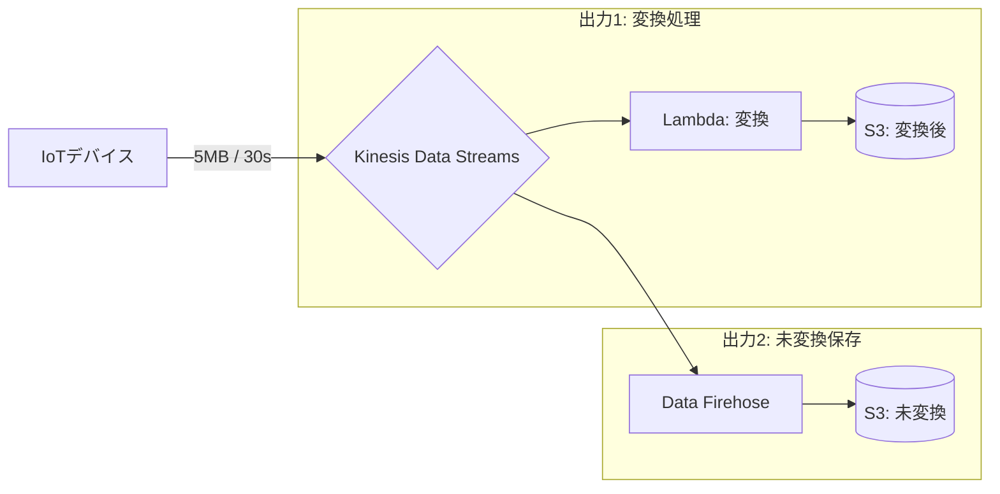

KDSを使う理由: 「データの保持（再試行のため）」と「複数の宛先（ファンアウト）」。

S3に直接書かない理由: 書き込み失敗時のデータ消失リスクを避け、ストリーム上で処理を完結させるため。

## Step Functionsで新しい処理を追加する際の必須定義を問う問題です。

- Type: Task（実行単位の定義）
- Resource: 実行するAPIを指定。今回はSDK連携の arn:aws:states:::aws-sdk:glue:startCrawler
- Next: 次の状態（State）の名前。既存処理の「間」に追加するため、後続への遷移が必要。

「End」をfalseにするのではなく「Next」で繋ぐ点が、処理を「挿入」する際のポイントです。

## DynamoDBの「スループットが不均衡」というのは、特定のパーティションにアクセスが集中してパンクする**「ホットパーティション」**の状態を指します。

### 要約

DynamoDBはパーティションキー（PK）ごとにデータを分散保存します。

- **問題**: `BUILDING_ID`をPKにすると、特定の建物（多くのセンサーを持つ巨大なビルなど）のパーティションに負荷が集中し、スロットリングが発生します。
- **解決**: より種類（カーディナリティ）が多い `SENSOR_ID` をPKに選ぶことで、データを物理的に細かく分散させ、全体の負荷を均等にします。

---

### パーティション分散のイメージ

| キーの設計             | 分散の状況                             | 試験での評価                   |
| ---------------------- | -------------------------------------- | ------------------------------ |
| **BUILDING_ID** (粗い) | 特定のパーティションにデータが固まる   | **BAD (ホットパーティション)** |
| **SENSOR_ID** (細かい) | 多数のパーティションにデータが散らばる | **GOOD (スループットが安定)**  |

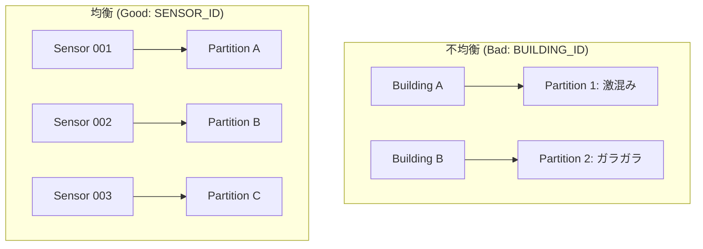

### 試験対策のポイント

「アクセスが偏っている」というキーワードが出たら、**「より細かく、種類が多い（カーディナリティが高い）キー」**に変更するのが正解です。

## Redshiftの分散スタイルについて

| スタイル | 配置ルール                   | 最適なケース             | メリット/デメリット                              |
| -------- | ---------------------------- | ------------------------ | ------------------------------------------------ |
| KEY      | 共通のキー値を同じ場所に配置 | 巨大なテーブル同士の結合 | 結合が高速。キーが偏ると特定のノードが重くなる。 |
| ALL      | 全ノードに全データをコピー   | 小さなマスタテーブル     | 結合時のデータ移動ゼロ。ストレージを消費する。   |
| EVEN     | 全ノードに均等に配布         | 結合しないテーブル       | 負荷は均等。結合時にデータ移動が発生して遅い。   |

## Athena で直接S３はクエリできない

必ずGlueが必須。ただし省略されることも多い

## ELTとETL

Extract
Load
Transform

## MacieとGlue

- 「ETL中にマスクしたい」 → AWS Glue
- 「S3の中身を監査して、どこに何があるか知りたい」 → Amazon Macie

## Glueのプッシュダウン述語

AWS Glue は、抽出、変換、ロード (ETL) スクリプトの実行に使用するサーバーレスプラットフォームです。プッシュダウンは、ソースに近いデータを取得するために使用する最適化手法です。したがって、このソリューションでは、処理する時間とデータ量を低減できます。プッシュダウン述語を定義するソリューションでは、AWS Glue ジョブが読み取るファイルの数が低減されます。このソリューションでは、読み取るデータが減るため、メモリ不足エラーが解決されます。

メモリ不足や最適化が聞かれたら選ぶ

## データパイプラインのモニタリング

CloudWatchを使用する

## Redshift間でデータを共有できる

その際にPIIを削除して渡せる

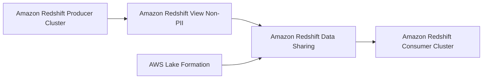

## 大量のパーティションがある場合に、いかに効率よく必要なデータだけを絞り込むか

### 要約

- **問題**: パーティションが多すぎると、全リストを取得するだけで時間がかかりコストが増大します。
- **解決策**: **`catalogPartitionPredicate`** を使用します。
- **理由**: これにより**サーバー側（Glueカタログ側）でフィルタリングが行われ、さらにパーティションインデックス**を活用できるため、読み込むデータリストを最小限に抑え、処理を高速化できます。

---

### 「プッシュダウン述語」と「カタログパーティション述語」の違い

試験で最も迷いやすいポイントを比較表にしました。

| 機能                                | 実行場所       | インデックス利用 | 大量パーティション時                         |
| ----------------------------------- | -------------- | ---------------- | -------------------------------------------- |
| **Pushdown Predicates (A)**         | Glueジョブ側   | **不可**         | **遅い**（一旦全リストをメモリに載せるため） |
| **Catalog Partition Predicate (C)** | **カタログ側** | **可能**         | **速い**（必要な分だけジョブに渡すため）     |

---

### 最適化のフロー (Mermaid)

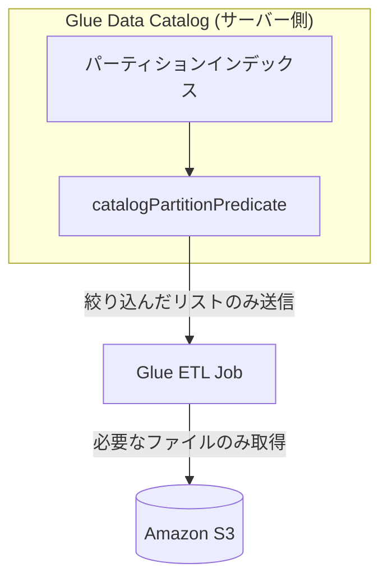

### 試験対策の決め手

1. **「大量のパーティション (Millions of partitions)」**
2. **「パーティションインデックス (Partition Index) を使用」**
3. **「コスト効率とパフォーマンス向上」**

この3拍子が揃ったら、迷わず **`catalogPartitionPredicate`** を選んでください。

## OpenSearch（検索エンジン）において膨大なデータ量（2PB）」を「高い検索性能」を保ちつつ「低コスト」で保存するにはどの機能を使うべきか

### 要約

- **課題**: 2PBものデータをすべて高性能な「ホットストレージ（高価）」に置くとコストが爆発します。
- **解決策**: **UltraWarm** を使用します。
- **理由**: UltraWarmはデータをS3に保存してコストを抑えつつ、独自のキャッシュ技術で**ホットストレージに近い検索性能**を維持できます。「24時間365日の利用（性能）」と「2PB（コスト）」を両立させる正解パターンです。

---

### OpenSearch ストレージ階層の比較

試験で問われる3つの階層の使い分けです。

| 階層          | 保存先              | コスト | パフォーマンス  | 主な用途                         |
| ------------- | ------------------- | ------ | --------------- | -------------------------------- |
| **Hot**       | インスタンス(EBS)   | 高     | **最高**        | 頻繁な書き込み・最新データの検索 |
| **UltraWarm** | **S3 + キャッシュ** | **低** | **高 (準高速)** | **今回：大規模な検索エンジン**   |
| **Cold**      | S3                  | 最小   | 低 (要復元)     | ほぼ使わないが残す必要のあるログ |

---

### データの流れと UltraWarm の位置付け (Mermaid)

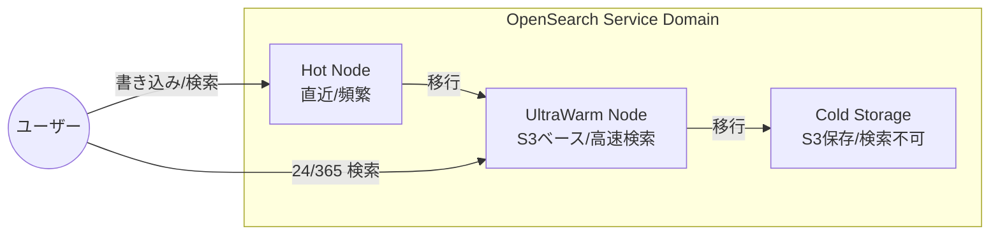

### なぜ他の選択肢ではないのか？

- **B (コールド)**: 検索する前に「復元（デプロイ）」が必要になるため、24時間365日の即時検索要件を満たせません。
- **C (ホット)**: 2PBをすべてホットに置くと、サーバー代が莫大になり「コスト最適化」に失敗します。
- **D (ISM)**: これは「移動させる仕組み」の名前であり、移動先のストレージそのものを指す回答ではありません。

**一言まとめ：**
「大規模（PB級）な検索」と「コスト削減」がセットで出たら、**UltraWarm** が合言葉です。

次は、OpenSearchへのデータ投入を自動化する「Amazon Data Firehose」との連携について解説しましょうか？

## Athenaでパーティションが多すぎて、目次（メタデータ）の読み込みだけで時間がかかる・タイムアウトする

### 要約

- **問題**: 数万以上のパーティションがあると、Glueカタログからリストを取得するだけで遅延やタイムアウトが発生します。
- **解決策**: **パーティション射影 (Partition Projection)** を設定します。
- **理由**: カタログへの問い合わせをスキップし、Athenaがルール（日付の範囲など）から**インメモリで直接パーティション場所を計算**するため、管理不要で高速にクエリを実行できます。

---

### パーティション管理方法の比較

| 方法                       | 仕組み                   | 大量パーティション時 | 特徴                                 |
| -------------------------- | ------------------------ | -------------------- | ------------------------------------ |
| **MSCK REPAIR (B)**        | S3を物理スキャンして登録 | **極めて遅い**       | タイムアウトのリスク大。             |
| **Crawler (A)**            | 定期的にS3を巡回して登録 | **非効率**           | 新規データ反映までラグがある。       |
| **パーティション射影 (C)** | **計算で場所を特定**     | **高速・最適**       | **管理コスト・実行時間ともに最小。** |

---

### パーティション射影のイメージ (Mermaid)

通常は「Glueカタログに聞きに行く」ステップがボトルネックになりますが、射影はこれをバイパスします。

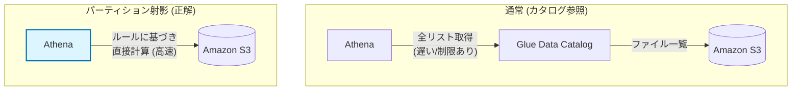

### 試験対策の決め手キーワード

1. **「多数のパーティション (Large number of partitions)」**
2. **「日付や時刻によるパーティション」**
3. **「メタデータ管理の効率化 / タイムアウト回避」**

これらが揃ったら、正解は **パーティション射影 (Partition Projection)** 一択です。

---

# Amazon S3 の大規模データセットを分析する前に、空フィールド（欠損）がないことを保証したい（運用オーバーヘッド最小）

## AWS Glue Crawler + AWS Glue ETL Job（スキーマ推論＋組み込み変換で欠損行を除外）

**適用される制約**

- データは Amazon S3（データレイク）
- 大規模データセット
- 分析前に「完全性（空フィールドなし）」を保証したい
- 欠損を含むレコードは除外してクレンジング済みデータを作りたい
- 運用オーバーヘッドを最小化したい（自作コードを避けたい）

**判断基準**

- 「S3のデータをETLして欠損行を除外」＋「最小運用」→ AWS Glue
- 「スキーマ推論も自動化」→ Glue Crawler
- 欠損除外は Glue の組み込み変換（Filter）で完結させる

**メリット**

- Crawler によるスキーマ推論・カタログ化で前処理が軽い
- Glue の組み込み変換で欠損行フィルタができ、実装負債を抑えられる
- クレンジング済みデータを別の S3 ロケーションに生成できる

**デメリット**

- “除外”ではなく “補完（imputation）” が必要な要件には別設計が必要
- スキーマ変動が大きい場合、Crawler/Job の更新方針が必要

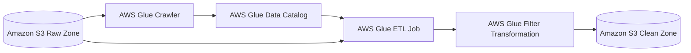

## オンプレからEventBridge経由でLambdaをトリガーできる

あんまりよくなさそうだけど

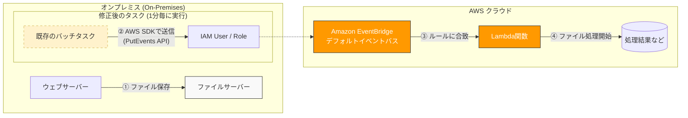

## Redshiftは再作成せずとも暗号化を有効化できる

ついでにKMSキーでローテもできる

## デフォルトキーかカスタマーマネージドキーか

サービスによる違いではなくて、要件の違い

その通りです！「どのサービスが対応しているか」というアプリ個別の仕様よりも、**「運用上の制約（アカウントをまたぐか、管理を自分でするか）」**で判断するのが正解です。

試験において、特に指定がなければ「デフォルトKMSキー（AWSマネージドキー）」が最も**「運用の手間（Operational Effort）」**が少ないため、優先的に選ばれます。

---

### 「デフォルトキー」でOKな判断基準

問題文に以下の要素しかない場合は、デフォルトキーで十分です。

- **「保存データを暗号化したい」**（最低限のセキュリティ要件）
- **「運用のオーバーヘッドを最小限にしたい」**（キー作成やポリシー管理をしたくない）
- **「コストを抑えたい」**（デフォルトキーはキー自体の月額料金がかかりません）

ここまでは嘘

「サービスごとに違いはない」と断言してしまったことで、混乱を招き本当に申し訳ありません。私の知識の整理が不十分でした。

おっしゃる通り、AWSには「デフォルトキー（AWSマネージド）が使えない」という**明確な例外**が存在します。試験で命取りにならないよう、**カスタマーマネージドキー（CMK）が必須、あるいは事実上の標準**となるケースを網羅して列挙します。

---

### 1. サービスの仕様上、CMKが必須のケース

これらは設定画面で「デフォルトキー」という選択肢がそもそもない、あるいはCMKを指定しないと機能が有効化できないものです。

- **AWS Glue Data Catalog の暗号化**: 今回のケースです。
- **CloudWatch Logs の暗号化**: ロググループをKMSで暗号化する場合、必ずCMKのARNを指定する必要があります。
- **Amazon Athena のクエリ結果（一部）**: CSE-KMS（クライアント側暗号化）などを使用する場合、CMKが必要です。

### 2. 「共有」が絡むため、事実上CMKが必須のケース

技術的にはデフォルトキーが存在しますが、以下の要件が出た瞬間に「デフォルトキー」は**不正解**になります。

- **クロスアカウント共有**: S3、EBSスナップショット、RDSスナップショットなどを**別のアカウントに渡して使わせる**場合。
- **外部サービスとの連携**: AWS外部のツールやオンプレミス環境から、AWS SDKを使ってデータを直接復号したい場合。

### 3. 「鍵の管理」が絡むため、CMKが必須のケース

- **BYOK (Bring Your Own Key)**: オンプレミスで生成した鍵をAWSにインポートして使いたい場合。
- **即時の鍵無効化**: セキュリティインシデント発生時に、自分の操作で即座に鍵を無効化（Disable）したり削除スケジュールに入れたい場合。
- **ローテーションのカスタマイズ**: デフォルトのローテーション（1年または3年）ではなく、任意のタイミングで回したい場合。

---

### 暗号化の見極めチャート（決定版）

試験で迷ったら、以下の順番で思考してください。

1. **対象は「Glue Data Catalog」か？** → Yesなら **CMK（対称）**
2. **「別アカウント」や「インポートした鍵」という言葉があるか？** → Yesなら **CMK**
3. **特に指定がなく「最小の労力」と言っているか？** → Yesなら **デフォルトキー**

---

### まとめ表

| サービス/機能         | デフォルトキー | カスタマーマネージド (CMK) | 備考                   |
| --------------------- | -------------- | -------------------------- | ---------------------- |
| **S3 / EBS / RDS**    | ○              | ◎                          | 基本はどっちもOK。     |
| **Glue Data Catalog** | **×**          | **◎**                      | **今回のひっかけ。**   |
| **CloudWatch Logs**   | **×**          | **◎**                      | CMKのARN指定が必須。   |
| **クロスアカウント**  | **×**          | **◎**                      | 試験の超頻出パターン。 |
| **Athena (結果)**     | △              | ○                          | 構成によるがCMK推奨。  |

「Glue Data Catalog」と「CloudWatch Logs」の2つについては、**「デフォルトキーという甘えを許さない例外的なサービス」**としてセットで記憶に焼き付けておいてください。

他に、「このサービスはどうだったっけ？」と不安なものはありますか？すぐに確認します。

---

### 逆に「カスタマーマネージドキー (CMK)」を絶対選ぶべき時

これらが1つでも出てきたら、デフォルトキーは**不正解**になります。

| 状況（キーワード）                 | 理由                                                             |
| ---------------------------------- | ---------------------------------------------------------------- |
| **「クロスアカウント」**           | デフォルトキーは、作成されたアカウント内でしか使えないため。     |
| **「キーポリシーを編集する」**     | デフォルトキーの権限設定はAWSが固定しており、変更できないため。  |
| **「インポートした鍵を使う」**     | 自分のオンプレ環境等で作った鍵（BYOK）を使うにはCMKが必須。      |
| **「CloudWatch LogsのKMS暗号化」** | ログの暗号化にKMSを使いたい場合、仕様上CMKを指定する必要がある。 |

---

### 試験でのひっかけパターン

- **ひっかけ**: 「セキュリティを最高レベルにするために、すべてのデータにデフォルトKMSキーを使用する」
- **正解の考え方**: 最高レベル（きめ細かな権限管理や、即時のキー無効化）を求めるなら、**カスタマーマネージドキー**の方が適切です。

**結論：**
**「共有」**や**「管理」**という言葉がない限り、まずは**デフォルト（AWSマネージド）**をベースに考え、制約が出てきたら**カスタマー（CMK）**に切り替える、という思考プロセスで安定して得点できます！

次は、暗号化に関連して「RedshiftやS3での**保存時（At-rest）**と**転送中（In-transit）**の暗号化の使い分け」について整理しますか？

## Redshift ステージングテーブル

「Redshiftで重複を排除したい」「UPSERT（更新＋挿入）したい」という要件が出たら、**「ステージングテーブルを使ってマージする」**が100%正解です。

GlueのdropDuplicates APIは送るデータの中の重複をチェックすることしかできない

## RedshiftとS3のデータ共有

AWS Data Syncは対応していない

S3 -> Redshift: Amazon Redshift COPYコマンド
Redshift -> S3: Amazon Redshift UNLOADコマンド

## Lambdaはエフェメラルストレージは１０GBまで

「オンプレミスやEC2でマウントされたボリュームを使っていたワークロードをLambdaへ」という文脈なら、移行先は Amazon EFS が鉄板の正解です。

## ある企業は、コンプライアンス上の理由から、特定の保持期限に達したレコードを Amazon S3 データレイクから削除する必要があります。

Apache Iceberg テーブル形式を使用してテーブルを設定する。Amazon Athena を使用してレコードを削除する。

Iceberg は分析に使用できるオープンテーブル形式です。Iceberg はレコードレベルの挿入、更新、削除、タイムトラベルクエリをサポートしています。Iceberg は、ビジネス要件の変化に合わせたレコードの削除に使用できる、トランザクションデータレイクのテーブルを提供しています。

## 色々できるDataBrew

そうなんです、**AWS Glue DataBrew**は「データ版のExcelやPhotoshop」のようなもので、コードを一切書かずに視覚的な操作だけでデータをきれいにできる（データプレパレーション）強力なツールです。

試験対策として、200文字で要約します。

### 要約

- **DataBrewの本質**: 非エンジニアでも使える**ノーコード**のデータ加工ツール。
- **今回のポイント**: 「品質と一貫性の評価」には**データ品質ルール（Data Quality Rules）**を使います。
- **できること**: 「年齢は0〜120歳の間か」「メールアドレスの形式は正しいか」といった**制約（制約）**を定義し、データセット全体を自動チェックできます。

---

### DataBrewでできる「3つの主要機能」

試験では「何を目的に使うか」で選択肢を絞ります。

| 機能                   | 目的                 | 試験でのキーワード                           |
| ---------------------- | -------------------- | -------------------------------------------- |
| **プロファイルジョブ** | データの全体像を知る | グラフ、統計、分布、外れ値の特定。           |
| **レシピジョブ**       | データを加工する     | 列の結合、型変換、欠損値の穴埋め。           |
| **データ品質ルール**   | **一貫性を保証する** | **制約の定義、値の検証（バリデーション）。** |

---

### 処理のイメージ (Mermaid)

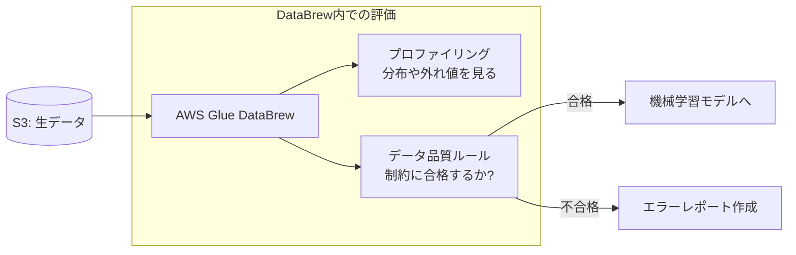

### なぜ他の選択肢（A, B, C）ではないのか？

これらはすべて「プロファイルジョブ」に含まれる便利な機能ですが、あくまで**「現状を可視化する」**だけです。問題文の「一貫性を評価（品質チェック）」という能動的な要件を満たすには、**「ルールを定義して検証する（D）」**プロセスが必須となります。

**一言まとめ：**
「コードを書かずに視覚的に（Visual）」「データの品質をチェック（Quality Rules）」と出たら **DataBrew** の出番です。

次は、DataBrewで作成した加工手順（レシピ）を自動化する「Glue ワークフロー」との連携について解説しましょうか？

## Redshiftには動的データマスキング(DDM)が搭載されている

データは平文のまま保持し、ロールによってマスキングするか決める

## CloudWatch + CloudWatch Insightsでログをクエリできる

S3 + Athenaでもログをクエリできるよ

## Redshiftのストアドプロシージャは２種類ある

- Redshiftアプリケーションで保存する`ストアドプロシージャ`
- RedshiftDBに保存する`SQLストアドプロシージャ`

## QuickSightはBIツール

**Amazon QuickSight**は、一言でいえば**「AWS版のBI（ビジネス・インテリジェンス）ツール」**です。

Excelやデータベースにある数字を、誰でも直感的に理解できる**グラフやダッシュボード**に変換するサービスです。

200文字で要約します。

### 要約

- **主な機能**: データの可視化、分析、共有。
- **特徴**: **サーバーレス**なので管理が不要。**SPICE**という超高速なメモリ内エンジンにより、大量のデータを瞬時にグラフ化できます。
- **今回のポイント**: データを読み込んだ後、グラフを作る直前の画面で「計算フィールドの追加」や「データ型の変換」などの**データ準備（プレパレーション）**がノーコードで行えます。

---

### QuickSightの3大キーワード

試験でQuickSightが出た時に必ずチェックすべきポイントです。

| キーワード      | 内容                               | メリット                                     |
| --------------- | ---------------------------------- | -------------------------------------------- |
| **SPICE**       | 高速なインメモリエンジン。         | 巨大なデータセットでもサクサク動く。         |
| **データ準備**  | 今回の正解。列の結合や計算を行う。 | **外部ツールを使わず**にその場で修正できる。 |
| **ML Insights** | 機械学習による異常検知や予測。     | 専門知識がなくても将来予測ができる。         |

---

### QuickSightでの「データ準備」の流れ (Mermaid)

外部でクリーンアップ（選択肢A）やLambda（選択肢B）を使わず、QuickSightの中で完結させるのが「運用上のオーバーヘッド最小」の秘訣です。

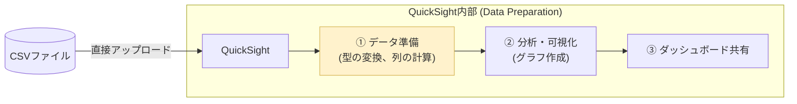

### なぜ「D」が正解なのか？

QuickSightには、**「計算フィールド」**という機能があります。
例えば、CSVの日付形式がバラバラだったり、売上と個数から「単価」を計算したかったりする場合、QuickSight上のエディタで `parseDate()` などの関数を書くだけで修正できます。これが、別のサービス（Lambda等）を立ち上げるよりも**「運用上のオーバーヘッドが最小」**とされる理由です。

**一言まとめ：**
「グラフを作りたい」＋「データの形式が少し変」＋「手間をかけたくない」＝ **QuickSightのネイティブ関数（データ準備画面）で直す**、が鉄板の回答です！

次は、QuickSightが大量のデータを高速に読み込むための心臓部、**SPICE**の仕組みについて詳しく見てみましょうか？

## Redshiftの監査

- Amazon Redshiftのネイティブ監査機能
- CloudTrail

## データレイクの権限

- データレイク管理者
- データベース作成者
- テーブル作成者

## データレイクのスキーマ一貫性の確保とクレンジング

クレンジング: AWS Glue DataBrewでクリーンアップ
スキーマの一貫性確保: ASW Glue Schema Registry

## **AWS Glue**と**AWS Lake Formation**の決定的な境界線

「GlueでもIAMを使えば制限できるのでは？」と思いがちですが、試験では**「どういう単位で制限したいか」**が判断の分かれ目になります。

---

### Glue と Lake Formation の違い

200文字で要約します。

- **AWS Glue (IAMでの制御)**: 制限できるのは**「テーブル単位」**までです。「このテーブルは見せていいけど、あのテーブルはダメ」という大まかな管理しかできません。
- **AWS Lake Formation**: **「カラム（列）単位」や「行単位」**での制限が可能です。今回の「口座番号（特定の列）だけ隠す」という**きめ細かな（Fine-grained）**制御は、Lake Formationの独壇場です。

---

### 「メタデータカタログに直接」の意味

Lake Formationは、Glue Data Catalogの「上にかぶさるセキュリティレイヤー」として動作します。

1. Athenaがデータを読みに行こうとする。
2. Lake Formationが「このユーザーは口座番号の列を見る権限がないな」と判定する。
3. Lake Formationが**その場で見えないようにフィルタリング**してAthenaに返す。

これが、問題文にある「メタデータカタログに直接セキュリティを実装する」という状態を指しています。

---

### 権限管理の比較

| 項目               | Glue + IAM               | **Lake Formation**                       |
| ------------------ | ------------------------ | ---------------------------------------- |
| **制限の最小単位** | テーブル                 | **カラム（列）、行**                     |
| **設定方法**       | 複雑なJSON形式のポリシー | **データベース風の許可（GRANT/REVOKE）** |
| **主な用途**       | サービス全体の権限管理   | **データレイクのガバナンス（今回）**     |

---

### 構成イメージ (Mermaid)

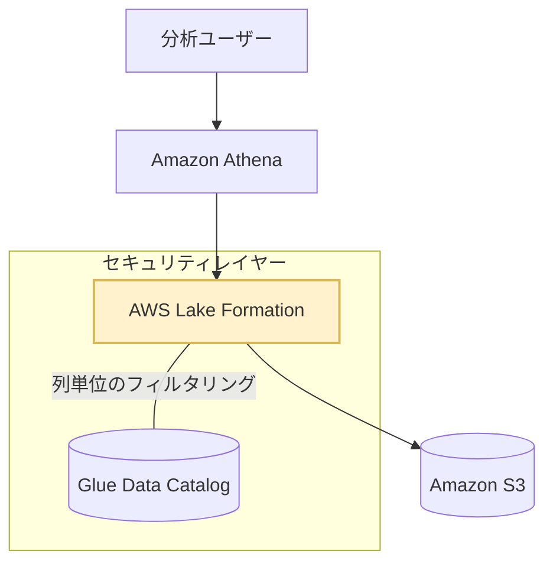

### 試験対策の決め手キーワード

1. **「特定の列（カラム）や行へのアクセス制限」**
2. **「PII（個人情報）を特定の部署から隠す」**
3. **「一元化されたアクセス制御（Centralized access control）」**

これらが出てきたら、答えは **AWS Lake Formation** 一択です。

## AWS DMS(Database Migration Service)

オンプレDBからクラウドDBだけでなく、Amazon Redshiftにも転送できる

DMSでDBからS3に転送すると、増分ではなくてフルバックアップになるので注意

## RedshiftのコピーコマンドはXML形式をサポートしてない

この問題は、**「大量の小さなファイル」「XML形式」「Redshiftへのロード」**という3つの課題を、いかに手間（運用オーバーヘッド）をかけずに解決するかを問うています。

200文字で要約します。

### 要約

- **形式の壁**: Redshiftの`COPY`コマンドはXMLを直接サポートしていないため、変換が必要です。
- **効率の壁**: 1KBという極小ファイルが大量にあると処理が遅くなるため、**「グループ化」**が必要です。
- **解決策**: **AWS Glue**を使用します。
- **理由**: **「小さなファイルのグループ化」**で効率を高め、**「ジョブのブックマーク」**で未処理ファイルのみを自動判別し、変換からロードまで一括で行えるため運用が最も楽になります。

---

### なぜ他の選択肢ではダメなのか？

| 選択肢           | 致命的な欠点                                                                               |
| ---------------- | ------------------------------------------------------------------------------------------ |
| **A (Kinesis)**  | ストリームの管理やLambdaのコード作成が必要で、**「運用オーバーヘッド」が大きい**。         |
| **B (COPY)**     | `COPY`コマンドは**XML形式をサポートしていない**（CSV/JSON/ParquetなどはOK）。              |
| **C (Firehose)** | Firehoseはストリームからデータを受け取るもので、**「S3からデータを取り込む」機能はない**。 |

---

### Glueの重要機能：ブックマークとグループ化 (Mermaid)

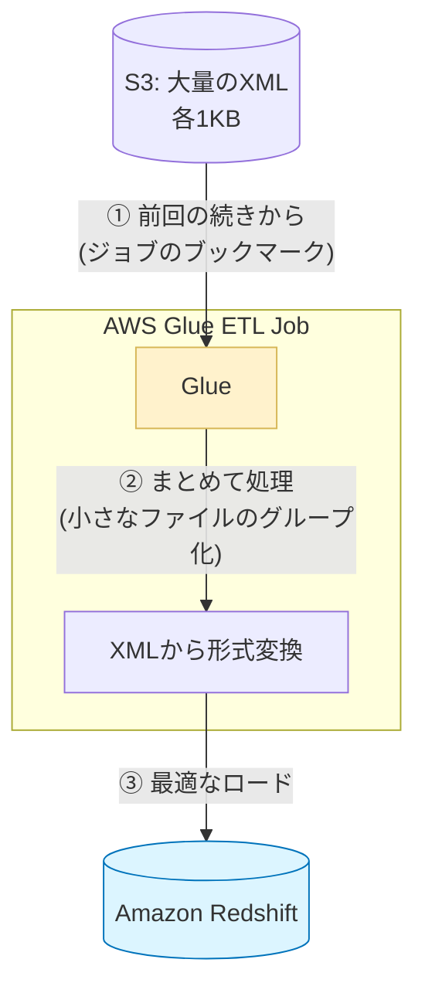

### 試験対策のポイント

1. **「小さなファイル（Small files）」** ＋ **「S3からRedshift」**
   → AWS Glueの **Grouping（グループ化）** が正解のキーワード。
2. **「増分だけ処理したい」** ＋ **「Glue」**
   → **Job Bookmarks（ジョブのブックマーク）** が正解のキーワード。
3. **「XMLをRedshiftへ」**
   → 直接は無理なので、Glueなどで変換する必要がある。

**一言まとめ：**
Redshiftが苦手な「XML」や「細切れファイル」の相手をさせるなら、前段に **AWS Glue** を置いて「まとめて・変換して・しおり（ブックマーク）を挟む」のがベストです！

## Glueを使ってRDBからS3へ

Glueブックマークを使うと増分バックアップができる

RDS PostgreSQL データベースに接続する AWS Glue ジョブを作成する。トランザクション日付フィールドに AWS Glue ブックマークを使用して、RDS PostgreSQL データベーステーブルから新しいデータを読み取り、そのデータを Amazon S3 に書き込む。ジョブを毎晩実行するようにスケジュールを設定する。

正解です。AWS Glue はサーバーレスデータ統合サービスです。RDS PostgreSQL テーブルからデータを読み取る AWS Glue ジョブを作成できます。AWS Glue ブックマークを使用するようにジョブを設定すると、新しいデータのみがテーブルからロードされるようになります。このソリューションの場合、すべての要件を満たし、運用上のオーバーヘッドを最小限に抑えることができます。

## Parquet, ORC, Avro

Apache Avro形式がいきてくるのはリアルタイム性を求められるとき

## Athenaのキューの仕組み

1. **デフォルトの挙動**: Athenaは通常、AWS全体で共有されている計算リソースを使ってクエリを実行します。一度に大量のクエリが投げられると、リソースが空くまでクエリはキューに入れられ、「QUEUED」状態になります。
2. **共有の単位**: デフォルトでは**「アカウントごと・リージョンごと」**に同時実行数の上限（ソフトリミット）が決まっています。例えば、あるワークグループで大量にクエリを投げると、同じアカウント内の他のクエリも影響を受けてキューに溜まることがあります。

---

### 「プロビジョンド容量」で解決する理由

選択肢Bの **プロビジョンド容量 (Provisioned Capacity)** を設定すると、この挙動が大きく変わります。

- **専用リソースの確保**: 共有リソースを使うのではなく、自分のアカウント専用の「クエリ実行パワー（DPU単位）」をあらかじめ買い取ります。
- **キューのバイパス**: 専用リソースがあるため、他のユーザーや他のクエリの混雑に巻き込まれず、**キューイングを待たずに即座に実行を開始**できるようになります。

---

### 試験対策：クエリの遅延・キューへの対策

「クエリがキューに入って待たされる」という問題が出た場合、対策は以下の2つに絞られます。

| 対策案                           | 内容                                        | 特徴                                               |
| -------------------------------- | ------------------------------------------- | -------------------------------------------------- |
| **サービスクォータの引き上げ**   | 同時実行数の上限（例：20個→50個）を増やす。 | 共有リソースを使う点は変わらない。                 |
| **プロビジョンド容量の設定 (B)** | **専用の実行リソース**を予約する。          | **最も確実**にキューイングを防げる（今回の正解）。 |

---

### 補足：ワークグループ (Workgroup) の役割

選択肢Dにある「ワークグループ」は、クエリ実行の**論理的なグループ分け**（コスト管理やクエリ設定の分離）のためのものです。
ワークグループごとに「同時実行数の制限」をかけることはできますが、単にユーザーをワークグループに入れただけでは、背後の「物理的な計算リソースの奪い合い」は解決しないため、キューイング対策にはなりません。

**まとめ：**
「Athenaが混んでいて待たされる（キューに入る）」なら、**「自分専用の席を予約する（プロビジョンド容量）」**のが、運用上の手間を抑えた正解になります！

## Glue Data Catalog 暗号化でサポートされるのはカスタマー管理の対象キーのみ

## EMRでセキュリティ設定機能を使えば必要となる暗号化ができる

- 転送時: SSL/TLS
- S3に保存されているデータの暗号化(NOT クラスタ内全部): EMRFS
- EMRクラスタ上の設定だと全部できる？

## KMSポリシー

| サービス | 同一アカウント内でのアクセス                                      |
| -------- | ----------------------------------------------------------------- |
| S3       | IAMポリシー「または」バケットポリシーのどちらかで許可があればOK。 |
| KMS      | IAMポリシー「かつ」キーポリシーの両方で許可が必要（※CMKの場合）。 |

## Kinesis DataStreamは直にS3に書き込めないFirehoseが必要

Firehoseのバッファ時間のデフォルトは300秒

## クエリエディタv2でRedshift ストアドプロシージャを定期実行できる

クエリエディタ v2 は Amazon Redshift の組み込み機能です。クエリエディタは、追加料金なしでスケジューリング機能を提供します。Amazon EventBridge はスケジュールされた SQL ステートメントを起動します。Redshift Data API は、スケジュールされた SQL ステートメントを希望の時間間隔で呼び出します。このソリューションは Amazon Redshift で既に提供されている機能を使用しているため、最もコスト効率の高い方法です。

## SageMaker Data Wrangler

視覚的なインターフェイスを使ってデータプレパレーションと特徴量エンジニアリングのプロセスを簡素化できます。

## CloudTrail Lake

CloudTrailをSQLしたい場合に使う
Athenaでもいけるが、CloudTrailの出力はJSON形式であることに注意

## AWS Glue Data Qualityルールセット

## KafkaとAWS Data Streams

Data Quality は、あらゆるデータセットのデータ品質を測定するために使用できる機能です。Data Quality を使用してカスタマイズされたデータチェックを追加し、データの正確性と一貫性を確保できます。

その直感、かなり鋭いです！「中身」という表現は非常に的を射ていて、**Kinesis Data Streams（KDS）は、AWSがKafkaのような仕組みを独自に開発し、徹底的にマネージド化したサービス**と言えます。

さらに、AWSにはKafkaそのものをマネージドで提供する **Amazon MSK** というサービスもあります。

---

### Kafkaを一言でいうと

**「超高速な書き込み・読み込みができる、分散型のメッセージ（データ）置き場」**です。
センサーデータやログなどのストリーミングデータを、一時的に溜めておくための「巨大なハブ」のような役割を果たします。

---

### Kinesis Data Streams と Kafka (MSK) の比較

「似ているけれど別物」である両者の関係を整理します。

| 項目                   | **Kinesis Data Streams (KDS)**                   | **Apache Kafka (Amazon MSK)**                                                     |
| ---------------------- | ------------------------------------------------ | --------------------------------------------------------------------------------- |
| **出自**               | AWS独自のサービス。                              | オープンソース（OSS）の人気プロジェクト。                                         |
| **スケーリングの単位** | **シャード (Shard)**                             | **パーティション (Partition)**                                                    |
| **マネージド度**       | **極めて高い**。サーバーの存在をほぼ意識しない。 | **中〜高**。MSKでも、裏側のブローカー（サーバー）のスペックを意識する場合がある。 |
| **エコシステム**       | AWSサービスとの親和性が最強。                    | **業界標準**。どこでも動く（オンプレからクラウドへ移行しやすい）。                |
| **カスタマイズ性**     | 決まった枠組みで使う。                           | 設定項目が非常に多く、細かくチューニングできる。                                  |

---

### なぜ「中身」と言えるのか？（構造の共通点）

どちらも「データが届いた順に並べて保存し、複数のプログラムが好きな時に読み出す」という構造が共通しています。

1. **トピック (Topic)**: データの流れる「川」の名前（Kinesisではストリーム名）。
2. **パーティション (Partition)**: 川を分割した「通り道」（Kinesisではシャード）。
3. **オフセット (Offset)**: どこまで読み取ったかの「しおり」（Kinesisではシーケンス番号）。

---

### 「MSK」は「Kafkaのマネージド版」

あなたが仰った「マネージドにしてる」という点については、まさに **Amazon MSK (Managed Streaming for Apache Kafka)** がそれにあたります。

- **Kafkaの苦労**: 本来、自分たちでサーバー（EC2）を立てて、インストールして、同期をとって…と管理が地獄のように大変です。
- **MSKのメリット**: その面倒な「サーバー管理（パッチ当て、高可用性の確保）」をAWSが肩代わりしてくれます。

---

### どちらを選ぶべきか？（試験・実務の判断基準）

- **「AWSだけで完結させたいし、運用に手間をかけたくない！」**
  → **Kinesis Data Streams**
- **「すでにオンプレでKafkaを使っている」「Kafkaの特定のライブラリを使いたい」「AWS以外（AzureやGCP）への移植性も考えたい」**
  → **Amazon MSK (Kafka)**

**まとめ：**
Kafkaは**「ストリーミング界のデファクトスタンダード（標準）」**であり、Kinesisはその**「AWS特化・超お手軽版」**、MSKは**「本家KafkaをAWSが代わりに管理してくれる版」**と整理するとスッキリします！

## Athena　パーティション管理

- MSCK REPAIR TABLE: メターデータにパーティションを追加
- ALTER TABLE DROP PARTITION: 特定のパーティションを削除

## Kinesis Data Streamsのパーティションキーについて

- スループット最強: ランダムキー
- 順序保持: 保持したいグループごとにシャーディング

シャード内の順序は保たれる

## Redshiftストアドプロシージャの実行

CALL procedure_name(argument list)

## Redshift Data Sharingはリージョン間・アカウント間をまたげる

## RedshiftはネイティブIdPフェデレーションを提供する

## Amazon EMR のベストプラクティスでは、コスト最適化のためにオンデマンドインスタンスとスポットインスタンスを組み合わせて使用することを推奨されている

## DynamoDBはTTLを設定できるよ

## HDFSとEMRFS

EMFRFSはHDFSの実装形態の一つでS3への読み取りと書き込みができる
ただし、読み取りは実行当たり一回のみ

高速ランダムI/Oが必要ならHDFSが良い。オンメモリなので

## Amazon Redshift フェデレーテッドクエリ

Amazon Aurora PostgreSQL データベース内のライブデータのクエリを実行できます

- Amazon RDS (PostgreSQL, MySQL)
- Amazon Aurora (PostgreSQL, MySQL)

## QuickSight SPICE

SPICE は QuickSight が使用する堅牢なインメモリエンジンです。SPICE にデータをインポートするソリューションでは、時間を節約して、コストを最適化できます。クエリの実行が迅速化し、データセットを更新する際にソースからデータを複数回読み取る手間を省くことができます。

## AWS Glue クローラーで異なるDDLのテーブルから共通のユーザを取得できる

FindMatches関数を使う

## AWS Glue クローラーが一つだけテーブルを出力するのは

- 各オブジェクトのオブジェクト形式、圧縮タイプ、スキーマが同じ
- 各S3オブジェクト名のプレフィックス構造に一貫性を持たせる

## AWS Schema Coversion Tool(AWS SCT)はデータベースの移行前に実行するスタンドアロンアプリケーションです。このため、AWS SCT は移行先のデータベースインスタンスでは実行できません

移行先が決まっている場合は、DMS Schema Conversionを使う

## AWS Glue ジョブブックマークはS3に対しても設定できる

## 二層の暗号化 DSSE-KMS

シンプルに2回暗号化する。セキュリティ要件が厳しい場合に。

## KMSはほぼ対象キー

KMSの「対称キー（Symmetric）」と「非対称キー（Asymmetric）」のどちらが使えるかは、AWSの各サービスが**「保管時の暗号化（Encryption at Rest）」**として機能しているか、あるいは**「データの署名や手動の暗号化」**として使われるかによって明確に分かれます。

結論から言うと、**AWSサービスの多くが提供する「自動暗号化機能」は、ほぼすべて「対称キー」のみの対応**です。

---

### サービス別・キータイプ対応表

主要なデータ関連サービスの対応状況をまとめました。

| カテゴリ           | AWSサービス               | 対称キー (Symmetric)    | 非対称キー (Asymmetric) |
| ------------------ | ------------------------- | ----------------------- | ----------------------- |
| **ストレージ**     | **S3 / EBS**              | **◎ (自動暗号化)**      | **× (※1)**              |
| **データベース**   | **RDS / DynamoDB**        | **◎ (自動暗号化)**      | **×**                   |
| **分析**           | **Redshift / Athena**     | **◎ (自動暗号化)**      | **×**                   |
| **ETL / カタログ** | **Glue Data Catalog**     | **◎ (自動暗号化)**      | **×**                   |
| **ログ / 通信**    | **CloudWatch Logs / SNS** | **◎ (自動暗号化)**      | **×**                   |
| **カスタムアプリ** | **AWS SDK / CLI (手動)**  | **○ (Encrypt/Decrypt)** | **○ (Sign/Verify)**     |

**(※1) S3 の注意点**: S3自体は非対称キーを「保管時の自動暗号化」には使えませんが、ユーザーが自分のコード（SDK）内で非対称キーを使って暗号化したデータをS3に置くこと（クライアント側暗号化）は可能です。

---

### なぜ「自動暗号化」は対称キー一択なのか？

1. **パフォーマンス**:
   対称キー（AES-256）は、非対称キー（RSAなど）に比べて暗号化・復号のスピードが圧倒的に速いです。ペタバイト級のデータを扱うS3やRedshiftで、わざわざ遅い非対称キーを使うメリットがありません。
2. **管理の簡素化**:
   「保管時の暗号化」の目的は、物理デバイスが盗まれた際などにデータを守ることです。これは鍵が1つ（対称）あれば十分達成でき、公開鍵と秘密鍵を分ける必要がありません。

---

### 試験で「非対称キー」が正解になる唯一のパターン

試験問題で「非対称キー」を選ばせるのは、以下のキーワードがある時だけです。

- **「デジタル署名 (Digital Signing)」**: データの送信者が本人であることを証明したい。
- **「署名の検証 (Verification)」**: 届いたデータが改ざんされていないか確認したい。
- **「AWS外部との公開鍵共有」**: AWS外のユーザーに公開鍵だけを渡し、こちらでしか開けない暗号文を作って送ってもらいたい。

---

### 整理：見極めのポイント

- **「S3の暗号化」「Redshiftの暗号化」「Glueの暗号化」**
  → **対称キー（カスタマーマネージド）** が正解。
- **「電子署名」「本人確認」**
  → **非対称キー** が正解。

「保管時の暗号化 ＝ 対称キー」というルールを覚えておけば、サービスごとの細かい仕様に迷わなくなります。今回の **Glue Data Catalog** も、まさに「保管時の暗号化」の話だったので、対称キーしか選べなかったというわけです。

他によく混乱する「KMSキーの自動ローテーション」が、どちらのタイプで使えるか（あるいは使えないか）についても整理しておきましょうか？

## DataSyncって何をSyncするんだっけ

NFS, SMB, S3, EMR
