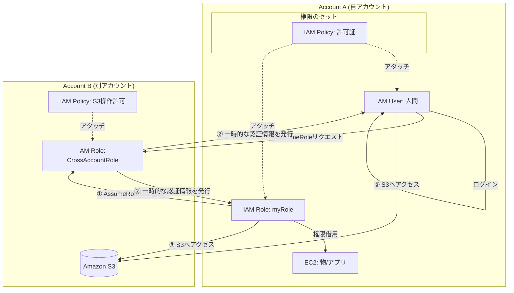
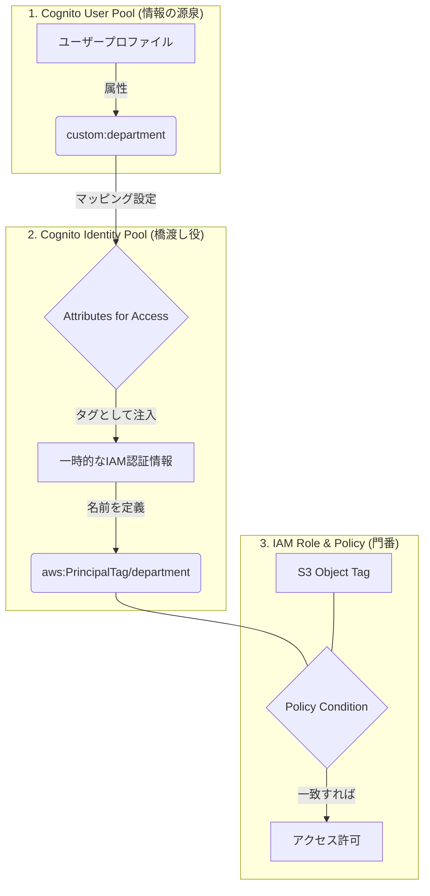
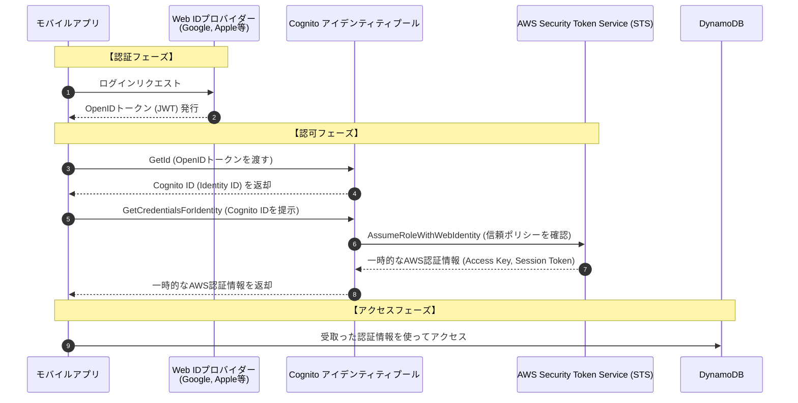

## dynamodb stream
dynamodb streamsってstreamを保存できるわけではなくてs3のイベント通知と同じ


## Lambdaのエイリアスについて

エイリアスはDockerのタグ（latest等）と同じで、不変な「バージョン（イメージID）」を指し示す。

**イベントソースマッピング（SQS等の接続設定）**にエイリアスのARNを使えば、中身の更新時に設定変更が不要。

**「エイリアス割り当て」と「エイリアスARNの使用」**の組み合わせが、運用負荷を最小にする正解パターン。

当たり前だがエイリアスのエイリアスはできないみたい


## Step Functions

- HeartbeatSeconds: タスクが生存していることを示す, Default なし
- TimeoutSeconds: タスクの最長実行時間, Default 999,999,999second
- MaxAttepmts: 最大リトライ回数, Default 2回

## Lambdaのウォームスタート
**DB接続などの重い処理は「ハンドラーの外」**に書くことで、次回の呼び出し時にメモリ上の接続を使い回せる。

これにより、初期化にかかる時間（Cold Startのような遅延）を削り、レイテンシーを最小化できる。

**「接続の再利用」「レイテンシー回避」というキーワードが出たら、「ハンドラー外での初期化」**を探す。


## AWS X-Rayサービスマップ

マイクロサービスのボトルネックサービスを探し出せる

CloudWatchよりも先にAWS X-Rayで調べる


## AWS SDK for Python (Boto3) はアクセスキーとシークレットアクセス機ーでのアクセスのみ

IAMユーザ名とパスワードは無理。それはそうか


## IAM



## API Gatewayの設定用

API Gatewayで「環境を動的に切り替える」ための構成を、極限まで削ぎ落として整理します。

### 1. 必要な3つの要素

* **ラベル（変数）**: ステージごとに「どのエイリアスを呼ぶか」を決める値。
* **動的な住所（ARN）**: 呼び出し先に固定値ではなく「ラベル」を埋め込んだ住所。
* **呼び出し許可**: API GatewayがLambdaを叩くための許可証。

---

### 2. 要素を満たすための操作

| 必要な要素 | 行うべき操作 |
| --- | --- |
| **ラベル（変数）** | API Gatewayの**「ステージ変数」**に `LambdaAlias` 等の名前で値を定義する。 |
| **動的な住所** | LambdaのARN末尾に **`${stageVariables.LambdaAlias}`** を連結してターゲットに設定する。 |
| **呼び出し許可** | Lambdaの**「リソースベースのポリシー」**に `lambda:InvokeFunction` 権限を追加する。 |

---

### 3. 解答の決め手（3行以内）

* **`${stageVariables.xxx}`** という書き方をしているか？
* 「実行ロール」ではなく**「リソースベースのポリシー」**をいじっているか？
* この2点が揃っている選択肢が正解です。

## RDSの読み取り向上

古いデータの読み込みを許容できないなどがあったら、レプリカじゃなくて、ElastiCacheを解凍にする

## S3のイベント通知をファンアウトしたい場合
S3 -> SNS -> SQS x N

一旦SNSを噛ませてファンアウトする必要がある

## AWS Database Encryption SDK
クライアント側で暗号化する

一応エンドツーエンドの暗号化になる

## appspec.ymlはコードのルートにおく

## Step Functionsでワーカーをリモートで動かす
- CreateActivity API
- GetActivityTask API
- SendTaskHeartbeat API
- SendTaskSuccess API
- SendTaskFailure API

## 修飾ARNと非修飾ARN


- 非修飾 ARN: バージョン指定なしのARN。常に $LATEST を指します。
  - 例：arn:aws:lambda:region:account-id:function:my-function
- 修飾 ARN: 末尾に特定のバージョン番号やエイリアスが付いているARN。
  - 例：arn:aws:lambda:region:account-id:function:my-function:1（バージョン1固定）
  - 例：arn:aws:lambda:region:account-id:function:my-function:prod（prodエイリアス）

## Lambdaレイヤー
名前の割に大したことない
node_modulesみたいに複数のLambdaに共通の依存をZIP形式で保存して共有できるという話


## 後続のLambdaのウォームスタンバイ

Lambda関数コードないかつハンドラーメソッド外で、データベース接続を初期化する

後続の Lambda 関数の呼び出しで、データベースへの初期 JDBC 接続によって生じるレイテンシーを回避したりできる


## デバイス間のセッションを維持したい

Redis 用 ElastiCache は、ミリ秒未満のレイテンシーを実現する高速なインメモリデータストアで、インターネット規模のアプリケーションをリアルタイムで強化します。データはインスタンス自体には保存されません。この選択は、セッションステータスの情報をデバイス間で確実に維持する場合に理想的です


## DynamoDB RCU WCU
- WCU: 1秒間に1KB
- RCU: 強力な整合性ベースで4KB


| 読み込みモード | 1 RCU あたりの性能 | 特徴 |
| --- | --- | --- |
| **強力な整合性** (Strongly Consistent) | **4 KB / 秒** | 書き込み直後の最新データを必ず返す。ただし、少し高い（RCUを正直に消費）。 |
| **結果整合性** (Eventually Consistent) | **8 KB / 秒** | 数百ミリ秒〜1秒程度の遅れを許容する。**コストが半分（RCU消費が0.5倍）**になる。 |

## KCLはコンシューマーでありプロデューサーにはならない

プロデューサーはKPL

## API GatewayはAPIキャッシュ機能があり、それ単体で完結する

ElastiCacheはいらないというか対応してない

## CloudWatch Logs暗号化
AWSマネジメントコンソールからはできなくて、AWS CLIを使用する必要がある
- associate-kms-key
- create-log-group

既存のもロググループを変更すれば暗号化できる

鍵は対称キー

非対称キーはかなり重く、一部のストレージでしか使われない


## AWS Serverless Application Model (AWS SAM)

「すべてのリソースを1つにまとめてデプロイ」かつ「ローカルでテスト」という要件において、**AWS SAM（Serverless Application Model）**は最強のツールです。


### デプロイツールの機能比較マトリクス

| ツール | Lambda / DynamoDB の統合デプロイ | ローカル実行 / テスト | 主な用途・特徴 |
| --- | --- | --- | --- |
| **AWS SAM** | **◯** (一括デプロイ) | **◯** (Docker使用) | **サーバーレス特化。** CloudFormationを拡張した短縮記法が使える。 |
| **CloudFormation** | **◯** (一括デプロイ) | **×** | **AWS全般のIaC。** ローカル実行機能はない。SAMの中身はこれ。 |
| **Elastic Beanstalk** | **×** (基本EC2ベース) | **△** (EB CLIのみ) | **Webアプリ（Java, Ruby等）向け。** サーバーレス構成には不向き。 |
| **CodeDeploy** | **△** (更新のみ) | **×** | **デプロイ戦略の制御。** 新規リソース（DynamoDB等）の作成はできない。 |


#### 1. ローカル環境でのシミュレーション (SAM CLI)

SAMは内部でDockerを使用し、**クラウドとほぼ同じLambda実行環境をローカルに再現**できます。

* `sam local invoke`: 関数を1回叩く。
* `sam local start-api`: ローカルでエンドポイントを立ち上げ、ブラウザやcurlからテストする。
* `sam local start-lambda`: テストコードからローカルのLambdaを呼び出す。


## Lambdaのスケールアップ

そもそもEC2で実行されないのでHPCの指定とかはできない

メモリサイズを上げるとCPUも上がるらしい（なんだそれ

CPUは指定できない

## CognitoのABAC(Attribute-Based Access Control)

### 属性マッピング:
ユーザープールの department 属性を、IAMの PrincipalTag/department にマッピングするよう設定します。

### ポリシーの記述:

```
{
  "Effect": "Allow",
  "Action": "s3:GetObject",
  "Resource": "arn:aws:s3:::my-bucket/*",
  "Condition": {
    "StringEquals": {
      "s3:ExistingObjectTag/department": "${aws:PrincipalTag/department}"
    }
  }
}
```




## X-Layはサーバレスでない限り、Daemonが必須

コレクタdaemonがいる

「X-Rayの実装 ＝ AOP（アスペクト指向）的な割り込み」

- 伝播: X-Amzn-Trace-Id ヘッダーを使い回す。
- 計測: SDKがHTTPクライアントやDBドライバに割り込んで「開始/終了時刻」を記録。
- 転送: アプリへの影響を最小にするため、UDPでDaemonへ「投げっぱなし」にする。

## SQSのDelaySecondsは配信のタイミングを遅らせるだけ


## SQS標準キューとSQS FIFOキュー
- SQSのキュータイプは変更できない
- SQS FIFO キューはワーカーが複数いても確実に1回だけ処理される
- FILOスタックとかはない。あくまで標準キューとFIFOキュー

## SQSの重複読み取りを防ぐ
- FIFOキューにする（既存のキューは変更できないので注意）
- 可視性タイムアウトをトランザクション処理時間より長くする
- アプリで頑張る

## Amazon Cognito Sync
デベロッパーがモバイルデバイスやウェブ間でユーザープロファイルデータを同期できるようにする AWS サービスです。
IAMユーザじゃなくてCognitoユーザなので開発者しか使えない

## CodePipeline：ステージは直列、アクションは並列
- ステージ: 順序を守るための箱（Build ➔ Test ➔ Deploy）。
- アクション: 1つの箱の中で一斉にやる作業。

## グローバルセカンダリインデックス
既存のインデックスが検索条件に合致しなかったら作る。最大で20個だがAWSに申請すればいける。WCUが上昇する。

| 特徴 | LSI (Local) | GSI (Global) |
| --- | --- | --- |
| **パーティションキー** | **ベースと同じでなければならない** | **自由に変えられる** |
| **テーブルデザインとの関係** | **一心同体**（作成時のみ） | **別居**（いつでも追加・削除可） |
| **強力なメリット** | 強い整合性（最新データ）が読める | スケーラビリティが高い |
| **追加可能か** | 作成時にしか作れない | あとで追加できる |


## InvalidSignatureException – Signature expired: [time] is now earlier than [time] ＝ 時計を疑え

AWS APIは前後5分以内の時刻ズレしか許さない。

原因はIAMや署名方式ではなく、EC2内のNTP（時刻同期）の失敗。

対策：chronyd などの時刻同期デーモンが正しく動いているか確認する。


## 信頼ポリシーで落ちた場合とアクセスポリシーで落ちる場合

- **sts:*** でエラー（今回）
  - 意味: 「ロールになること」そのものの失敗。
  - 原因: 信頼ポリシー。
  - 内容: Principal（誰が）や Condition（どのIDプールからか）の設定ミス。
- **s3:*** **や dynamodb:*** でエラー
  - 意味: 「ロールになった後」のアクションの失敗。
  - 原因: アクセスポリシー。
  - 内容: Resource や Action の権限不足。

## S3バケットアップロードの最大サイズは固定
マルチパートアップロードしようね

## Cognito IdP連携

OIDCもSAMLも対応してる

コンソールだとソーシャル(OIDC)、SAMLで別れてるらしい

なのでソーシャルIdP = OIDCという認識らしい。キモイね


## Lambda用のイメージを作る際にはJREはいらない

| 言語 | 持っていくもの (Package) | おいていくもの (Managed) |
| --- | --- | --- |
| **Java** | アプリコード + 依存JAR | **JRE** |
| **Python** | `.py`コード + サードパーティ製ライブラリ | **Pythonインタプリタ**, **boto3** |
| **Node.js** | `.js`コード + `node_modules` | **Node.jsランタイム**, **AWS SDK** |

## CloudWatch エージェントはEC2などだけでなく、オンプレもいける


## S3へのhttps必須
```json
{
  "Id": "ExamplePolicy",
  "Version": "2012-10-17",
  "Statement": [
    {
      "Sid": "AllowSSLRequestsOnly",
      "Action": "s3:*",
      "Effect": "Deny",
      "Resource": [
        "arn:aws:s3:::DOC-EXAMPLE-BUCKET",
        "arn:aws:s3:::DOC-EXAMPLE-BUCKET/*"
      ],
      "Condition": {
        "Bool": {
          "aws:SecureTransport": "false"
        }
      },
      "Principal": "*"
    }
  ]
}
```

## AWS認証情報をOpenIDトークン経由で取得する




## AWS STS decode-authorization-message
特定の AWS オペレーションは、エンコードされた認証メッセージを返します。エンコードされたメッセージの場合、AWS STS decode-authorization-message コマンドを使用すると、AWS のリクエストへの応答として返されるエンコードされたメッセージのリクエストの認証ステータスに関する追加情報をデコードすることができます。

## SSE-CとSSE-KMSは非対称暗号化キーをサポートしてない
AWS KMSはサポートしている

## .ebextensions フォルダ内の設定ファイルは、拡張子 .config を付けて保存する必要がある


## AWS CodeBuildとCodeDeployの置き場
- ./buildspec.yaml
- ./appspec.yaml

## S3をメタデータで高速に検索したい場合、DynamoDBのGSIを使う

## Cognitoは一般ユーザのアカウント管理にも使えるってよ

## CodeBuildでマウント使ってビルドキャッシュできるよ
ローカルキャッシュを実装するように CodeBuild プロジェクトを変更する。/.m2 フォルダへのパスを含むように buildspec のキャッシュ設定を変更する。

## CodeBuildはカスタムイメージ作れるよ

## DynamoDBの排他制御
条件付き書き込み使えばできるらしい