## ログ・イベントの転送マトリックス

「送り元（Source）」から「送り先（Destination）」へ**直接**送れるかどうかの表です。

| 送り元 \ 送り先 | CloudWatch Logs | Kinesis Data Streams (KDS) | Amazon Data Firehose (ADF) | S3 |
| --- | --- | --- | --- | --- |
| **CW Agent** (EC2等) | **○** (標準) | × | × | × |
| **CW Logs** (ｻﾌﾞｽｸﾘﾌﾟｼｮﾝﾌｨﾙﾀ) | - | **○** | **○** | × |
| **CW Logs** (ｴｸｽﾎﾟｰﾄ) | - | × | × | **○** (非ﾘｱﾙﾀｲﾑ) |
| **Kinesis Data Streams** | × | - | **○** | × |
| **Amazon Data Firehose** | × | × | - | **○** (標準) |
| **Lambda** (出力) | **○** (標準) | **○** (SDK経由) | **○** (SDK経由) | **○** (SDK経由) |

> **【注意ポイント】**
> * **CloudWatch Agent** は、Logs には送れますが、Firehose や Streams に直接投げる機能はありません。
> * **CloudWatch Logs** から S3 へ送る「エクスポート」は、完了まで時間がかかるため「リアルタイムな根本原因分析」には不向きです。

## CodeGuru Reviewer / Profiler

- CodeGuru Reviewer: SAST(静的解析)
- CodeGuru Profiler: APM

## Code Deploy

デプロイメントグループはタグで管理。デプロイ先がオンプレであってもタグで管理。

Code Deployは複数のデプロイ先に同時にデプロイすることができない。なので「同一の〜」のような同時デプロイを促す言葉があればCloud Formationを考える

## Auto Scalingグループ

ライフサイクルフックを追加して特定の処理後にReadinessをTrueにする。
Pending: Waitにした後にCOUTINUEやABANDANを指定できる

## Elastic Beanstalk CLIの優先順位

1. 環境に直接適用される設定 (API)
2. 保存済み設定
3. 設定ファイル (.ebextensions)
4. デフォルト値

## AMIの更新

この問題は、いわゆる **「Immutable Infrastructure（不変のインフラ）」** という考え方を問うものです。

問題文が言いたいことを一言でまとめると：
**「個別のサーバーをいじるな。全部同じ AMI から作り直して、古いのは捨てろ」** です。

---

### 解法を分ける 3 つのキーワード

1. **「ゴールデンイメージ（AMI）」の作成**
* 起動時に `yum update` など（ユーザーデータ）を走らせると、実行タイミングによってパッチのバージョンがズレる可能性があります。
* 完全に設定済みの **AMI** を用意することで、いつ起動しても「同一」であることを保証します。

2. **「OldestLaunchConfiguration」終了ポリシー**
* 新しい AMI（新しい起動設定）を作った後、古いインスタンスから順に消していくための設定です。
* これにより、ASG 内のインスタンスがすべて新しい AMI に入れ替わります。

3. **コンソールアクセスの禁止 ＋ Systems Manager**
* **手動変更（不整合の元）** を物理的に防ぐために、SSH やコンソールアクセスを禁止します。
* それでも必要なメンテナンスは、ログが残り、自動化しやすい **Systems Manager (Run Command 等)** で一斉に実行します。

---

### DOP 試験での「入れ替え手法」の呼び名

問題文にある **「サイズを 2 倍にしてから元に戻す」** という手法は、DOP ではよく **「Max Size 2倍 / Min Size 維持（または倍）」** の構成として出題されます。

* **A がダメな理由**: `NewestInstance`（最新）を消すと、せっかく作った「新しい AMI のインスタンス」が真っ先に消えてしまい、古いのが残るので意味がありません。
* **B がダメな理由**: 起動時にパッチを落とすと、その瞬間のレポジトリの状態に依存するため「同一性」が保証されません。
* **C がダメな理由**: AWS Config は「設定の記録・監視」ツールであり、メンテナンス（コマンド実行）をするツールではありません。

### まとめ（一言）

**「AMI で固めて、古い順に消して入れ替えろ。手出しは無用」**

## CloudFormationのドリフト検知と修正
1. 全てのプロパティの設定値を指定（デフォルト値も含む）
2. cloudformation-stack-drift-detection-check **AWS Config** ルールをしよう
3. AWS-UpdateCloudFormationStackの**AWS System Manager Automation**ランブックを実行するようにルールの自動修復アクションを設定

## AWS Configによる自動修復

問題文に**「自動的に検出（detect）および終了（terminate）する」**とあります。
この「できてしまった後の話」に対応できるのは **AWS Config** だけです。

| サービス | 役割（DOP試験での位置づけ） | 修正までできるか |
| --- | --- | --- |
| **AWS Config** | **構成の監視・監査**。ルール違反を見つけ、LambdaやSSMで**自動修復**する。 | **○** |
| **Service Catalog** | 承認済みセットの**販売・提供**。セルフサービスで安全に起動させる。 | × |
| **SCP (Organizations)** | **ガードレール（権限の最大値設定）**。組織全体で特定の操作を禁止する。 | × |
| **CloudFormation** | **テンプレートによる標準化**。同じ構成を何度も作る。 | × |

S3のバケット公開・非公開などの単位でも**AWS Config**でカバーできる

## AWS Serverless Application Model(AWS SAM)
AWS CloudFormationテンプレートの拡張機能

## Lambda Authorizer

API Gatewayでカスタム認証をしたい時に使う

## Service Quotasのアラート

Service QuotasはOrganizationsと連携できる。CloudWatchアラームを設定する。

## API Gatewayの互換性サポート

既存と新規でIFが変わる時にマッピングテンプレートを提供できる

## EC2インスタンスの終了を検知したい

EventBridgeを使う

## ALB + EC2 Auto Scaling

Blue/Greenデプロイ後にCloudWatchでALERTが上がったら自動で切り戻すように設定できる

Blue/Greenデプロイは
1. ALBがヘッダーやパスを見て
2. ターゲットグループごとに振り分け (Auto Scaling Groupの下でReplica Set的な単位)

### Auto Scalingのターゲットはカスタムメトリクスを設定できる
SQSキューの数をアクティブインスタンスで割る

## API Gatewayのカナリアリリース
既存のAPI本番ステージにカナリアリリースを追加できる

## Auto Scaling Group

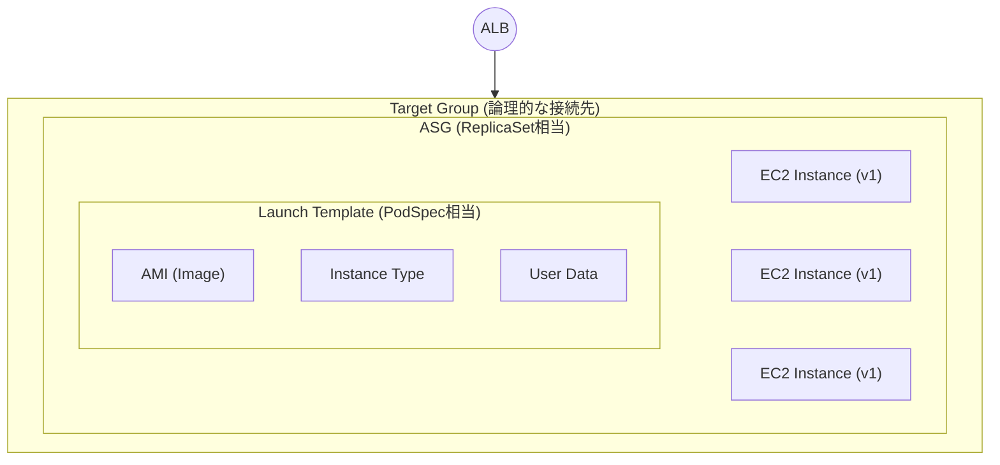

## API Gateway

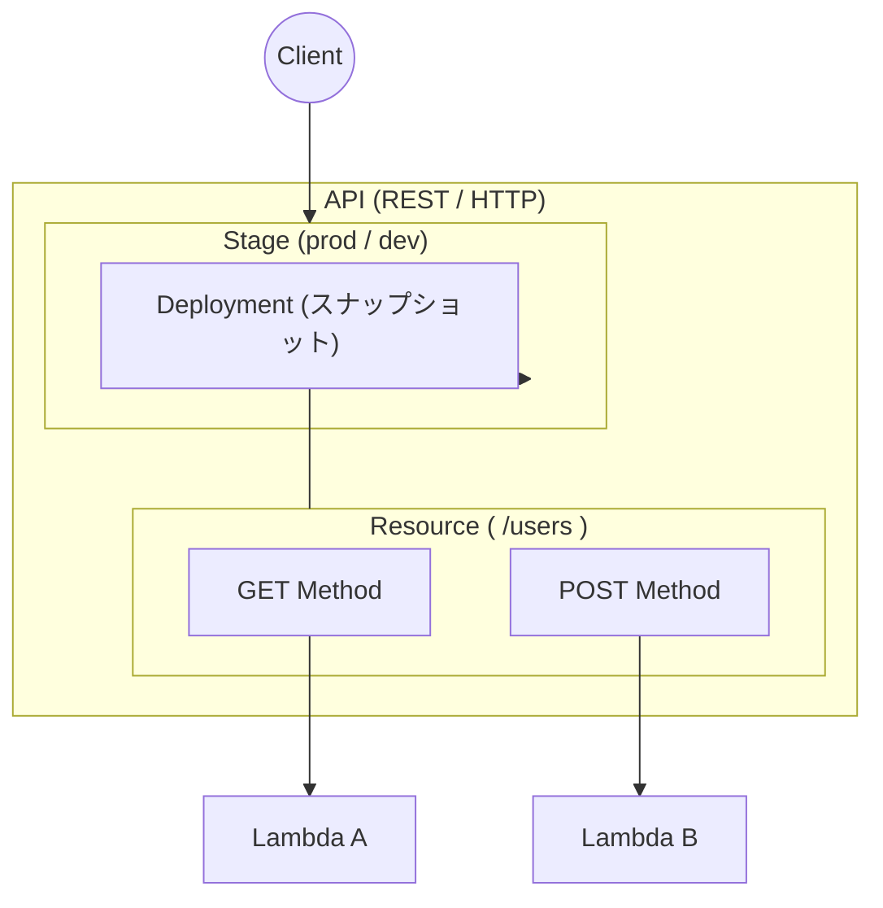

## CodeDeploy 単体でデプロイ失敗の検知とロールバックができる

通知が欲しければEventBridgeを足す

デプロイ障害 = インスタンスが起動しない

## クロスリージョンデプロイ

S3のクロスリージョンレプリカではアーティファクトは共有できない

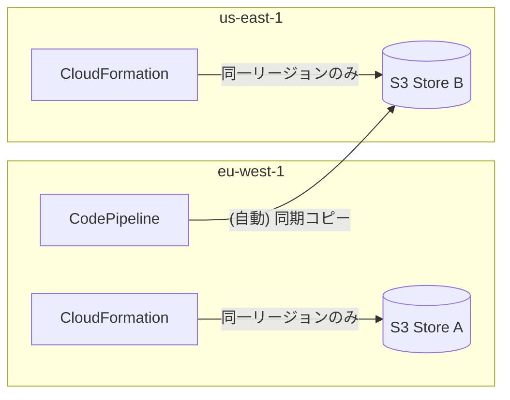

## 送信元IPによってWAFのレートリミットを変更する

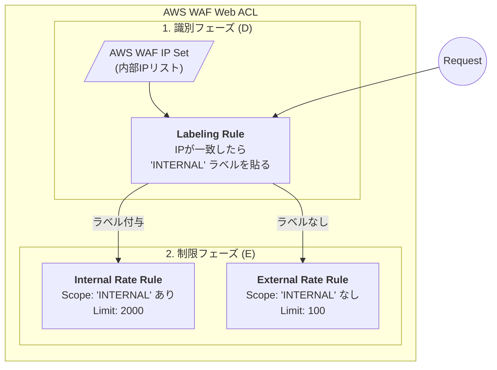

## SGの変更をリアルタイムに監視する

### 「EventBridge + Lambda」 vs 「Config + SSM」 の見分け方

Configはリアルタイム性に乏しい

| 要件キーワード | 推奨ソリューション | 理由 |
| --- | --- | --- |
| **「ほぼリアルタイム」** | **EventBridge + Lambda (D)** | API発行をトリガーにするため最速。 |
| **「既存リソースの検知・是正」** | **AWS Config (C等)** | 過去に作られた全リソースの状態を網羅的にチェックできる。 |
| **「特定のAPI操作を防ぐ/戻す」** | **EventBridge** | 「誰かが何かをした」というイベントに即応。 |

## Elastic Beanstalk 実行要素

| 実行要素 | 実行タイミング | 実行場所 (CWD) | ソース解凍状態 | 特徴・主な用途 |
| --- | --- | --- | --- | --- |
| **`commands`** | 最優先（インフラ初期化時） | `/` (ルート) | **未解凍** | アプリに依存しないOS設定、パッケージ導入 |
| **`files`** | 設定ファイル生成時 | 設定による | - | **(選択肢Cの肝)** Hook等のファイルを特定パスに配置 |
| **`container_commands`** | デプロイ直前（中盤） | 一時フォルダ | **解凍済み** | DBマイグレーション、環境変数を使ったビルド |
| **`pre hooks`** | デプロイ中（配置前） | `/var/app/staging` | **解凍済み** | 最終ディレクトリに移動する前の最終調整 |
| **`post hooks`** | **デプロイ完了後** | `/var/app/current` | **デプロイ済み** | **(正解の選択肢C)** アプリ起動後の後処理、通知 |

## IAMユーザのTTL管理もConfigでできる

AWS アカウントで AWS Config を有効にする。AWS Config マネージドルールである iam-user-unused-credentials-check をデプロイする。ルールを定期的に実行するように設定する。AWS Config の自動修復を設定して、AWSConfigRemediation-RevokeUnusedIAMUserCredentials AWS Systems Manager Automation ランブックを実行する。

## ECRの暗号化に使ってるKMSキーは新規作成できないよ
まあそれはそうか、既存のデータに困るし

## GuardDutyでIPアドレスの脅威リストを設定する。
S3に保存したリストを参照できる

## Apache Flink
運用負荷最小限、異常検知などが合った場合、

CloudWatch + OpenSearch Serviceよりも
DataStream + Apache Flinkが好まれることがある

## Elastic Beanstalkはインスタンスの自動復旧しない

## Image Builderについて

イメージパイプライン
イメージパイプラインは、安全な AMI とコンテナイメージを構築するための自動化フレームワークを提供する AWS。Image Builder イメージパイプラインは、イメージビルドライフサイクルのビルド、検証、およびテストフェーズを定義するイメージレシピまたはコンテナレシピに関連付けられています。

イメージパイプラインは、イメージの構築場所を定義するインフラストラクチャ構成に関連付けることができます。インスタンスタイプ、サブネット、セキュリティグループ、ログ記録、その他のインフラストラクチャ関連の構成などの属性を定義できます。また、イメージパイプラインをディストリビューション構成に関連付けて、イメージのデプロイ方法を定義することもできます。

マネージドイメージ
マネージドイメージは、AMI またはコンテナイメージに加えて、バージョンやプラットフォームなどのメタデータで構成される Image Builder のリソースです。管理対象イメージは、Image Builder パイプラインによってビルドに使用するベースイメージを決定するために使用されます。このガイドでは、管理対象イメージは「イメージ」と呼ばれることもありますが、イメージは AMI とは異なります。

イメージのレシピ
Image Builder イメージレシピは、ベースイメージとベースイメージに適用するコンポーネントを定義し、必要な構成の出力イメージを生成するためのドキュメントです。イメージ recipe を使用して、ビルドを複製できます。Image Builder イメージレシピは、コンソールウィザード、、または API を使用して共有、分岐 AWS CLI、編集できます。バージョン管理ソフトウェアでイメージ recipe を使用して、バージョン管理された共有可能なイメージ recipe を維持できます。

コンテナレシピ
Image Builder コンテナレシピは、ベースイメージと、出力コンテナイメージに必要な構成を生成するためにベースイメージに適用されるコンポーネントを定義する文書です。コンテナレシピを使ってビルドを複製することができます。コンソールウィザード、 AWS CLI、または API を使用して、Image Builder イメージレシピを共有、分岐、編集できます。コンテナレシピをバージョン管理ソフトウェアと一緒に使うことで、共有可能でバージョン管理されたコンテナレシピを維持することができます。

基本のイメージ
ベースイメージとは、イメージまたはコンテナレシピドキュメントで使用される、選択されたイメージとオペレーティングシステム、およびコンポーネントです。ベースイメージとコンポーネント定義を組み合わせることで、出力イメージに必要な設定が作成されます。

コンポーネント
コンポーネントは、イメージ作成前にインスタンスをカスタマイズする（ビルドコンポーネント）か、作成されたイメージから起動されたインスタンスをテストする（テストコンポーネント）ために必要な一連の手順を定義します。

コンポーネントは、パイプラインによって生成されたインスタンスをビルド、検証、またはテストするためのランタイム設定を記述した、宣言型のプレーンテキストの YAML または JSON ドキュメントから作成されます。コンポーネントは、コンポーネント管理アプリケーションを使用してインスタンス上で実行されます。コンポーネント管理アプリケーションはドキュメントを解析し、必要なステップを実行します。

## EventBridgeはCodeArtifactレポジトリの変更でトリガーできる

## テスト結果の保存
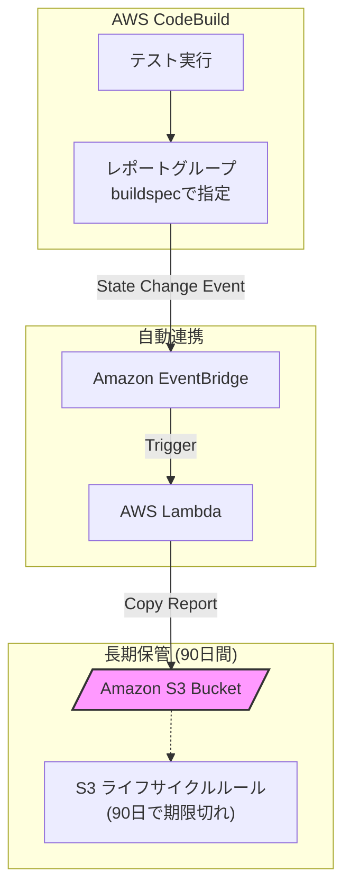

## IAMアクセスキーの検出と削除
AWS Health AWS_RISK_CREDENTIALS_EXPOSED が大事
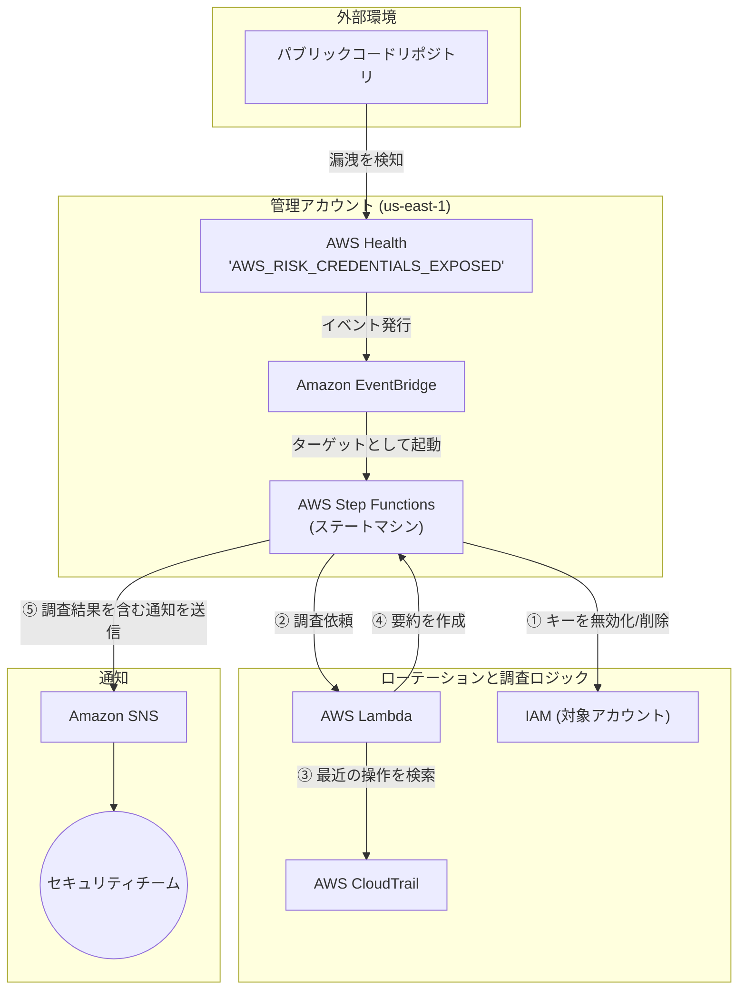

## SESとSNSの使い分け

SNS（Simple Notification Service）ではなく、**SES（Simple Email Service）**が正解になるのは、一言で言えば**「通知」を超えた「メールとしてのリッチさや柔軟性」**が求められるケースです。

### SES が正解になる 3 つのケース

| ケース | 内容 | 理由 |
| --- | --- | --- |
| **HTML/リッチな形式** | HTMLメール、インライン画像、複雑なレイアウトが必要な場合。 | SNSのメール通知はプレーンテキスト（または簡素なJSON）に限定されるため。 |
| **添付ファイル** | PDFのレポートやログファイルなどを添付して送る必要がある場合。 | SNSはメッセージ本文しか送れず、添付ファイルをサポートしていないため。 |
| **高度なカスタマイズ** | 宛先ごとに本文をパーソナライズしたり、差出人（From）を自由に設定したい場合。 | SNSはあらかじめ登録されたサブスクライバー全員に同じ内容を送る仕組みだから。 |

## Inspectorはオンプレには使えない
それはそう感あるが忘れないように

## Auroraレプリカはリージョンを跨げない
跨ぐならAuroraグローバルデータベース

## Kinesis DataStreamsではなくてEventBridgeを選ぶケース
最もオペレーション効率がいい
コンシューマーがどんどん増える

## ネットワーク構成図
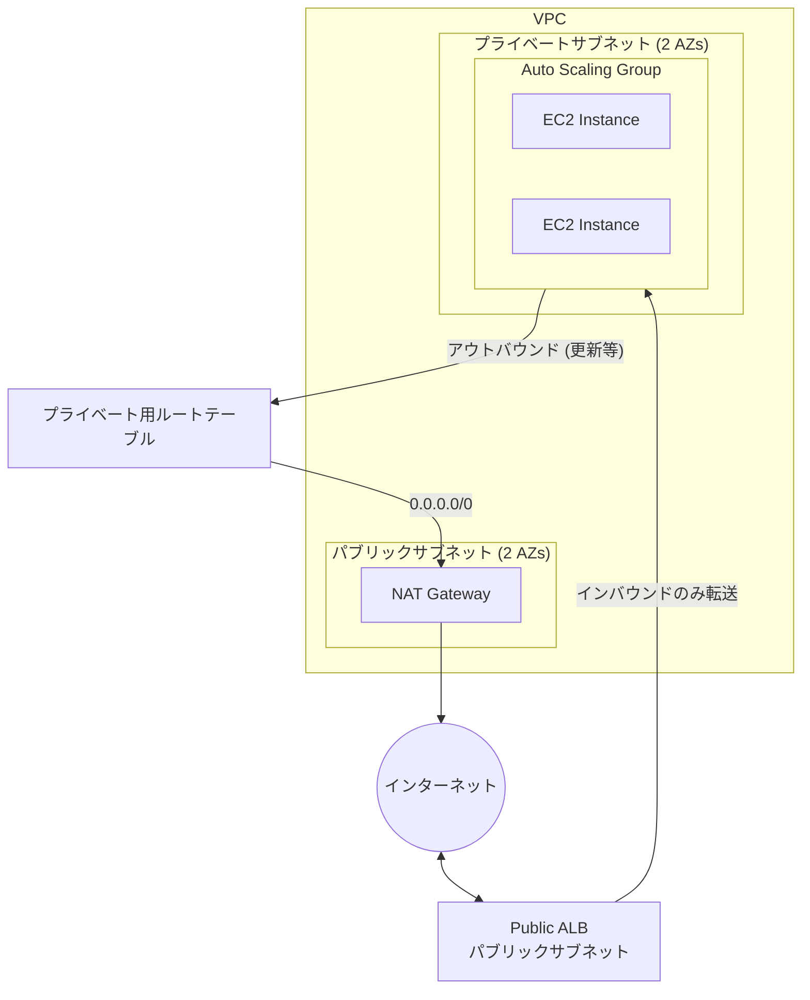

## Firewall Manager
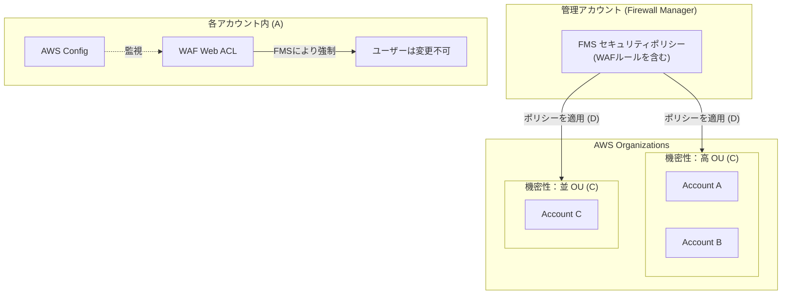

## Glueクローラで特定の拡張子のファイルを処理したい
フィルターとかできないので、バケットを分けるしかない

## Elastic BeanstalkでSQSもS3バケットも構築できるよ

## ECS Anywhere と Fargate によるハイブリッド・スケーリング
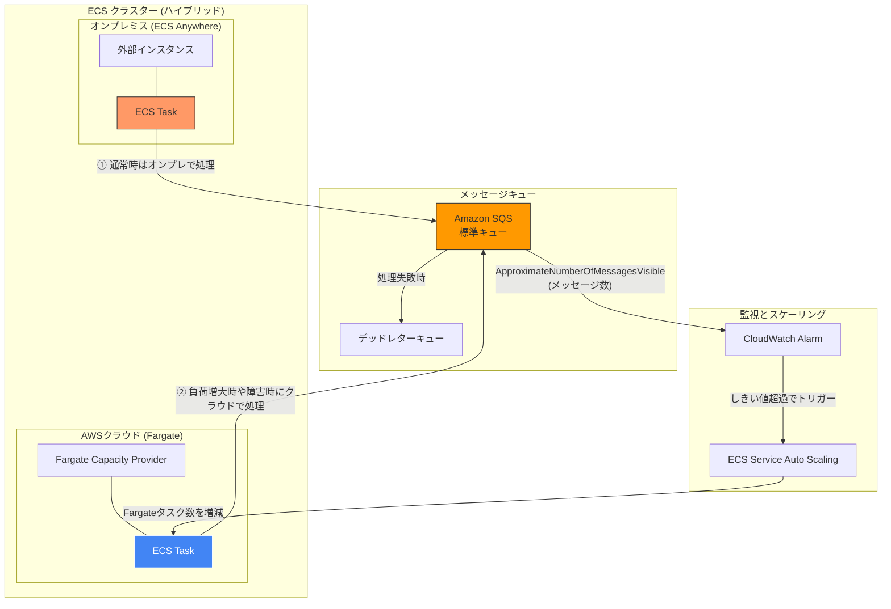

## CodeBuildで単体テストなどを実行できるよ
Code Guruはダメ
- Code Guru Profiler
- Code Guru Reviwer

## Cloud Formation StackSetsの同時実行数
- リージョンの同時実行を「並行」に設定する
- 最大同時実行アカウントの割合を25に設定する (数ではなくて割合であることに注意)

## DataStream 拡張ファンアウト
スループットは最大になる

ファンアウトっていうと複数のコンシューマーに振りそうだが、そんなことはない

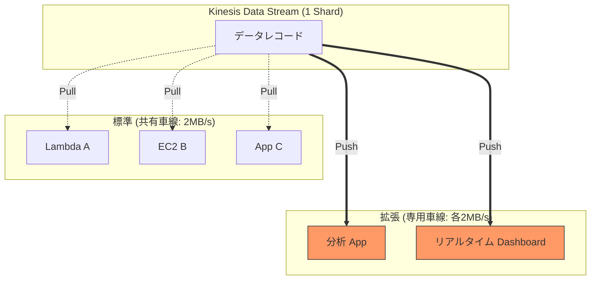

## Health Service イベントでEOL情報を受け取れる
lambdaだけでなくAMIも受け取れる
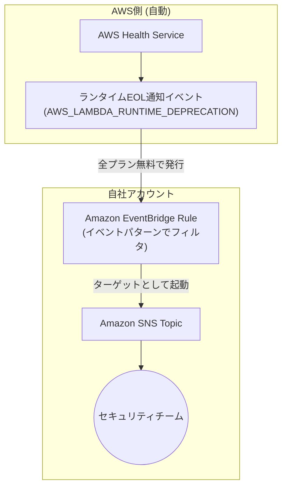

## ECRレポジトリポリシー
Harborにもあったよね

## ECRにS3バケットを紐づけることはできない

## Lambdaの最大ランタイムは１５分
デフォルトは3秒
15分以上には伸ばせない

## CloudFront

OACはS３のみ

ALBに直接アクセスしないようにカスタムヘッダーを設定してALBに受信トラフィックの判断をさせる

## **「既存のAWSアカウントを、どのようにしてAWS Control Towerの管理下に安全に引き入れるか」**
実務でも非常に神経を使う移行作業の手順を問うています。

正解の **C** と **E** は、Control Towerがアカウントを制御するために必要な「権限（Role）」と「既存設定との競合回避（Config）」という2つの重要ポイントを押さえています。

---

### 1. 構成と手順の全体図（Mermaid）

小規模企業のアカウントを、大企業のControl Tower（組織）へ合流させる流れです。

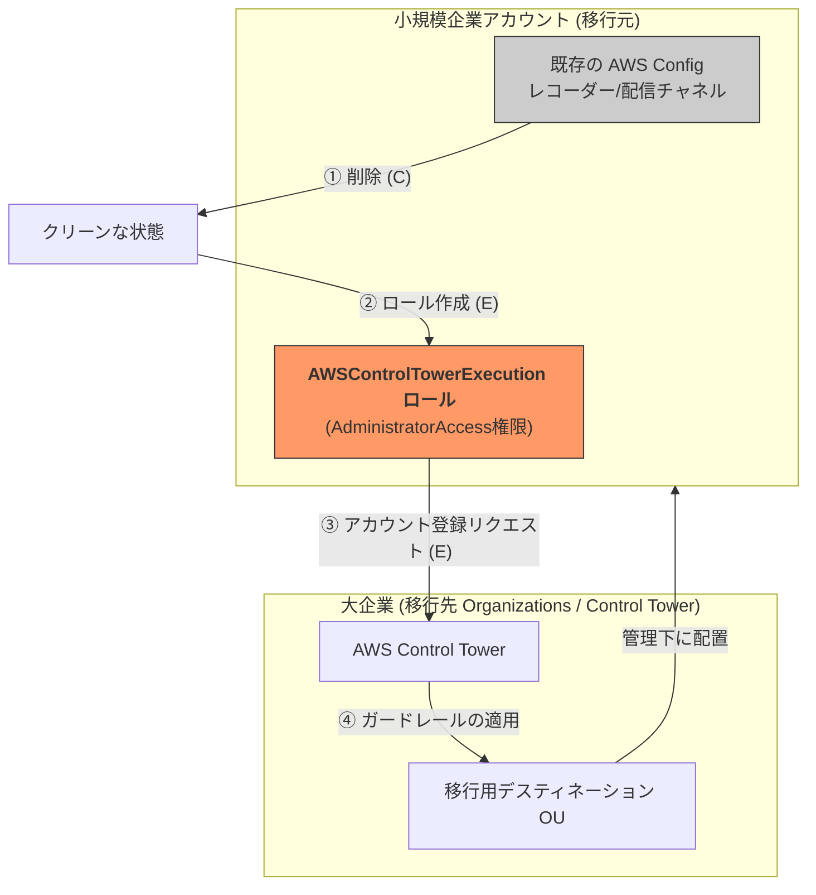

---

### 2. なぜこの2つが必要なのか？

#### **ステップ1：既存設定の削除（C）**

AWS Configは、一つのリージョンに「設定レコーダー」と「配信チャネル」を一つずつしか持てません。
Control Towerは登録時に**独自のConfig設定を自動で流し込もうとする**ため、移行元のアカウントに古いConfig設定が残っていると、衝突して登録エラー（Enrollment failure）になります。そのため、あらかじめ削除しておく必要があります。

#### **ステップ2：実行ロールの作成（E）**

Control Towerは「管理アカウント」から「子アカウント」を操作します。この時、子アカウント側に **`AWSControlTowerExecution`** という名前の、特定の信頼関係を持つIAMロールが存在しないと、Control Towerは中に入ってお世話（ガードレールの適用など）ができません。

---

### 3. 他の選択肢がダメな理由（間違い探し）

| 選択肢 | 却下される理由 |
| --- | --- |
| **A** | 「セキュリティOUにランディングゾーンを作成する」という記述が間違い。ランディングゾーンは組織全体に一つあれば良く、追加作成するものではありません。 |
| **B** | 移行前にSCPでガチガチに固めてしまうと、Control Towerの設定変更（リソース作成）までブロックしてしまい、登録に失敗するリスクが高まります。 |
| **D** | 問題文に「単一のアカウント（Single account）」とあるため、OU（組織単位）ごと登録するのではなく、アカウント単位で登録するのが適切です。 |

---

### まとめ（一言）

**「Configの古い設定を掃除して（C）、Control Towerが入るための専用の門（ロール）を作ってあげる（E）」**

これが、既存アカウントをControl Towerに迎え入れる際の鉄板の儀式です。

ちなみに、この **`AWSControlTowerExecution` ロール**を全アカウントに手動で作るのが面倒な場合、**CloudFormation StackSets** を使って一括配布する手法もよく併用されます。そのあたりの「自動化の工夫」についても整理しますか？

## EFSのマウント
- ユーザアカウントでマウントできない
- マウントターゲットポリシー設定はサポートしてない
  - 一つのAZで複数のマウントターゲットもサポートしてない
- 別のパスでマウントしたい場合はEFSアクセスポイントを作成し、API経由でアクセスポイントをマウントする

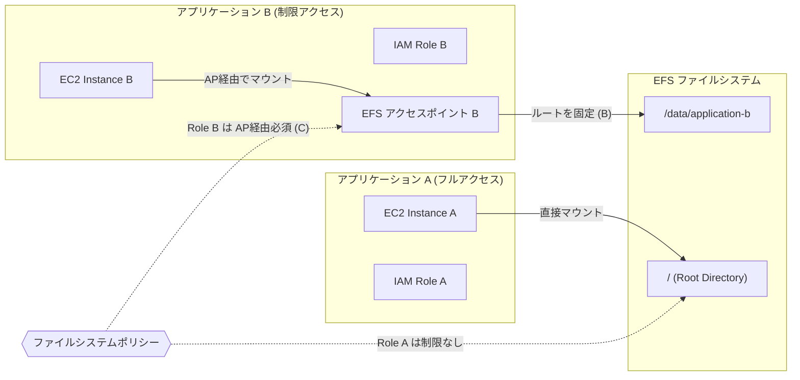

## イミュータブルとBlue/Greenの見分け方

### 1. 「環境」と「インスタンス」の粒度の違い
| 要件 | イミュータブル (C) | Blue/Green (D) |
|---|---|---|
| ダウンタイム最小 | 【メリット】◎同じ環境内で新旧を入れ替えるため、エンドポイントの変更がなくスムーズ。 | 【メリット】◎別環境へURLスワップで一気に切り替えるため、ダウンタイムは発生しない。 |
| パフォーマンス維持 | 【メリット】◎旧インスタンスを維持したまま、一時的に別ASGで新インスタンスを増やすため、処理能力が落ちない。 | 【メリット】◎新しい環境をフルセットで並行して立ち上げるため、キャパシティは維持される。 |
| バージョンの「一貫性」 | 【メリット】◎単一の環境・単一のASG内で完結。「全台成功」するまで切り替わらないため、失敗しても中途半端な状態にならない。 | 【デメリット】△環境自体が別物になるため、環境変数、セキュリティグループ、DB接続先などの設定が100%同一である保証を別で管理する手間がある。 |
| 運用効率 / 手間 | 【メリット】◎既存環境の設定を1箇所変えるだけ。AWSが裏側で一時的なリソースの作成・削除を全て自動で行う。 | 【デメリット】×新しい「Environment」を別途作成し、URLスワップ後に古い環境を消すなど、手動または外部の管理工程が増える。 |

## DynamoDB StreamはKinesis同様にポーリングが必須

## Service Catalogのデプロイ
- CodeDeployは統合されてない
- CodeBuildも統合されてない
- CodePipelineからLambdaを呼び出し更新する

## CloudWatch複合アラームは複数のアラームを掛け合わせるというだけ

## CloudWatch Logs サブスクリプションフィルターは、ログストリームレベルではなくロググループレベルで適用されます
なんのこっちゃだが、見分ける時が来るかも

## S3バケットを個別に編集したい
同一リージョンレプリケーションはカスタマイズ要件を満たさない

**S3オブジェクトLambda**でpre scriptみたいな感じでデータを編集して参照できる

## ルールグループにはスコープダウンステートメントを含めることはできません。
スコープダウンステートメントを定義できるのはルール内のみです。

なんのこっちゃ