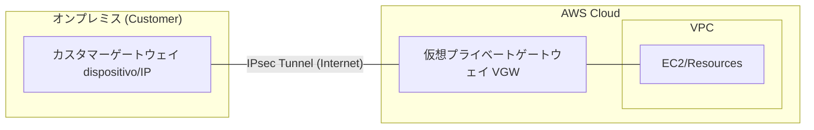
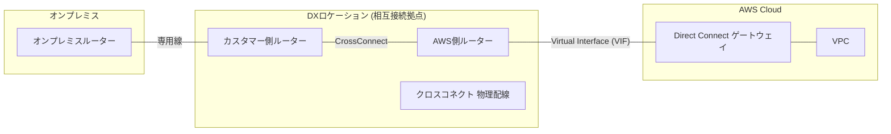
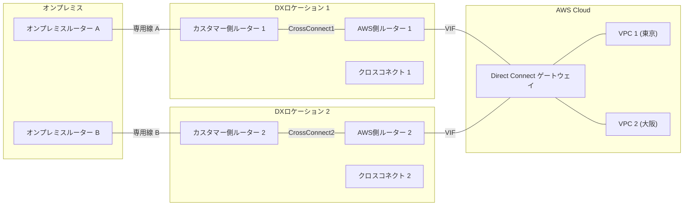
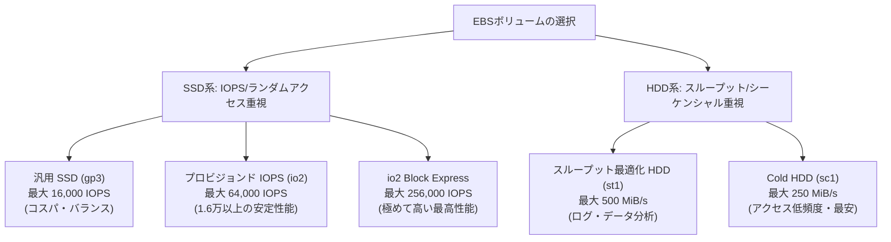
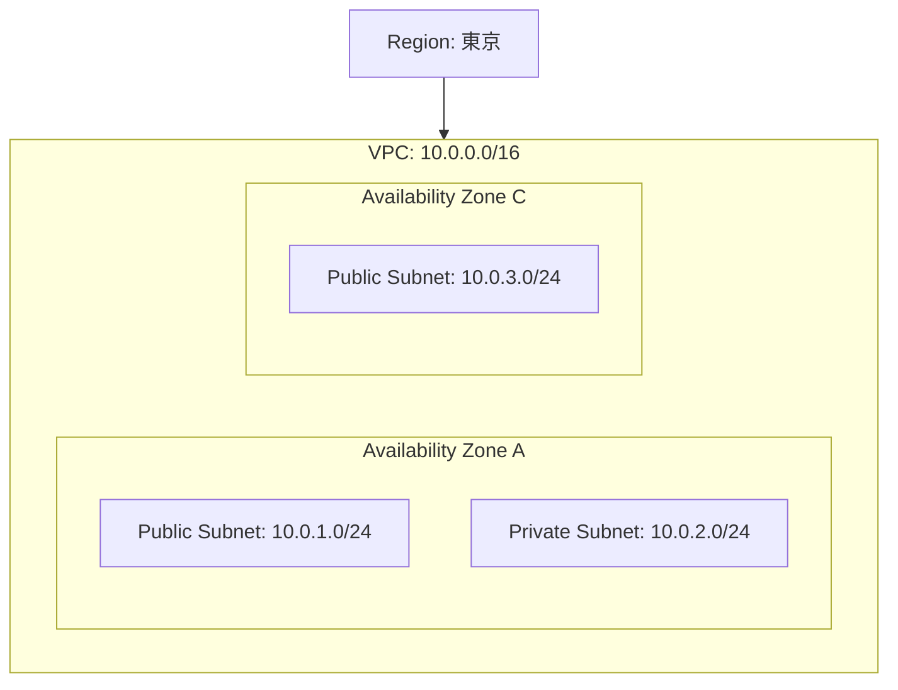

## データ転送の比較

| 転送方法 | 対象データ量（目安） | 特徴・判断の根拠 |
| --- | --- | --- |
| **AWS DataSync** | 数GB 〜 数TB | オンライン転送。定期的・自動的な同期に最適。 |
| **Snowcone** | 〜 8 TB | 小型デバイス。持ち運びや過酷な環境での転送に。 |
| **Snowball Edge** | 数十TB 〜 数PB | 物理配送。大容量データの移行で最もコスト効率が良い。 |
| **Snowmobile** | **10 PB 〜 数百 PB** | **大型トラック（トレーラー）**。超大規模なデータ移行用。 |

※現在の試験（SAA/SAP）では、10PBを超えるような極端なケースを除き、基本的には **Snowball Edge** が正解になることが多いです。

## リンクローカルアドレスや予約アドレス

### 1. インフラサービス用 固定アドレス（リンクローカル）

OSの設定に関わらず、AWS環境内からのみ疎通する特殊なアドレスです。

| IPアドレス | 用途 | 試験でのキーワード |
| --- | --- | --- |
| **169.254.169.254** | **EC2 メタデータ (IMDS)** | インスタンスID、プライベートIP、**IAMロールの認証情報**の取得。 |
| **169.254.170.2** | **ECS タスクメタデータ** | ECSコンテナ内から自身のコンテナ情報を取得する。 |
| **169.254.169.123** | **Amazon Time Sync Service** | 高精度なNTPサーバー。時刻同期。 |

---

### 2. VPCサブネット内の予約アドレス（計5つ）

各サブネット（例：`10.0.0.0/24`）において、AWSが管理用に占有しているアドレスです。**ユーザーは利用（アサイン）できません。**

| アドレス末尾 | 役割 | 備考 |
| --- | --- | --- |
| **.0** | **ネットワークアドレス** | サブネット自体の識別。 |
| **.1** | **VPC ルーター** | サブネットのデフォルトゲートウェイ。 |
| **.2** | **Amazon DNS (Route 53)** | **VPC CIDR + 2**。名前解決に必須。 |
| **.3** | **将来の利用（予約）** | AWSが予約。現在は未使用。 |
| **.255** | **ブロードキャストアドレス** | VPCはブロードキャストをサポートしないが予約。 |

---

### 3. その他、試験に出る特殊なアドレス・範囲

ネットワーク構成図やセキュリティグループの設定で頻出します。

* **0.0.0.0/0**: すべてのIPv4アドレス（インターネット全体）。
* **::/0**: すべてのIPv6アドレス。
* **10.64.0.0/10**: CGNAT（Carrier Grade NAT）。VPC内ではないが、Transit Gateway経由などで稀に見かける範囲。
* **224.0.0.0/4**: マルチキャスト範囲。VPC（Transit Gateway経由を除く）では基本サポート外。

---

### 解答の根拠になるフレーズ

* 「VPC内のDNSサーバーのアドレスは？」 → **「VPCネットワーク範囲のプラス2」**
* 「EC2のIAMロール情報をスクリプトで取得したい」 → **「169.254.169.254へのcurl」**
* 「251個のIPが必要な時、/24(256個)で足りるか？」 → **「5個予約されているので251個しか使えず、ギリギリ足りる（または余裕がない）」**

## Site-to-Site VPN の構成要素

インターネット経由で暗号化トンネルを張る構成です。

* **CGW (Customer Gateway):** オンプレ側の物理デバイスまたはソフト。
* **VGW (Virtual Private Gateway):** AWS側のVPN終端ポイント（最近は **Transit Gateway** を使うケースも頻出）。

---

## 2. Direct Connect (DX) の構成要素

専用線を引き込み、物理ポートで接続する構成です。

* **DX Location:** AWSと専用線を繋ぐ物理的な接続拠点。
* **Cross Connect:** 拠点内での物理的なパッチケーブル接続。
* **VIF (Virtual Interface):** 公開サービス用（Public）かVPC用（Private）かの論理定義。
* **DXGW (Direct Connect Gateway):** 複数のリージョンや複数のVPCに接続するためのハブ。

ロケーションの冗長化

## S3ストレージクラスごとの取得時間

### S3ストレージクラス取得時間一覧

| ストレージクラス | 取り出しにかかる時間（初動） | 根拠となるフレーズ |
| --- | --- | --- |
| **Standard** | **ミリ秒単位（即時）** | 「頻繁なアクセス」「アクティブなデータ」 |
| **Standard-IA** | **ミリ秒単位（即時）** | 「月1回程度のアクセス」「即時性が必要」 |
| **Intelligent-Tiering** | **ミリ秒単位（即時）** | 「アクセスパターンが不明・変化する」 |
| **Glacier Instant Retrieval** | **ミリ秒単位（即時）** | 「四半期に1回」「**即時性が必要なアーカイブ**」 |
| **Glacier Flexible Retrieval** | **数分 〜 数時間** | 「通常1〜5分（迅速）」「3〜5時間（標準）」 |
| **Glacier Deep Archive** | **12時間 〜 48時間** | 「最も安価」「年1回あるかないか」「即時性不要」 |

---

### 解答の根拠になる「キラーフレーズ」

* **「ミリ秒単位 (Milliseconds)」が出たら：**
通常のクラスか、**Glacier Instant Retrieval** のどちらか。
※「アーカイブしたいが、取り出しは即時」という矛盾した要望には **Instant Retrieval** が正解。
* **「数分 (Minutes)」が必要なアーカイブなら：**
**Glacier Flexible Retrieval** の「迅速 (Expedited) 取り出し」を選択。
* **「コストが最優先で、時間はいくらかかっても良い」なら：**
**Glacier Deep Archive**。12時間は待つ覚悟が必要。

---

### SAA試験での注意点

最近の試験では、**S3 Glacier Flexible Retrieval**（旧名：S3 Glacier）と **S3 Glacier Instant Retrieval** の名前が似ているため、ここを入れ替えて受験者を迷わせるパターンが非常に多いです。

> **「ミリ秒」という単語があるかないか**

これだけで正解が絞れる問題が多々あります。

次は、S3に関連して「ライフサイクルポリシー（移行のタイミング）」や「S3 Object Lock（コンプライアンス）」について確認しますか？

## AWS セキュリティサービス比較

| サービス | 主な役割・機能 | 根拠・キーワード | 関連製品 / OSS |
| --- | --- | --- | --- |
| **GuardDuty** | **脅威検知** (IDS/IPS相当) | 「ログ分析（VPC/DNS/CloudTrail）」「機械学習」「意図しない通信」 | Snort, Suricata, Falco |
| **Inspector** | **脆弱性診断** | 「EC2/ECR/Lambdaの脆弱性」「CVE」「ソフトウェアのパッチ管理」 | Nessus, OpenVAS, Trivy |
| **Detective** | **根本原因分析** | 「セキュリティ事象の調査」「時系列グラフ」「GuardDuty検知後の詳細分析」 | Splunk, Maltego |
| **Security Hub** | **一元管理 (CSPM)** | 「セキュリティチェックの集約」「コンプライアンス準拠確認」 | Palo Alto Prisma Cloud |
| **Macie** | **機密データ検出** | 「S3内の個人情報(PII)」「自動分類」「機密情報の漏洩防止」 | Google Cloud DLP |

---

### 使い分けと判断のポイント

* **GuardDuty vs Inspector:** * 外部からの攻撃（振る舞い）を監視したいなら **GuardDuty**。
* 内部のソフトウェアの欠陥（脆弱性）をスキャンしたいなら **Inspector**。

* **GuardDuty vs Detective:**
* 何か異常が起きたことを知りたいなら **GuardDuty**。
* 起きた異常が「なぜ、どうやって」発生したか深掘りしたいなら **Detective**。

## EBSボリュームタイプ：性能とユースケースの相関

## ストレージオプション比較表（EBS + インスタンスストア）

| ボリュームタイプ | 最大 IOPS | 最大スループット | 永続性 | 相対コスト | 解答の根拠になるキーワード |
| --- | --- | --- | --- | --- | --- |
| **インスタンスストア** | **数十万〜** | **数 GB/s** | **なし** (停止で消滅) | **無料** (込) | **「一時データ」「破棄可能」「追加コストなしで超高速」** |
| **io2 Block Express** | **256,000** | 4,000 MiB/s | あり | 最高 | 「最高のパフォーマンス」「SANレベルの要求」 |
| **プロビジョンド IOPS** | **64,000** | 1,000 MiB/s | あり | 高い | 「16,000 IOPS超」「データベースの安定性能」 |
| **汎用 SSD (gp3)** | **16,000** | 1,000 MiB/s | あり | 中 | 「コスパ重視」「容量によらずIOPS/帯域を確保」 |
| **スループット最適化** | 500 | **500 MiB/s** | あり | 低 | **「スループット重視」「DWH」「大量のログ」** |
| **Cold HDD (sc1)** | 250 | 250 MiB/s | あり | 最安 | 「アクセス低頻度」「容量単価が最安」 |

### 整理と補足

* **インスタンスストアのスループット**: ネットワーク経由のEBSと異なり、物理直結のため数GB/s単位の帯域が出ます。今回の「レンダリング」のような重い処理に最適です。
* **st1（スループット最適化）の立ち位置**: IOPSは極端に低いですが、スループットは `gp3` の半分程度を安価に出せます。「大容量データを一気に読み書きするが、ランダムアクセスはしない」場合に選ばれます。

---

### 整理のポイント

試験問題で「数値」が出てきた際は、以下の境界線で判断してください。

1. **16,000 IOPS** を超えているか？ → 超えていれば **io1/io2**。
2. **IOPS**（回数）か、**スループット**（MB/s）か？ → 後者なら **st1**。
3. **コスト最小** かつ **アクセス低頻度** か？ → それなら **sc1**。

## AWS 災害対策 (DR) 戦略の比較

| 戦略 | 実行インスタンスの状態 | RTO / RPO | コスト | 根拠・キーワード |
| --- | --- | --- | --- | --- |
| **バックアップと復元** | **なし**（データのみ） | **数時間〜** | 最安 | 「コスト最優先」「許容できるダウンタイムが長い」 |
| **パイロットライト** | **なし**（DB等の核となるデータのみ同期） | 数十分 〜 | 低 | 「最小限のフットプリント」「**インスタンスは停止状態**」 |
| **ウォームスタンバイ** | **最小容量で稼働** | **数分（5分〜）** | 中 | 「**常に最小構成で実行中**」「迅速なスケールアウト」 |
| **マルチサイト** | **フル容量で稼働** | **ほぼゼロ** | 最高 | 「ミッションクリティカル」「アクティブ/アクティブ」 |

---

### 今回の問題の判断ポイント

* **「RTO 5分」**: バックアップと復元（数時間）やパイロットライト（プロビジョニングに時間がかかる）では間に合わないため、**ウォームスタンバイ** 以上が必須となります。
* **「最小限の実行容量」**: ウォームスタンバイは、DR側で小さなインスタンスや最小限の台数を**常に動かしておく**戦略です。これに対し、パイロットライトは「停止」しているため、起動に時間がかかります。
* **「コスト最小」**: RTOを満たす選択肢の中で、フル稼働させるマルチサイト（最高値）を避け、**ウォームスタンバイ** を選ぶのが最もコスト効率が良いと判断されます。

### 整理のヒント

* **パイロットライト**: 「種火（核となるデータ）」だけ残して、他は消している。
* **ウォームスタンバイ**: 「アイドリング状態」。すぐに出発できるが、アクセル（オートスケーリング）を踏む必要がある。

## ネットワークの包含関係

## SQSでメッセージの優先順位はつけられない

## インスタンスを停止してもお金がかかるもの
- Elastic IP
- EBS

## Auto Scalingグループでスケールインする際は最も多いAZから間引かれる

## EBSもマルチアタッチできる
- 同じAZ内のインスタンス
- Nitro System上に構築されてる
- 16台まで
- プロビジョンドIOPS SSD

## 切り離し(decoupling)という言葉が来たらSQSを考える

## EBS最適化はコスト分析や削減には寄与しない
性能は向上しうるが

## Amazon CloudWatch GetMetricDataアクション
io2 ボリュームの IOPS とスループットを表示して、io2 ボリュームが低コストのボリュームタイプに変更するための適切な選択肢かどうか判断するのに役立ちます

## EC2 ModifyVolumeアクション
EC2 の ModifyVolume アクションを使用すると、ボリュームのダウンタイムを発生させずに変更を行うことができます

## VPCのCIDR周りのあれこれ

「一度決めたら変えられない」というイメージが強いですが、最近のAWSでは柔軟性が増しています。要点を整理しましょう。

---

### 1. VPC CIDR の追加と変更

結論から言うと、**「メインCIDR自体の変更」はできません。** ただし、**「セカンダリCIDRの追加」**によって、実質的にネットワークを拡張・変更することが可能です。

* **追加の手順**:
1. VPCの「CIDRの編集」から、新しいIPv4範囲（セカンダリCIDR）を追加する。
2. 追加した範囲内に新しいサブネットを作成する。

* **「変更」したい場合**:
1. 新しいCIDRを追加する。
2. 新しいサブネットへリソースを移行する。
3. 古いサブネットと古いCIDRを削除する。

* **制約**:
* 追加できるCIDRにはルールがあります（例：既存のルートテーブル内のルートと重複しない、特定の範囲内であるなど）。
* メインCIDRを削除することはできません。

---

### 2. VPCピアリングでのCIDR重複（被り）

これが最も厄介なケースです。**CIDRが重複（Overlapping）しているVPC同士では、ピアリング接続を作成できません。**

#### ピアリングができない場合の解決策

「既にIPアドレスが被ってしまったVPC同士を繋ぎたい」という要求に対し、試験で問われる解決手段は主に以下の2つです。

| 解決策 | 特徴・キーワード |
| --- | --- |
| **Private NAT Gateway** | **重複を回避する定番。** 送信元/宛先IPを変換（NAT）して通信させる。 |
| **AWS PrivateLink** | **特定のサービス（アプリ）単位で公開。** ネットワーク全体を繋がず、インターフェイス型エンドポイント経由で通信させる。 |

---

### 解答の根拠になる判断ポイント

* **「VPCの容量が足りなくなった」** → **セカンダリCIDRを追加する**。
* **「既存VPCとオンプレミスのIPが被っていて繋げない」** → **Private NAT Gateway** を使用するか、**PrivateLink** でアプリケーションのみを公開する。

「Private NAT Gateway」を使った構成の詳細や、サブネットごとの「予約IP（5個）」の内訳について、さらに深掘りしますか？

## アプリケーションの変更を許容する文言があれば、それはもうドラスティックに変える
- NFSをS3に
- RDBをDynamo

## Lexiconは語意目録

## ECMPルートティング
Site-to-Site VPN 接続の最大スループットは 1.25 Gbps です。より高いスループットが必要な場合は、等コストマルチパス (ECMP) ルーティングを使用できます。ECMP ルーティングは、Transit Gateway にアタッチされている VPN 接続で使用できます。ECMP ルーティングを使用すると、複数の VPN 接続を集約して、より高い効果的なスループットを実現できます。

## AWS Config コンフォーマンスパック
アカウントとリージョン、または AWS Organizations の組織全体で 1 つのエンティティとして簡単にデプロイできる AWS Config ルールと修正アクションを集めたもの