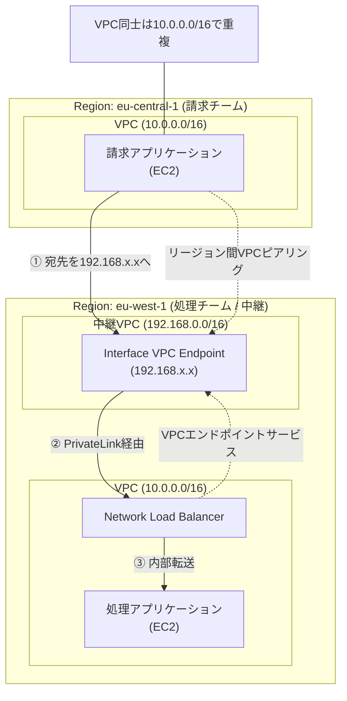
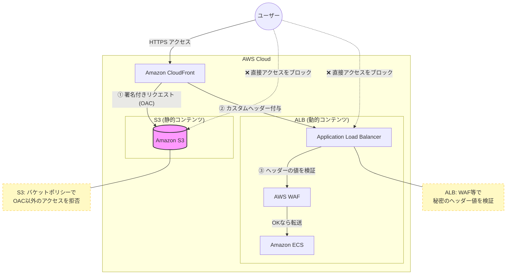
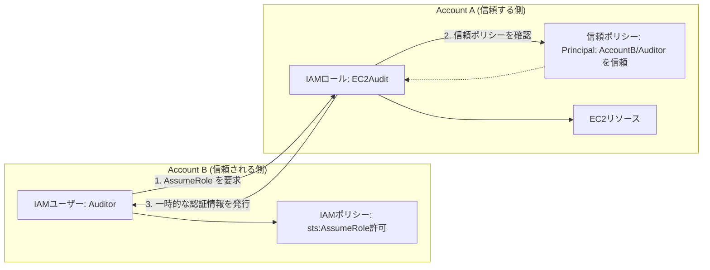

## データ転送手段

データ移行ツールの選定は、SAP試験において「帯域幅」「移行期間」「コスト」のトレードオフを正確に評価できるかが問われます。

あなたが好む「実装レベルの具体性」と「試験での判断基準」を軸に、ネットワーク構成要素であるLAG（Link Aggregation Group）を含めて整理しました。

### AWSデータ転送ツール・移行オプション比較表

| ツール / オプション | 主要スペック・特徴 | ネットワーキング / LAG | 試験で回答（最適解）になるケース |
| --- | --- | --- | --- |
| **Snowball Edge (Storage Opt.)** | 80TB / デバイス。オフライン転送。 | 10/25/40/100Gbps ポート搭載。物理配送。 | **帯域不足でオンライン転送に数週間以上かかる場合。** またはインターネット接続が不安定な環境からの大規模移行。 |
| **Snowmobile** | 最大100PB / トラック。超大規模移行。 | ネットワーク経由ではなく物理。 | **数百PB規模のデータ** かつ、複数のSnowball配送では運用管理が不可能な場合。 |
| **Direct Connect (DX)** | 1Gbps / 10Gbps / 100Gbps の専用線。 | **LAG（Link Aggregation Group）**により最大4つの接続を1つに束ねて帯域を拡張可能。 | **一貫したネットワークパフォーマンス**が必要な場合。ハイブリッド環境での定常的なデータ転送。 |
| **AWS DataSync** | オンラインデータ転送（S3, EFS, FSx等）。 | インターネットまたは **DX** 経由。増分転送、暗号化を自動化。 | **移行期間を短縮したい（並列処理）**、または既存のDX帯域を最大限活用して同期を自動化したい場合。 |
| **Storage Gateway** | ファイル/ボリューム/テープのハイブリッド。 | DXまたはインターネット経由。ローカルキャッシュが特徴。 | **オンプレミスからS3を低遅延でマウント**したい、または既存のバックアップソフト（VTL）をクラウドへ逃がしたい場合。 |
| **Transfer Family** | SFTP / FTPS / FTP サービス。 | エンドポイントはVPC内またはPublic。S3/EFSに直結。 | **既存のワークフロー（SFTP等）を変更せず**に、サードパーティとのデータ授受をクラウド化したい場合。 |

---

### SAP攻略のための深掘りポイント

#### 1. 「時間」の計算ロジック（暗算用）

試験では「100TBを1Gbpsの専用線で送ると何日かかるか？」といった感覚が重要です。

* 1Gbpsの実効速度を約80%と仮定すると、1日あたり約8.6TB転送可能です。
* 100TBなら約12日。ここに「ビジネス要件（1週間以内に完了せよ）」が加わると、オンライン（DX）ではなく **Snowball Edge** が正解になります。

#### 2. Direct Connect と LAG の使い所

LAGは単なる帯域拡張（10G × 4 = 40Gなど）だけでなく、以下の文脈で問われます。

* **運用効率:** 複数の物理接続を論理的に1つにまとめ、BGPセッションを簡素化する。
* **可用性:** LAG内の1リンクが落ちても通信を継続する。ただし、**「高可用性（HA）」の文脈では、LAGよりも「異なるDXロケーションからの冗長化」が正解**になるケースが多いです。LAGはあくまで「同一ロケーション内」の冗長・拡張であることに注意してください。

#### 3. DataSync vs Snowball

* **DataSync:** 既存のDX回線に余裕があり、スクリプト作成の手間（運用オーバーヘッド）を減らしたい場合に選択します。
* **Snowball:** そもそも回線がない、または回線を占有すると業務に支障が出る場合に選択します。

次に、具体的なシナリオ（例：オンプレの大量ログをS3に移行しつつ、EKSで分析する構成など）での使い分けについて、深掘りしたい部分はありますか？

確かに、個別の機能説明だけだと「結局何ができるのか」という全貌が捉えにくいですね。
実装者のメンタルモデルに合わせて、CloudWatchのコンソールメニューから潜っていくような**「樹形図（階層構造）」**でSyntheticsの全機能を整理します。

あわせて、SAP試験で頻出する「AWS Organizations」も同じスタイルで構造化してみます。

---
## CloudWatch Synthetics

#### 1. 監視手法（設計図 / Blueprints）

「何を、どの深さでチェックするか」の選択。

* **Heartbeat Monitor（稼働状況）**: 単一URLのロード。画面が出るか（L7表面）の確認。
* **API Canary（API）**: **レスポンスコードや中身(JSON等)を検証。**（今回の問題の正解）
* **GUI Workflow**: ログイン→購入などの一連の操作。
* **Visual Monitoring**: 前回の正常時と「見た目」を比較。CSS崩れを検知。

#### 2. ネットワーク（配置場所）

「どこから叩くか」の選択。

* **パブリック**: インターネット経由で外部公開エンドポイントを監視。
* **VPC内実行**: **PrivateLink** やオンプレミス(VPN/DX経由)の閉域資産を監視。
* *※Lambda同様、ENIが作成される。*

## AWS 非リレーショナルデータベース比較表

| サービス | 主な用途・データモデル | MongoDB互換性 | 分析機能 | データの退避・階層化（ライフサイクル） |
| --- | --- | --- | --- | --- |
| **DocumentDB** | 複雑な階層構造を持つJSONドキュメントの管理・検索。 | **あり**（既存のMongoDBコードやツールをそのまま利用可能） | インデックスを活用した複雑な検索、ソート、集計。 | インスタンスベースのストレージ。自動の階層化機能はないため、古いデータは手動でS3等へエクスポートが必要。 |
| **Timestream** | IoT、ログ、クリックストリーム等の時系列データの管理。 | なし（SQL準拠） | **強力な組み込み関数**（移動平均、相関、補間、近似など）。 | **標準機能で自動階層化。** メモリストア（最新）から磁気ストア（履歴）へ自動で移動し、期限後は自動削除。 |
| **DynamoDB** | 高頻度な読み書きが発生する汎用アプリケーション。 | なし（独自のAPI） | 基本的なクエリのみ。複雑な分析は他サービス（Athena等）との連携が前提。 | **TTL（Time To Live）**機能により、指定した時刻を過ぎたデータを自動削除可能。S3へのエクスポートは手動またはFirehose経由。 |

---

### 各サービスの「退避・階層化」に関する補足

* **Timestream**: サービス自体が「データの鮮度」に応じたストレージ階層（メモリストアと磁気ストア）を内包しています。設定画面で「何日後に磁気ストアへ移動するか」「何年後に削除するか」を指定するだけで、アプリケーション側で移動処理を実装することなく、コスト最適化とパフォーマンス維持を両立できます。
* **DocumentDB**: 基本的にプロビジョニングされたストレージにデータが蓄積され続けるため、コストを抑えるための「古いデータの退避（S3への移動など）」は、別途バッチ処理やAWS Glueなどを用いた実装が必要になります。
* **DynamoDB**: TTL機能によって「不要になったデータの自動削除」は容易ですが、別の安価なストレージ層へ「退避」させて検索可能な状態を維持するには、DynamoDB StreamsやAmazon S3へのエクスポート機能を組み合わせて構成する必要があります。

## AWS Security Hub
セキュリティ系のサービスをアカウントを跨いで集約して確認できる。マルチアカウントセキュリティやるなら必須。

## Step Functions ワークフロー比較表

| 項目 | スタンダード (Standard) | エクスプレス (Express) |
| --- | --- | --- |
| **最大実行時間** | **最大1年** | **最大5分** |
| **実行モデル** | 非同期のみ | **同期 (StartSyncExecution)** / 非同期 |
| **実行のセマンティクス** | **正確に1回 (Exactly-once)** | 少なくとも1回 (At-least-once) |
| **リクエストレート** | 毎秒2,000件程度まで | **毎秒100,000件以上**（高スループット） |
| **状態の履歴** | 全ステップの詳細な履歴を保持 | CloudWatch Logsに記録（コンソール履歴なし） |
| **主な用途** | 長時間の処理、決済、注文管理 | **短時間の処理、IoT、APIの裏側** |
| **今回の決め手** | × 同期実行が不可 | **○ 同期実行が可能、高頻度リクエスト対応** |

## 処理に時間がかかるとあればLambdaを外す

## AppRunner = Auto Scaling, LBなどを兼ね備えたPaaS (Web/APIをホストできる)

## 重複したVPC間の接続

## Amazon WorkSpaces
Windows DaaSができる

## SCP は、一括請求 (コンソリデーティッドビリング) のみが有効な組織では使用できません。SCP を使用できるようにするには、組織内のすべての機能を有効にする必要があります。

## IAM のネイティブサポート

| データベース | 分類 | IAMサポート範囲 | 特徴・ARNによる制御 |
| --- | --- | --- | --- |
| **DynamoDB** | NoSQL | **フルネイティブ** | **ARNベース**でテーブル単位、さらに条件付きで項目・属性単位の制御が可能。 |
| **Timestream** | NoSQL | **フルネイティブ** | テーブルやデータベースの**ARNベース**で、クエリや書き込みを制御。 |
| **Keyspaces (Cassandra)** | NoSQL | **フルネイティブ** | カサンドラの操作をIAMポリシーで定義可能。 |
| **Neptune (Graph)** | NoSQL | **フルネイティブ** | グラフデータの読み書きをIAMポリシーで制御可能。 |
| **MemoryDB / ElastiCache** | NoSQL | **フルネイティブ** (Redis 7.0以降) | **IAMポリシーとRedis ACL**を統合し、ユーザー単位の制御が可能。 |
| **RDS / Aurora** | SQL | **認証のみ** | IAMはログイン（トークン発行）に使用。**認可はDB内部のGRANT**で行う。 |
| **Redshift** | SQL | フルネイティブ | **IAMベース**でクラスタ接続や一時的な認証情報の生成を制御。 |
| **DocumentDB** | NoSQL | 管理のみ | **データの読み書き（データプレーン）はMongoDBのRBAC**を使用。 |

## Amazon Aurora Global Database
PostgreSQL互換・MySQL互換どっちも提供されてる

## Global Accelerator　と　Route53

| 項目 | AWS Global Accelerator (GA) | Route 53 |
| --- | --- | --- |
| **対応ターゲット** | **ALB, NLB, EC2, Elastic IP** | **ALB, NLB, EC2, S3, CloudFront等** |
| **マルチリージョン対応** | **対応**（複数リージョンへの振り分け） | **対応**（ルーティングポリシーによる） |
| **ヘルスチェック機能** | **あり**（異常時に自動切り替え） | **あり**（異常時にDNS回答から除外） |
| **主な仕組み** | **2つの固定IP (エニーキャスト)** | **DNS名 (名前解決)** |
| **パケットの通り道** | **AWS専用ネットワーク** | **パブリックインターネット** |
| **切り替えの速さ** | **即時** (IPレベルで制御) | **TTL（キャッシュ）に依存** |
| **本質的なメリット** | **ネットワーク経路の最適化とIP固定** | **ドメイン名による柔軟な誘導** |

## MemcachedとRedisに互換性はない
開発コストがかかるので注意

## ElasticBeanstalk以外を選ぶ基準

### 消去法で使う「サービスの立ち位置」

| サービス | 優先度 | これが出たら選ぶ（キーワード） |
| --- | --- | --- |
| **Elastic Beanstalk** | **高（標準）** | **自動スケーリング**、Java/Go/.NET等の多様な言語、既存VPCとの統合、インフラ管理を楽にしたい。 |
| **Lightsail** | **低（特殊）** | **予算固定**、**専門知識ゼロ**、**小規模**、**LAMP/WordPressパッケージ**。 |
| **App Runner** | **中（現代的）** | **コンテナ（Docker）**、サーバー管理を一切したくない、Go/Python/Node.js等のシンプルなWeb。 |

### 「Beanstalk 優先」が崩れる瞬間

基本はBeanstalkで考えつつ、以下の要素が混ざってきたら「待てよ？」とブレーキをかけてください。

1. **「予算の予測可能性」を強調されたら**
* Beanstalkは裏側のEC2がスケールすると料金が跳ね上がります。これがNGなら **Lightsail** です。

2. **「Dockerコンテナを使っていて、もっと管理を減らしたい」と言われたら**
* Beanstalkでもコンテナは動きますが、今は **App Runner** や **Fargate** が「最小の管理労力」としての正解になりやすいです。

3. **「静的サイト + 少々のAPI」と言われたら**
* サーバーを立てるBeanstalkよりも、**S3 + CloudFront + Lambda** のサーバーレス構成が優先されます。

---

### 💡 アーキテクトの思考トレース

* **問：「スケーラブルなPHPサイトを構築したい」**
* 思考：Beanstalkが第一候補。

* **問：「スケーラブルで、AWSの専門知識がない開発者がやりたい」**
* 思考：Beanstalk。管理を任せられるから。

* **問：「予算が決まっていて、月額を一定にしたい。専門知識もない」**
* 思考：**Lightsail**。これしかない。

## AWS Backupで全てのストレージ製品のバックアップできる

- S3
- EBS
- EFS
- RDS
- Storage Gateway (オンプレミス)

## MemoryDB

一言で言うと、**「データが消えない超高速なRedis」**です。

ライトスルーでマルチAZに書き込む

これまで「Redis（ElastiCache）」は、あくまで一時的なキャッシュとして使われ、マスターデータはRDSなどのディスク型のDBに置くのが定石でした。それを「これ一台でメインDBとして使っていいよ」と進化させたのが Amazon MemoryDB for Redis です。

## AWS Application Migration Service
VM Import/Exportの後継。VM Import/Exportが解答になることはない

## AWS Snowball vs S3 Transfer Acceleration
Snowballは7日
S3は回線による

## AWS Application Discovery Service
オンプレミスサーバーの使用状況および設定データを収集し、AWS クラウドへの移行計画を支援します

## CognitoにてSAML,OIDC対応でない場合は論理的に分けようと思ったら
それぞれ認証基盤が紐づいた別々のユーザプールを作成する必要がある

## IAM Access Analyzer
外部エンティティと共有されているリソースを特定するのに役立ちます。組織を信頼ゾーンとするアナライザーは、外部アカウントのみの検出結果を生成します。組織内の内部アカウントの検出結果は含まれません。

## OUの整理の際には削除ではなくて移動

## AMIはOSイメージであり、Dockerイメージではない
のでEC2が必要

## Oracleが使いたい

Amazon RDS for Oracle DB

## Intelligent-Tiering vs Glacier Flexible Retrieval

| 項目 | **B: Intelligent-Tiering** | **C: ライフサイクルルール** |
| --- | --- | --- |
| **最初の180日間** | **自動で安くなる。** アクセスがないものは30日後、90日後に勝手に安い階層へ移動する。 | **ずっと高いまま。** 180日経つまで、一律で「S3 Standard」の料金を払い続ける。 |
| **アクセス管理** | AWSが実際のアクセスを見て判断してくれる。 | 日付（180日）だけで機械的に移動させる。 |
| **180日後の取り出し** | アーカイブアクセス階層：**3〜5時間** (OK) | Glacier Flexible Retrieval：**3〜5時間** (OK) |
| **コスト効率** | **最高**（180日以内も最適化されるため） | 普通（180日経つまでは無駄が多い） |

## Amazon Lex
- 音声をテキストに変換する自動音声認識 (ASR) の高度な深層学習機能を備えています
- 会話の意図を認識する自然言語理解 (NLU) 機能も搭載されています。

## Stacksets と Configの使い分け
リソースそのものを配布するならStacksets
Configはルールの強制

## KMSではなくCloudHSMを使うケース

### 1. 鍵の「完全な所有権」が欲しい（物理的な隔離）

KMSは「AWSが裏側で管理しているマルチテナントな仕組み」ですが、CloudHSMは「VPC内に置かれた**あなた専用の物理ハードウェア**」です。

* **AWSも中身を見られない**: CloudHSMのユーザー管理はAWSのIAMとは完全に独立しています。AWSのエンジニアであっても、物理的・論理的にあなたの鍵に触れることは不可能です。
* **単一占有**: ハードウェアを他の顧客と共有したくない、という非常に厳しいセキュリティポリシーを持つ企業（銀行など）で重宝されます。

---

### 2. 業界標準のAPI（PKCS#11, JCE, CNG）を使いたい

KMSを使うには、アプリケーションに「AWS KMS SDK」を組み込む必要があります。しかし、世の中には**「特定のインターフェースじゃないと動かない」レガシーなシステム**が山ほどあります。

* **PKCS#11, Java Cryptography Extensions (JCE), Microsoft CNG**: これらは暗号化の世界の「共通語」です。
* **既存アプリの持ち込み**: オンプレミスでこれらを使って暗号化していたアプリを、コードを書き換えずにAWSへ移行（リフト＆シフト）したい場合、標準APIをサポートしているCloudHSMが唯一の選択肢になります。

---

### 3. 特殊な暗号アルゴリズムを使いたい

KMSは非常に便利ですが、サポートしているアルゴリズムには限りがあります。

* **ニッチなニーズ**: 独自にカスタマイズされた暗号方式や、KMSが標準で対応していない特定の楕円曲線（ECC）を使いたい場合、CloudHSMならハードウェアレベルで柔軟に対応できることがあります。

---

### 4. 圧倒的なスループット（大量の署名・暗号化）

KMSには「1秒間に何回まで」というクォータ（制限）があり、大規模な署名処理を行うとスロットリングが発生することがあります。

* **爆速処理**: CloudHSMは専用ハードウェアなので、秒間数千回の暗号化処理（RSA 2048の署名など）を低遅延でこなせます。大量のトランザクションを捌く決済基盤などでは、コストを払ってでもこのパワーが必要になります。

---

### まとめ：CloudHSM を選ぶ基準

| 理由 | 内容 |
| --- | --- |
| **法的・コンプライアンス** | FIPS 140-2 Level 3 が必須。 |
| **レガシー対応** | PKCS#11 等の標準ライブラリをそのまま使いたい。 |
| **究極の隔離** | 物理デバイスを専有し、AWS 運営側も鍵に触れさせたくない。 |
| **性能** | KMS の API 制限に引っかかるほどの超大量処理が必要。 |

## Apache ActiveMQ と SQSはプロトコルが違う
- SQS: http or https
- ActiveMQ: ActiveMQ

## Configは検知＋修正が遅れる
SCPで弾く方が確実

## タグを整理することなら Resource Groupsのタグエディタが最強

## EBSをマルチAZで共有したい
EFSにするしかない

- マルチアタッチ: 同一AZのみ
- DataSync: EBSは非対応

## 高可用性、耐障害性を高めたい場合、NATゲートウェイも冗長化する

インターネットゲートウェイはそもそも冗長化されてる

## HPCクラスター
確かに、**C (ハイパースレッディングの無効化)** は「ネットワークの改善と言ってるのになぜCPU？」と感じますし、**D (バーストパフォーマンスインスタンス)** は名前だけ見ると「凄まじい瞬発力で速そう」に見えてしまうので、初見ではかなり迷うポイントです。

HPC（ハイパフォーマンスコンピューティング）特有の考え方を整理すると、スッキリ納得できるはずです。

---

### C: なぜ「ハイパースレッディングの無効化」が正解なのか

「ネットワーク性能を上げたい」と言っているのにCPUの設定をいじるのは、HPCにおける**「待ち合わせ」**の挙動が関係しています。

* **ジッター（ばらつき）の排除**:
HPCの「密結合（Tightly Coupled）」ワークロードでは、複数のインスタンスが計算結果を頻繁に送り合い、全員の計算が終わるのを待って次のステップに進みます（MPI通信）。
* **1人が遅れると全員止まる**:
ハイパースレッディングが有効だと、1つの物理コアを2つのスレッドで分け合うため、キャッシュの競合が発生し、わずかに処理が遅れる瞬間が生まれます。この「わずかな遅れ」がクラスター全体に伝染し、結果としてネットワークの待機時間（レイテンシー）が増大してしまいます。
* **物理コア専有が鉄則**:
HPCの世界では、1つの計算スレッドが1つの物理コアを100%独占して、予測可能な速度で計算し続けることが、全体の通信効率を最大化する近道なんです。

---

### D: なぜ「バーストパフォーマンスインスタンス」はダメなのか

「バースト」という響きは強そうですが、AWSの「T系インスタンス（T3など）」は、HPCとは真逆の設計思想です。

* **貯金（クレジット）方式**:
T系は「普段は暇だけど、たまに頑張る」という用途向けです。CPUクレジットが切れるとパフォーマンスが強制的に落とされます。常にフルパワーで回し続けるHPCでこれを使うと、すぐに「貯金」が尽きて使い物にならなくなります。
* **ネットワークの細さ**:
バースト系インスタンスは、ネットワーク帯域も「最大○Gbps（バースト時）」という不安定な仕様です。HPCが必要とする「常に安定した100Gbpsクラスの帯域」は提供できません。

---

### HPCの「三種の神器」：E・F・C

この問題の正解セットは、HPCを構築する際の**黄金構成**そのものです。

| 正解 | 役割 | HPCにおける効果 |
| --- | --- | --- |
| **E: 単一AZ（クラスター配置）** | 物理的な距離を縮める | 光速の限界を超えられないため、物理的に隣に置くのが最強。 |
| **F: EFA (Elastic Fabric Adapter)** | 独自のバイパス通信 | OSを介さず直接通信（OSバイパス）することで、レイテンシーを極限まで下げる。 |
| **C: ハイパースレッディング無効** | 処理の予測可能性 | 1ノードの計算ジッターを消し、クラスター全体の通信同期をスムーズにする。 |

---

### 💡 結論

* **C** が正解なのは、**「計算のムラを無くすことが、ネットワークの待ち時間を減らすことに直結するから」** です。
* **D** が不正解なのは、**「HPCはマラソン選手なのに、短距離走専門の（しかもスタミナ制限がある）選手を連れてきてもダメだから」** です。

ちなみに、ハイパースレッディングを無効化する設定は、インスタンス起動時に **「スレッド/コア」** の比率を `1` に指定するだけで簡単にできます。

## WAFとOAC

## ランブックとは手順書のこと
IaCが答えになる

- CloudFormation
- EC2ユーザデータ

## Apexドメインに対してはCNAMEレコードを設定できない
Route53のエイリアスレコードが解決してくれる
Apexレコードとはbook.example.comに対するexample.comのことで、その組織におけるルートドメインのこと

## CloudFront + Lambda@Edge + S3
動的にコンテンツを変えたい場合はLambda@Edgeが必須

## TGWで開発と商用を分離したい
ルートテーブルを二つ作成する
最大200個まで

## DynamoDBとAuroraのGlobal Database

### 1. DynamoDB：真の分散マルチマスタ

DynamoDB Global Tablesは、各リージョンが「対等な権利」を持っています。

* **ローカル書き込み**: ニューヨークのサーバーは、ニューヨークのDBに書き込んだ瞬間に「完了！」と返せます。
* **後で同期**: その後、裏側で他のリージョンへデータを飛ばします。
* **競合**: もし同じデータを同時に書き換えたら、後で「どっちが最新か」を話し合って決めます（Last Writer Wins）。

---

### 2. Aurora：マスタへの「忖度」システム

対して、Aurora Global Databaseの書き込み転送は、あくまで**「転送」**であって「同時書き込み」ではないのがミソです。

* **実態はプロキシ**: セカンダリリージョンで `INSERT` を投げても、そのリージョンでは書き込み処理は行われません。パケットがそのままプライマリリージョンへ「転送」されます。
* **レイテンシーの壁**: つまり、東京からバージニアのAuroraに書き込もうとすると、**物理的な往復の通信時間（数百ミリ秒）**を必ず待たされます。
* **整合性の維持**: プライマリが「書いたよ！」と返して、さらにストレージの同期が戻ってくるのを待ってからレスポンスを返すので、構成としては「中央集権」のままなんです。

## EC2インスタンスファミリ

| ファミリー | 特徴・由来 | 向いているワークロード |
| --- | --- | --- |
| **C (Compute)** | **計算特化**。CPU性能が非常に高い。 | **動画変換、バッチ処理**、科学計算、ゲームサーバー。 |
| **R (RAM/Memory)** | **メモリ特化**。1CPUあたりのメモリ量が多い。 | **データベース (RDS)**、インメモリキャッシュ (Redis)、ビッグデータ解析。 |
| **M (Medium/Main)** | **汎用**。CPUとメモリのバランスが良い。 | 標準的なアプリケーションサーバー、小〜中規模のDB。 |
| **T (Tiny/Turbo)** | **バースト可能**。普段は安く、必要な時だけ加速。 | **低負荷のWebサイト**、開発・テスト環境、踏み台サーバー。 |
| **G / P (Graphics)** | **GPU搭載**。画像処理や行列演算が得意。 | 機械学習 (AI) の学習・推論、3Dグラフィックス、動画レンダリング。 |
| **I / D / H (Storage)** | **ストレージ特化**。高速なローカルSSDや大容量HDD。 | データウェアハウス、Hadoop、分散ファイルシステム。 |

「一気に負荷が数倍になる」ような激しい現場において、**簡易スケーリング（Simple Scaling）**は少しおっとりしすぎていて、**ステップスケーリング（Step Scaling）**は非常に機敏、という違いがあります。

一番の大きな違いは、**「追加のスケーリングをする前に、休憩（クールダウン）が必要かどうか」**です。

---

## 簡易スケーリング vs ステップスケーリング

| 項目 | **簡易スケーリング** | **ステップスケーリング** |
| --- | --- | --- |
| **連続スケーリング** | 不可（クールダウンが終わるまで待機） | **可能（追加しながらさらに追加できる）** |
| **負荷への対応力** | 緩やかな変化向け | **急激なスパイク（2〜10倍）向け** |
| **アクションの細かさ** | 1つの閾値に1つのアクション | 閾値の「超え具合」で段階的に調整可能 |
| **主な用途** | 昔ながらの設定（現在はあまり推奨されない） | 迅速なスケーリングが求められるモダンなアプリ |

## S3アクセスポイントによるアクセス制御

S3 アクセスポイントは、Amazon S3 にデータを保存する AWS のサービスやカスタマーアプリケーションのデータアクセスを簡素化します。IAM ポリシーは S3 アクセスポイントに直接アタッチできます。従業員は、自分のオブジェクトにアクセスするための単一の URL を持つことになります。また、このソリューションは、将来のプレフィックス用に S3 アクセスポイントを追加する柔軟な方法を提供します。

## Redis vs Memcached

仰る通り、今のインフラ設計では**「迷ったらRedis OSS」**と言われるほど、可用性（レプリケーション、フェイルオーバー）の面でRedisが圧倒的に選ばれやすくなっています。

しかし、Memcachedが絶滅していないのは、**「シンプルさゆえの純粋なスピードとスケーラビリティ」**という武器があるからです。

選定の際に考慮すべき、可用性以外の「4つの視点」を整理しました。

---

### 1. データ構造の「多才さ」

これが実務で最も大きな差になります。

* **Memcached**: **純粋な「Key-Value」のみ。**
「このIDに対応する、この文字列（またはオブジェクト）を返せ」という単純な用途に特化しています。
* **Redis OSS**: **データ構造のデパート。**
文字列だけでなく、List、Set、Hash、さらに「スコア順に並べる」**Sorted Set**などが使えます。「ランキング機能をDBを叩かずに作りたい」「最新10件のログを保持したい」といったロジックをキャッシュ側で完結させたいならRedis一択です。

---

### 2. マルチスレッド vs シングルスレッド

CPUの使い方が根本的に違います。

* **Memcached**: **マルチスレッド対応。**
コア数を増やせば増やすほど、素直にスループットが上がります。非常に巨大なトラフィックを、1台の大きなインスタンス（垂直スケーリング）で捌きたい場合はMemcachedの方が効率が良い場合があります。
* **Redis OSS**: **（基本は）シングルスレッド。**
メインの処理は1つのスレッドで動くため、1つのリクエストが重いと後続が詰まります。ただし、最近のバージョンではI/O部分のマルチスレッド化が進んでおり、この差は縮まりつつあります。

---

### 3. データの永続性（消えてもいいか？）

* **Memcached**: **完全にメモリのみ。**
再起動したらデータはすべて消えます。「消えたらDBから読み直せばいいだけ」という、純粋なキャッシュとして割り切った使い方が前提です。
* **Redis OSS**: **ディスクへの書き出しが可能（Snapshot / AOF）。**
メモリ上のデータをディスクに保存できるため、万が一の再起動後もデータを復旧できます。「キャッシュ兼、消えたら困る一時データベース」のような使い方ができるのが強みです。

---

### 4. メモリ管理の仕組み

* **Memcached**: **スラブ割当（Slab Allocation）。**
あらかじめメモリを固定サイズのブロックに切り分けて管理します。メモリの断片化が起きにくく、長期間動かしてもパフォーマンスが安定しやすいのが特徴です。
* **Redis OSS**: **柔軟なメモリ管理。**
データのサイズに合わせて動的にメモリを確保します。便利ですが、データの入れ替えが激しいと断片化が発生しやすく、メモリ効率に気を配る必要があります。

---

### 💡 どっちを選ぶべき？ まとめ表

| 視点 | **Redis OSS** | **Memcached** |
| --- | --- | --- |
| **主な用途** | 高機能なキャッシュ、ランキング、メッセージ中継 | **とにかく単純で高速なキャッシュ** |
| **データ型** | 豊富（Set, Hash, Geospatial等） | 文字列とバイナリのみ |
| **スケーリング** | クラスター構成で横に広げるのが得意 | 縦に大きく（コア数を活用）するのが得意 |
| **永続化** | できる（Snapshotなど） | できない（再起動で消失） |
| **Pub/Sub機能** | あり（チャットなどに向く） | なし |

---

### 結論

「可用性」以外で選ぶなら、**「キャッシュ側で複雑な計算や並び替えをしたいか（Redis）」**か、**「ただの箱として、とにかくシンプルに高速に動いてほしいか（Memcached）」**が分かれ道になります。

最近は **Amazon ElastiCache Serverless** の登場で、どちらを選んでも管理の手間は減っていますが、ライブラリの充実度や多機能さから、新規開発では9割型 Redis OSS が選ばれているのが現状ですね。

## CloudTrailで特定のアクセスポイントのログだけ集計できる

この問題のポイントは、**「高度なイベントセレクタ（Advanced Event Selectors）」**を使えば、バケット単位ではなく、**「特定のアクセスポイントを通った通信だけ」**を狙い撃ちしてログに残せるという点にあります。

---

### 「基本」と「高度」の決定的な違い

CloudTrailのデータイベント（GetObjectなど）を記録する際、昔からある「基本（Basic）」はかなり大雑把でしたが、2021年ごろに登場した「高度（Advanced）」で一気に痒いところに手が届くようになりました。

| 機能 | 基本的なイベントセレクタ | **高度なイベントセレクタ** |
| --- | --- | --- |
| **フィルタの細かさ** | バケット全体 または プレフィックス | **特定のリソースARN (アクセスポイント等)** |
| **読み書きの区別** | Readのみ / Writeのみ / 全て | 同じく可能 |
| **特定のAPIの除外** | 不可 | **特定のAPI名（eventName）でフィルタ可能** |
| **S3 Object Lambda** | **非対応** | **対応** |

---

### ソリューションの全体像

今回の正解（C）は、以下のような「監査専用の蛇口」を作るイメージです。

1. **CloudTrail の証跡を作成**: 監査チーム専用のバケットを出力先にする。
2. **高度なイベントセレクタを設定**:
* `resources.type` に `AWS::S3ObjectLambda::AccessPoint` を指定。
* `resources.ARN` に **「分析チームが使っているアクセスポイントのARN」** を指定。

3. **結果**: 監査用バケットには、**「最初から分析チームの活動しか載っていないログ」**だけが届く。

---

### 💡 結論

「CloudTrail はバケットごとにしかログを取れない」というのは古い知識で、今は **「特定のアクセスルート（アクセスポイント）を指定して、必要なログだけを抽出して保存する」** ことができます。

「監査人に優しい構成 ＝ 最初からノイズを削ぎ落としたログを渡す」というのが、この問題の裏にあるベストプラクティスですね。

## SQS + ASG の時に利用するカスタムメトリクス

バックログ ＝ キューにあるメッセージ数 ÷ 実行中のインスタンス数

## DataSyncはDatabase Migrationには使えない

## ワークロードはかなり大きめのアカウントの塊
500アカウントかになるとまとめるコストも大きくなる

- セキュリティアカウントを共通化しない
- OU, SCPもワークロード、環境ごとになる

## Active Directoryの中身をマイグレーションしたい
Active Directory Migration Kitなるものがある

## AWS Application Migration Service ってC++とかもいけるんだ

## S3バケットはデフォルトの暗号化を途中で有効にできる

## Route53 Application Recovery Controller
大したことはない。手動で切り替えるスイッチのこと。
LambdaやEventBridgeを使ってトリガーする

## Secrets Managerのシングルユーザと交替ユーザ

Secrets Manager のローテーション戦略、特に「どっちがどっちだっけ？」となりやすい部分ですよね。

### 比較まとめ

| 特徴 | シングルユーザー | **交替ユーザー** |
| --- | --- | --- |
| **ユーザー数** | 1人 | 2人（または管理用＋1人） |
| **可用性** | わずかな瞬断の可能性あり | **完全にゼロダウンタイム** |
| **設定の楽さ** | **最高（ポチるだけ）** | 普通（DB側の準備が必要） |
| **試験でのキーワード** | 「単一のユーザー」「最小の労力」 | 「ダウンタイムなし」「高可用性」 |

**結論として：**
「1人しかいないならシングル、絶対に止めたくないなら交替（2人）」と覚えておけば、AWS 試験のパスワード問題はほぼ解けます！

## AWS Budgets Action
特定のEC2インスタンスの停止とかできる

## STS AssumeRole

## Firewall Manager
大量のAWSアカウントでアクセス元の制限をしたい

同じ「ステートフル / ステートレス」という言葉を使っていても、**「何を指してそう呼んでいるか」**の階層が、SG/NACLの文脈とNetwork Firewall（NFW）の文脈では異なります。

一言で言うと、SG/NACLは**「戻り通信の扱いのルール」**の話ですが、NFWでは**「検査エンジンの仕組みと深さ」**の話になります。

---

### 1. SG/NACL 文脈の「ステート」

ここでは、**「コネクション（通信の往復）を覚えているか？」** だけが焦点です。

* **SG（ステートフル）**: 「行き」を許可すれば「帰り」は自動パス。
* **NACL（ステートレス）**: 「行き」も「帰り」も、両方の許可証が必要。

### 2. Network Firewall (NFW) 文脈の「ステート」

ここでは、**「パケットをどういうロジックで、どこまで深く見るか」** というエンジンの違いを指します。

| 特徴 | **ステートレス（NFW）** | **ステートフル（NFW）** |
| --- | --- | --- |
| **イメージ** | **高速な「仕分け」** | **じっくり「鑑識」** |
| **評価の仕組み** | **優先順位（Priority）** に従い上から順に評価。 | 優先順位、またはSuricata互換の複雑な評価。 |
| **検査の深さ** | 5-tuple（送信元/先IP、ポート、プロトコル）のみ。 | **DPI（Deep Packet Inspection）**。プロトコルの挙動やドメイン名まで見る。 |
| **戻り通信** | 基本は意識しない（NACLに近い）。 | **通信の流れ（フロー）** として管理。 |
| **主な用途** | とりあえず不要なIPを即座に捨てる（今回のようなSSH制限など）。 | 「特定のURL以外へのアクセス禁止」など高度な制御。 |

---

### 💡 なぜ「NFWのステートレス」が最強の門番なのか

今回の問題で「ステートレス」が正解になったのは、以下の理由からです。

1. **評価順序が絶対**: ステートレスエンジンは「数字が小さいルールから絶対に守る」という単純なルールで動きます。だから「許可IPを先に書き、それ以外を後に書く」だけで、**誰にも突破できない鉄の掟**が作れます。
2. **処理が爆速**: パケットの中身を深く解析せず、封筒（ヘッダー）だけ見て捨てるので、50アカウント分の全通信を通してもレイテンシーがほとんど増えません。

逆に、**NFWのステートフル（Suricataエンジンなど）**は、前後のパケットの関係性を解析したりするので、設定を間違えると「意図しないパケットがすり抜ける」あるいは「評価の順番が思っていたのと違う」といった複雑な問題（デフォルトの評価順序など）が起きやすいんです。

### 💡 整理：文脈による違いのまとめ

* **SG/NACL の世界**: 「戻りのパケット、自動で通す？」
* **Firewall Manager / NFW の世界**: 「ヘッダーだけで高速に捨てる（レス）？ それとも中身までじっくり見る（フル）？」

このように、**「ステートレス ＝ 単純だけど優先順位がガチガチに守られる高速フィルター」** と覚えると、NFWの問題は解きやすくなりますよ。

## AWS BackupにはOrganization単位でまとめてやってくれる